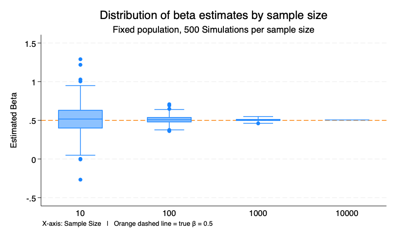
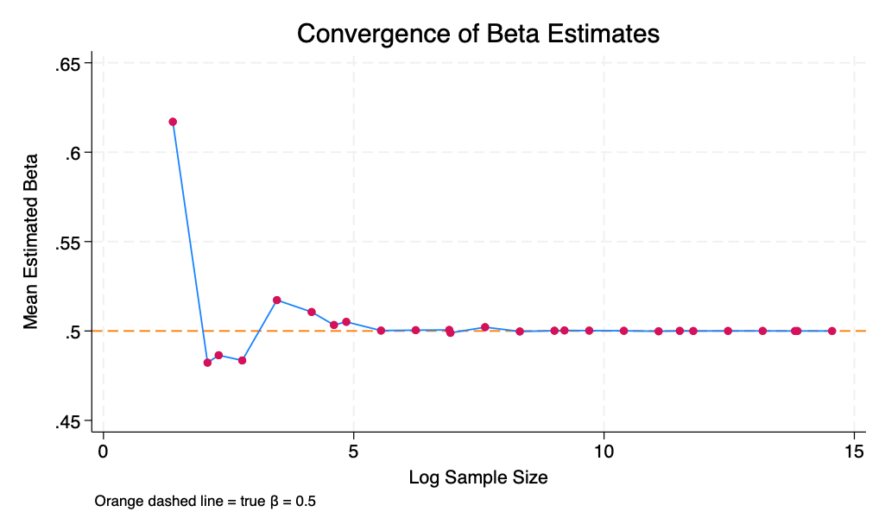
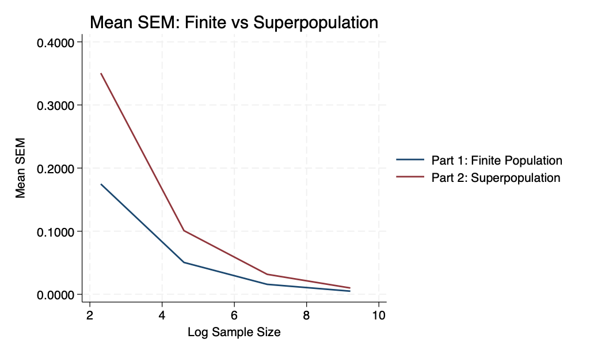
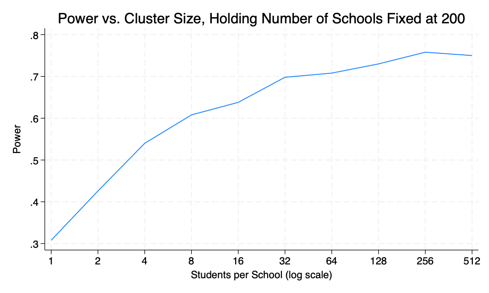

# Part 1: Sampling Noise in a Fixed Population

## Data Generating Process & Simulation Design
To examine sampling variability, I constructed a fixed population of 10,000 observations using the data-generating process where:

X is normally distributed (50, 10) which is a normal predictor

Y = 2 + 0.5X + ε where ε is also normally distributed (0, 5)

This implies a true beta of 0.5

I then wrote a program that repeatedly draws random samples from this population, estimates a regression of Y on X, and stores key statistics such as the coefficient, standard error, p-value, and confidence intervals. Then, using the simulate command, I ran 500 replications for each sample size (N = 10, 100, 1,000, and 10,000), which yielded a total of 2,000 regression estimates.

## Results

**Figure 1** shows the distribution of 500 beta estimates at each sample size.

Figure 1 illustrates how the distribution of estimated coefficients changes with sample size. At small sample sizes (N = 10), the estimates are widely dispersed, indicating substantial sampling variability. The interquartile range (IQR) is large and several outliers are present. As the sample size increases, the distribution becomes increasingly concentrated around the true coefficient of 0.5. By N = 10,000, the estimates are tightly clustered, with minimal variability, and closely approximate the true parameter.

**Table 1** shows the summary of the beta estimates at each sample size.

| Sample Size | Mean Beta | Mean SE | Mean CI Width | Mean p-value | SD Beta | SD SE | SD CI Width | SD p-value |
|------------|----------|--------|--------------|--------------|--------|-------|-------------|------------|
| 10         | 0.5161   | 0.1748 | 0.8061       | 0.0597       | 0.1746 | 0.0677 | 0.3121      | 0.1161     |
| 100        | 0.5041   | 0.0505 | 0.2005       | 0.0000       | 0.0512 | 0.0049 | 0.0195      | 0.0000     |
| 1000       | 0.5052   | 0.0158 | 0.0620       | 0.0000       | 0.0147 | 0.0005 | 0.0019      | 0.0000     |
| 10000      | 0.5053   | 0.0050 | 0.0196       | 0.0000       | 0.0000 | 0.0000 | 0.0000      | 0.0000     |

The table shows that both the standard error (SE) and the width of the confidence intervals decrease substantially as sample size increases. At N = 10, the mean SE is relatively large (0.1748), indicating imprecise estimates, and the average confidence interval width is wide (0.8061). As the sample size increases to 100 and 1,000, both the SE and confidence interval width decline sharply. By N = 10,000, the mean SE is very small (0.0050) and the confidence intervals are extremely narrow (0.0196), indicating highly precise estimates. P-values also decrease toward zero as sample size increases, reflecting stronger statistical evidence against the null hypothesis as estimates become more precise.

# Part 2: Sampling Noise in an Infinite Superpopulation
## Data Generating Process & Simulation Design
To study an infinite superpopulation, I defined a program that generates a new dataset in each simulation based on a specified data-generating process with a true relationship between X and Y and the error term. I then ran this program 500 times over a range of sample sizes, including the first 20 powers of 2 (starting at 4) and 6 additional sample sizes ranging from 10 to 1,000,000. This yields a total of 13,000 regression results, which allows me to examine how the estimated coefficients, standard errors, and confidence intervals behave as the sample size increases. 

## Results

**Figure 2** shows the distribution of 500 beta estimates at each sample size.

Figure 2 shows the convergence of the estimated coefficient as the sample size increases exponentially. At small sample sizes, the mean estimated beta deviates noticeably from the true value of 0.5, reflecting high sampling variability. However, as the sample size increases, the estimates quickly converge toward the true parameter. By approximately a log sample size of 5, the mean estimate is already very close to 0.5, and beyond this point it varies only minimally around the true value. At larger sample sizes, the estimate is basically indistinguishable from the true parameter.

**Table 2** shows the summary of the beta estimates at each sample size.
| sample_size | mean_beta | mean_sem | mean_ci_width | mean_p  | sd_beta | sd_sem | sd_ci_width | sd_p   |
|------------|----------|----------|---------------|---------|---------|--------|-------------|--------|
| 4          | 0.61703  | 0.73552  | 6.32941       | 0.40180 | 1.07705 | 0.73077| 6.28853     | 0.28419|
| 8          | 0.48229  | 0.41132  | 2.01291       | 0.32603 | 0.45844 | 0.18493| 0.90504     | 0.28601|
| 10         | 0.48643  | 0.35049  | 1.61647       | 0.28990 | 0.37464 | 0.13530| 0.62401     | 0.28548|
| 16         | 0.48351  | 0.25857  | 1.10915       | 0.18275 | 0.26451 | 0.06766| 0.29023     | 0.24104|
| 32         | 0.51727  | 0.18061  | 0.73771       | 0.05655 | 0.19224 | 0.03322| 0.13567     | 0.14578|
| 64         | 0.51063  | 0.12691  | 0.50736       | 0.00842 | 0.13710 | 0.01574| 0.06295     | 0.04076|
| 100        | 0.50336  | 0.10092  | 0.40056       | 0.00077 | 0.10165 | 0.01013| 0.04021     | 0.00453|
| 128        | 0.50511  | 0.08922  | 0.35314       | 0.00003 | 0.08578 | 0.00848| 0.03354     | 0.00019|
| 256        | 0.50022  | 0.06280  | 0.24735       | 0.00000 | 0.06235 | 0.00392| 0.01545     | 0.00000|
| 512        | 0.50045  | 0.04437  | 0.17435       | 0.00000 | 0.04716 | 0.00199| 0.00781     | 0.00000|
| 1000       | 0.50059  | 0.03170  | 0.12443       | 0.00000 | 0.03169 | 0.00103| 0.00405     | 0.00000|
| 1024       | 0.49894  | 0.03129  | 0.12282       | 0.00000 | 0.03256 | 0.00099| 0.00388     | 0.00000|
| 2048       | 0.50213  | 0.02213  | 0.08678       | 0.00000 | 0.02090 | 0.00052| 0.00203     | 0.00000|
| 4096       | 0.49973  | 0.01563  | 0.06128       | 0.00000 | 0.01502 | 0.00024| 0.00092     | 0.00000|
| 8192       | 0.50014  | 0.01105  | 0.04334       | 0.00000 | 0.01099 | 0.00013| 0.00049     | 0.00000|
| 10000      | 0.50030  | 0.01000  | 0.03921       | 0.00000 | 0.01028 | 0.00010| 0.00038     | 0.00000|
| 16384      | 0.50021  | 0.00781  | 0.03063       | 0.00000 | 0.00786 | 0.00006| 0.00024     | 0.00000|
| 32768      | 0.50011  | 0.00553  | 0.02166       | 0.00000 | 0.00562 | 0.00003| 0.00012     | 0.00000|
| 65536      | 0.49984  | 0.00391  | 0.01531       | 0.00000 | 0.00394 | 0.00001| 0.00006     | 0.00000|
| 100000     | 0.50007  | 0.00316  | 0.01240       | 0.00000 | 0.00328 | 0.00001| 0.00004     | 0.00000|
| 131072     | 0.49999  | 0.00276  | 0.01083       | 0.00000 | 0.00277 | 0.00001| 0.00003     | 0.00000|
| 262144     | 0.50004  | 0.00195  | 0.00766       | 0.00000 | 0.00195 | 0.00000| 0.00001     | 0.00000|
| 524288     | 0.50004  | 0.00138  | 0.00541       | 0.00000 | 0.00140 | 0.00000| 0.00001     | 0.00000|
| 1000000    | 0.49999  | 0.00100  | 0.00392       | 0.00000 | 0.00106 | 0.00000| 0.00000     | 0.00000|
| 1048576    | 0.50002  | 0.00098  | 0.00383       | 0.00000 | 0.00094 | 0.00000| 0.00000     | 0.00000|
| 2097152    | 0.49999  | 0.00069  | 0.00271       | 0.00000 | 0.00069 | 0.00000| 0.00000     | 0.00000|

As the sample size increases, both the standard error of the mean (SEM) and the width of the confidence intervals decline sharply. At small sample sizes, the SEM is large and the confidence intervals are very wide, indicating substantial uncertainty in the estimates. However, as N grows, the SEM decreases rapidly and the confidence intervals become much narrower, reflecting increased precision. At very large sample sizes, both the SEM and confidence interval width approach zero, indicating highly stable and precise estimates with minimal sampling variability.

## Comparison Results

In Part 2, I can draw much larger sample sizes than in Part 1 because I am not sampling from a fixed dataset with a limited number of observations. Instead, the program generates a new dataset each time from the data-generating process, so there is no upper bound on how large N can be. In Part 1, by contrast, I was repeatedly sampling from a fixed finite population, which means the maximum feasible sample size was constrained by the size of that underlying dataset.

The SEMs and confidence intervals at the powers of ten may also differ between Part 1 and Part 2 because the source of variation is different. In Part 1, sampling is from a finite population, so as the sample becomes a larger share of that population, sampling variability falls more quickly due to the finite population correction. This can make SEMs and confidence intervals smaller than in Part 2 at the same nominal sample size. In Part 2, each dataset is newly generated from the superpopulation, so there is always residual sampling noise, and precision improves more smoothly according to the usual relationship with sample size.

**Figure 2.1** shows the mean standard error (MSE) changing with sample size for both the finite population and the superpopulation.

Figure 2.1 shows that the mean SEM declines with sample size in both settings, but is consistently higher in the superpopulation than in the finite population, reflecting greater sampling variability when data are repeatedly drawn from an underlying distribution rather than a fixed population.

**Table 2.1** compares the mean beta estimates, SEs, and CI widths from Part 1 (finite population) and Part 2 (superpopulation) across shared sample sizes. 

| sample_size | part1_mean_beta | part2_mean_beta | part1_mean_sem | part2_mean_sem | part1_mean_ci_width | part2_mean_ci_width |
|-------------|-----------------|-----------------|----------------|----------------|---------------------|---------------------|
| 10          | 0.5161          | 0.4864          | 0.1748         | 0.3505         | 0.8061              | 1.6165              |
| 100         | 0.5041          | 0.5034          | 0.0505         | 0.1009         | 0.2005              | 0.4006              |
| 1000        | 0.5052          | 0.5006          | 0.0158         | 0.0317         | 0.0620              | 0.1244              |
| 10000       | 0.5053          | 0.5003          | 0.0050         | 0.0100         | 0.0196              | 0.0392              |

# Part 3: Power Calculations for Individual-level Randomizations

**Data Generating Process:** The outcome is generated as Y = rnormal(0,1) + treatment * te, so the baseline outcome is normally distributed with mean 0 and standard deviation 1.

**Average Treatment Effect:** Individual treatment effects are generated as runiform(0, 0.2), which implies an average treatment effect of 0.1 standard deviations.

**50/50 treatment assignment and required N:** Treatment is assigned by randomly dividing the sample into two equal groups, which creates a balanced design with half in treatment and half in control. The power twomeans command shows that 3,142 individuals are needed to achieve 80% power to detect a 0.1 standard deviation treatment effect.

**15% attrition:** Adjusting for attrition increases the required sample size to 3,697 individuals.

**30% treated:** When only 30% of the sample can be treated, the design becomes less efficient, and the required sample size increases to 4,424 individuals.

# Part 4: Power Calculations for Cluster Randomization

## Overview:
I simulated a cluster-randomized experiment where schools are randomly assigned to treatment. Outcomes are generated with both school-level and individual-level variation to achieve an ICC of about 0.3, meaning that 30% of the total variation in student scores is attributable to differences between schools, while the remaining 70% reflects within-school, individual-level variation. Treatment effects vary between 0.15 and 0.25 standard deviations, although the estimated coefficients cluster around 0.2 because the regression recovers the average treatment effect across schools and simulations. I also repeatedly estimated treatment effects using cluster-robust regressions and compute statistical power as the share of statistically significant results across simulations.

## Holding the number of clusters fixed at 200

**Table 3** holds the number of schools fixed at 200, varies cluster size to examine how increasing the number of students per school affects power.

| Cluster Size | Mean Power | Mean Beta | Mean ICC |
|-------------|-----------|----------|----------|
| 1           | 0.308     | 0.1989   |          |
| 2           | 0.426     | 0.2036   | 0.2958   |
| 4           | 0.540     | 0.2007   | 0.3005   |
| 8           | 0.608     | 0.2027   | 0.2976   |
| 16          | 0.638     | 0.1943   | 0.2997   |
| 32          | 0.698     | 0.1983   | 0.2997   |
| 64          | 0.708     | 0.2001   | 0.2985   |
| 128         | 0.730     | 0.2029   | 0.2991   |
| 256         | 0.758     | 0.2025   | 0.2989   |
| 512         | 0.750     | 0.2069   | 0.2993   |

**Figure 3** power increases as cluster size grows.

Holding the number of schools fixed at 200, power increases as cluster size grows, but the gains diminish once cluster size reaches about 32 students per school. Because power rises sharply up to this point and then levels off, I would recommend a cluster size of about 32 students per school. This size appears to provide a reasonable balance between improving power and avoiding unnecessarily large clusters that add cost but yield only limited additional precision.

## Fixing Cluster Size at 15 Students/School

**Table 4** holds cluster size constant at 15 students/school, varies number of schools. 

| Schools | Power | Beta  | ICC   |
|--------|------|------|------|
| 50  | 0.228 | 0.2053 | 0.2980 |
| 60  | 0.266 | 0.1989 | 0.2947 |
| 70  | 0.332 | 0.2113 | 0.2951 |
| 80  | 0.328 | 0.1999 | 0.2974 |
| 90  | 0.382 | 0.2045 | 0.2922 |
| 100 | 0.414 | 0.1989 | 0.2962 |
| 110 | 0.434 | 0.2071 | 0.2992 |
| 120 | 0.470 | 0.2043 | 0.2985 |
| 130 | 0.506 | 0.2043 | 0.3013 |
| 140 | 0.508 | 0.1925 | 0.2964 |
| 150 | 0.588 | 0.2080 | 0.2968 |
| 160 | 0.598 | 0.2055 | 0.2990 |
| 170 | 0.586 | 0.1974 | 0.3010 |
| 180 | 0.660 | 0.2050 | 0.2994 |
| 190 | 0.634 | 0.2002 | 0.3005 |
| 200 | 0.636 | 0.1952 | 0.2994 |
| 210 | 0.674 | 0.1980 | 0.2980 |
| 220 | 0.686 | 0.1999 | 0.3000 |
| 230 | 0.726 | 0.1941 | 0.2990 |
| 240 | 0.734 | 0.2001 | 0.2992 |
| 250 | 0.774 | 0.1996 | 0.2994 |
| 260 | 0.776 | 0.1981 | 0.3015 |
| 270 | 0.790 | 0.2014 | 0.2991 |
| 280 | 0.826 | 0.2017 | 0.2997 |
| 290 | 0.784 | 0.1951 | 0.2995 |
| 300 | 0.824 | 0.1978 | 0.3003 |
| 310 | 0.856 | 0.2015 | 0.2993 |
| 320 | 0.872 | 0.2024 | 0.2997 |
| 330 | 0.890 | 0.2021 | 0.2990 |
| 340 | 0.876 | 0.2027 | 0.2994 |
| 350 | 0.876 | 0.1995 | 0.2981 |
| 360 | 0.912 | 0.2028 | 0.2985 |
| 370 | 0.884 | 0.2014 | 0.3003 |
| 380 | 0.916 | 0.1995 | 0.3002 |
| 390 | 0.914 | 0.1995 | 0.3000 |
| 400 | 0.940 | 0.1996 | 0.2994 |
| 410 | 0.924 | 0.2017 | 0.2996 |
| 420 | 0.928 | 0.2013 | 0.3024 |
| 430 | 0.934 | 0.1976 | 0.3003 |
| 440 | 0.928 | 0.1979 | 0.3009 |
| 450 | 0.930 | 0.1963 | 0.2998 |
| 460 | 0.972 | 0.2022 | 0.2997 |
| 470 | 0.960 | 0.2002 | 0.2992 |
| 480 | 0.976 | 0.2010 | 0.2988 |
| 490 | 0.962 | 0.1985 | 0.3009 |
| 500 | 0.960 | 0.2010 | 0.3006 |

Holding cluster size fixed at 15 students per school, the minimum number of schools required to achieve at least 80% power is approximately **280 schools**. At this point, power reaches 0.826, exceeding the 0.80 threshold. Power increases steadily with the number of schools, highlighting that in cluster-randomized designs, increasing the number of clusters is more effective for improving power than increasing cluster size.

## Partial Adoption (70%)

**Table 5** power changes as the number of schools is increased, when only 70% of treated schools adopt the intervention.

| Schools | Power | Beta  | ICC   |
|--------|------|------|------|
| 100 | 0.242 | 0.1517 | 0.2984 |
| 110 | 0.248 | 0.1384 | 0.3000 |
| 120 | 0.268 | 0.1416 | 0.2997 |
| 130 | 0.250 | 0.1356 | 0.2977 |
| 140 | 0.276 | 0.1367 | 0.3001 |
| 150 | 0.294 | 0.1389 | 0.2993 |
| 160 | 0.296 | 0.1358 | 0.2999 |
| 170 | 0.336 | 0.1391 | 0.2980 |
| 180 | 0.334 | 0.1353 | 0.2969 |
| 190 | 0.340 | 0.1351 | 0.2992 |
| 200 | 0.386 | 0.1406 | 0.2996 |
| 210 | 0.382 | 0.1356 | 0.2977 |
| 220 | 0.448 | 0.1472 | 0.2984 |
| 230 | 0.434 | 0.1407 | 0.2995 |
| 240 | 0.464 | 0.1436 | 0.3008 |
| 250 | 0.456 | 0.1399 | 0.2985 |
| 260 | 0.514 | 0.1462 | 0.2986 |
| 270 | 0.488 | 0.1395 | 0.2986 |
| 280 | 0.480 | 0.1386 | 0.2979 |
| 290 | 0.510 | 0.1388 | 0.2990 |
| 300 | 0.520 | 0.1382 | 0.2983 |
| 310 | 0.568 | 0.1442 | 0.2984 |
| 320 | 0.478 | 0.1333 | 0.3019 |
| 330 | 0.568 | 0.1375 | 0.3000 |
| 340 | 0.586 | 0.1423 | 0.3001 |
| 350 | 0.566 | 0.1376 | 0.2992 |
| 360 | 0.570 | 0.1333 | 0.3011 |
| 370 | 0.608 | 0.1384 | 0.3000 |
| 380 | 0.624 | 0.1383 | 0.2989 |
| 390 | 0.632 | 0.1378 | 0.2995 |
| 400 | 0.694 | 0.1464 | 0.2991 |
| 410 | 0.670 | 0.1402 | 0.2989 |
| 420 | 0.700 | 0.1419 | 0.2988 |
| 430 | 0.710 | 0.1410 | 0.2991 |
| 440 | 0.700 | 0.1402 | 0.2994 |
| 450 | 0.704 | 0.1393 | 0.2998 |
| 460 | 0.702 | 0.1421 | 0.3003 |
| 470 | 0.712 | 0.1401 | 0.3002 |
| 480 | 0.756 | 0.1423 | 0.2988 |
| 490 | 0.752 | 0.1404 | 0.3004 |
| 500 | 0.782 | 0.1427 | 0.2988 |
| 510 | 0.754 | 0.1366 | 0.2978 |
| 520 | 0.756 | 0.1381 | 0.2989 |
| 530 | 0.762 | 0.1371 | 0.2995 |
| 540 | 0.768 | 0.1378 | 0.3006 |
| 550 | 0.784 | 0.1405 | 0.2996 |
| 560 | 0.814 | 0.1423 | 0.2999 |
| 570 | 0.802 | 0.1379 | 0.2990 |
| 580 | 0.808 | 0.1414 | 0.3001 |
| 590 | 0.806 | 0.1410 | 0.2995 |
| 600 | 0.830 | 0.1422 | 0.3000 |
| 610 | 0.856 | 0.1389 | 0.2990 |
| 620 | 0.798 | 0.1356 | 0.2998 |
| 630 | 0.844 | 0.1394 | 0.2997 |
| 640 | 0.836 | 0.1392 | 0.2996 |
| 650 | 0.832 | 0.1368 | 0.3011 |
| 660 | 0.842 | 0.1378 | 0.2991 |
| 670 | 0.888 | 0.1410 | 0.2999 |
| 680 | 0.874 | 0.1406 | 0.2999 |
| 690 | 0.872 | 0.1409 | 0.2998 |
| 700 | 0.872 | 0.1385 | 0.2992 |
| 710 | 0.902 | 0.1391 | 0.2997 |
| 720 | 0.884 | 0.1434 | 0.2997 |
| 730 | 0.926 | 0.1443 | 0.2996 |
| 740 | 0.862 | 0.1382 | 0.2990 |
| 750 | 0.884 | 0.1380 | 0.3000 |
| 760 | 0.894 | 0.1392 | 0.2999 |
| 770 | 0.896 | 0.1391 | 0.2987 |
| 780 | 0.902 | 0.1413 | 0.2990 |
| 790 | 0.906 | 0.1380 | 0.2992 |
| 800 | 0.932 | 0.1417 | 0.3000 |

Table 5 highlights that when only 70% of treated schools adopt the intervention, the minimum number of schools required to achieve 80% power increases to approximately **560 schools**. This reflects the reduction in effective treatment exposure due to partial compliance, which weakens the treatment effect.