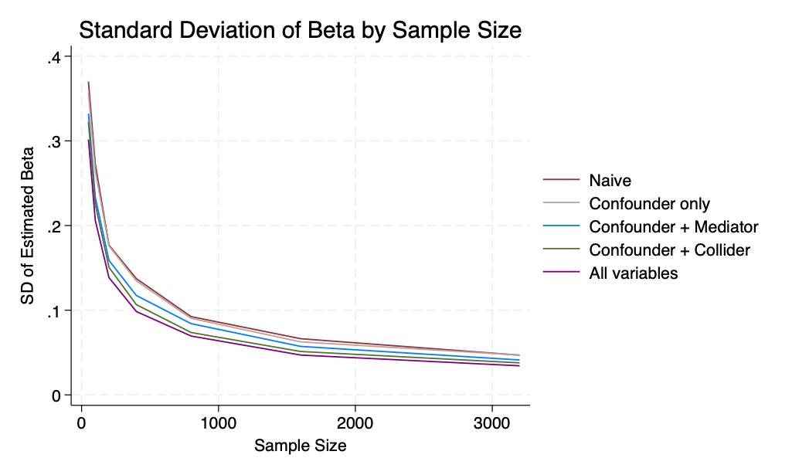
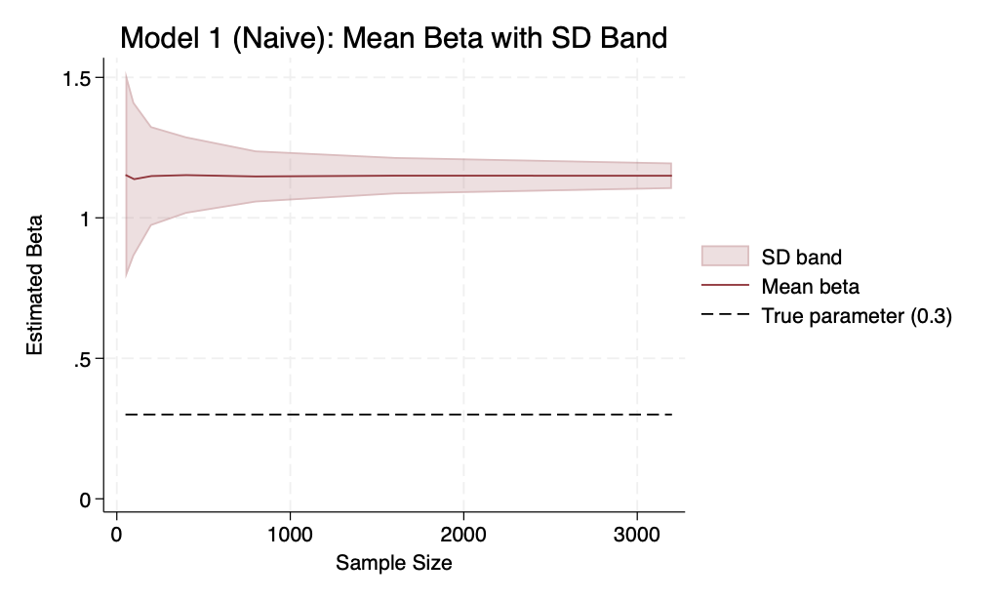
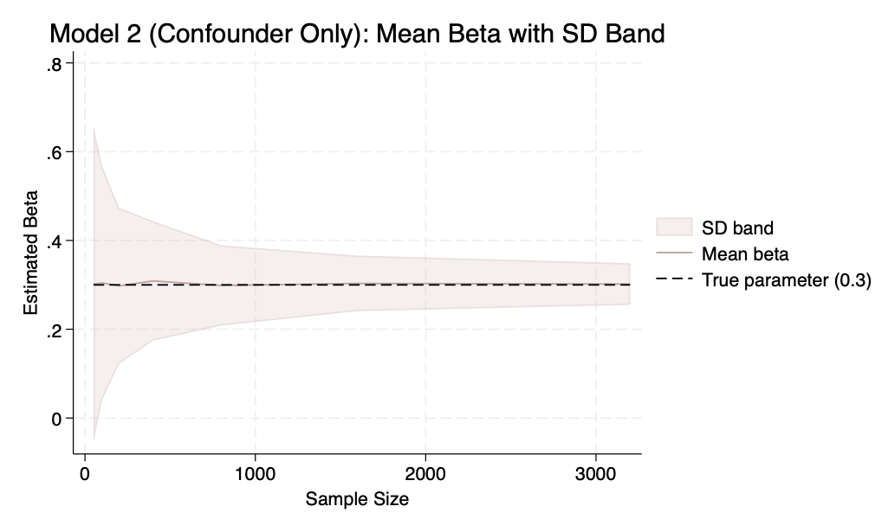
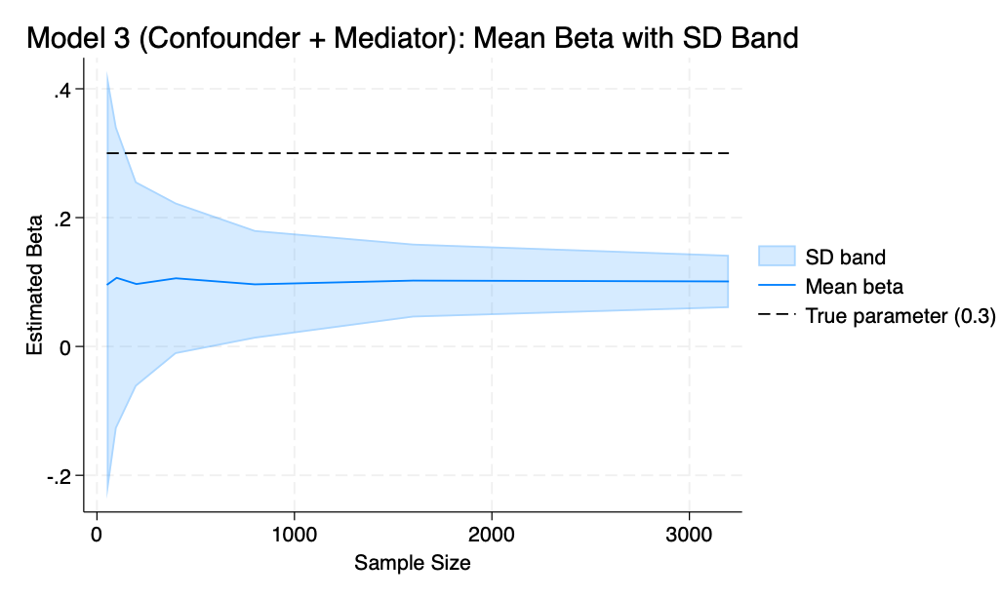
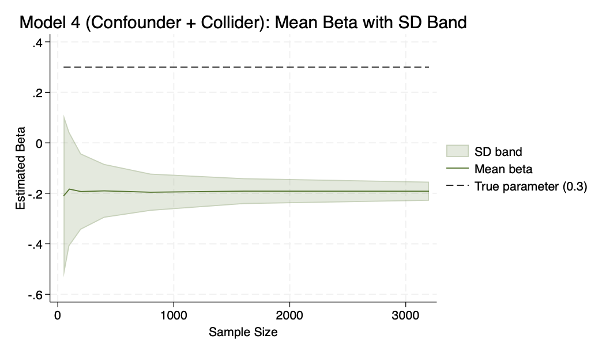
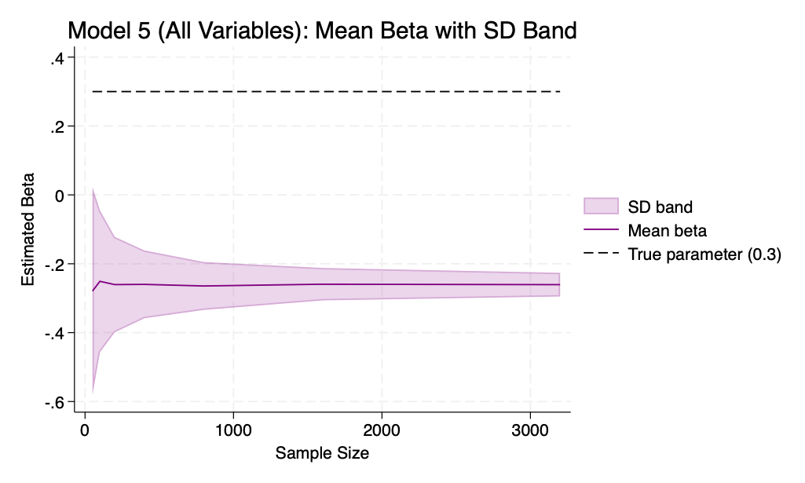
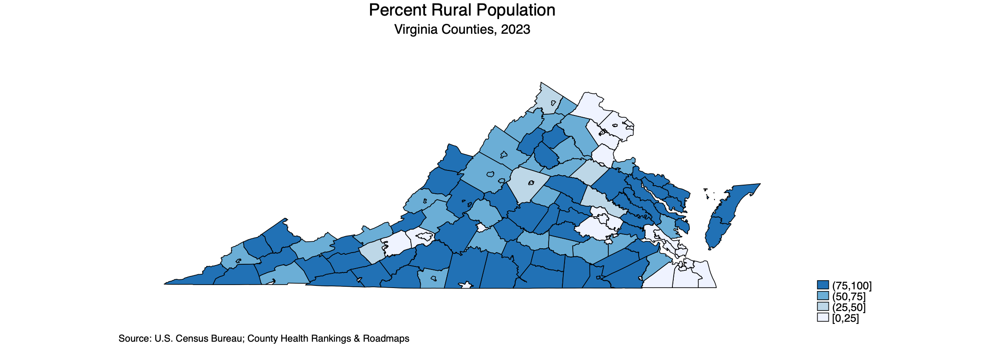

# Part 1: Fuzzy Matching

**1) How many wards exist both in 2010 and 2015?**  
2,379 wards

**2) How many are "parentless" wards (i.e. exist in 2015 but not in 2010)**  
1,565 wards

**3) How many are "orphan" wards? (i.e. exist in 2010 but not in 2015)**  
954 wards

**4) How many wards were divided into two wards between 2010 and 2015?**  
466 wards

**5) How many wards were divided into three or more wards between 2010 and 2015?**  
37 wards

**6) List regions along with the rate of ward division:**

| Region            | Total Wards (2010) | Number Split | Division Rate (%) |
|------------------|-------------------|--------------|-------------------|
| Kagera           | 180               | 9            | 5.00              |
| Singida          | 123               | 9            | 7.32              |
| Shinyanga        | 118               | 9            | 7.63              |
| Kilimanjaro      | 152               | 13           | 8.55              |
| Iringa           | 91                | 8            | 8.79              |
| Lindi            | 133               | 12           | 9.02              |
| Njombe           | 96                | 9            | 9.38              |
| Mbeya            | 215               | 21           | 9.77              |
| Dodoma           | 188               | 20           | 10.64             |
| Pwani            | 106               | 12           | 11.32             |
| Tanga            | 209               | 26           | 12.44             |
| Ruvuma           | 139               | 20           | 14.39             |
| Dar es Salaam    | 89                | 13           | 14.61             |
| Manyara          | 122               | 18           | 14.75             |
| Mara             | 152               | 23           | 15.13             |
| Simiyu           | 111               | 19           | 17.12             |
| Tabora           | 166               | 30           | 18.07             |
| Kigoma           | 109               | 22           | 20.18             |
| Geita            | 97                | 20           | 20.62             |
| Mwanza           | 153               | 34           | 22.22             |
| Arusha           | 122               | 30           | 24.59             |
| Mtwara           | 148               | 39           | 26.35             |
| Katavi           | 42                | 12           | 28.57             |
| Morogoro         | 152               | 50           | 32.89             |
| Rukwa            | 63                | 25           | 39.68             |

# Part 2: De-biasing a parameter estimate using controls

## Results

**Table 1.** Each cell reports the mean and standard deviation of the estimated treatment coefficient across simulation replications.

| Sample Size | Mean (Naive) | SD (Naive) | Mean (Confounder) | SD (Confounder) | Mean (Conf + Mediator) | SD (Conf + Mediator) | Mean (Conf + Collider) | SD (Conf + Collider) | Mean (All Vars) | SD (All Vars) |
|------------:|-------------:|-----------:|------------------:|----------------:|-----------------------:|---------------------:|------------------------:|----------------------:|----------------:|---------------:|
| 50   | 1.1528 | 0.3701 | 0.3017 | 0.3563 | 0.0956 | 0.3321 | -0.2104 | 0.3223 | -0.2792 | 0.3015 |
| 100  | 1.1377 | 0.2728 | 0.3043 | 0.2644 | 0.1066 | 0.2334 | -0.1832 | 0.2253 | -0.2509 | 0.2060 |
| 200  | 1.1488 | 0.1769 | 0.2977 | 0.1759 | 0.0969 | 0.1588 | -0.1930 | 0.1507 | -0.2605 | 0.1385 |
| 400  | 1.1521 | 0.1373 | 0.3089 | 0.1347 | 0.1058 | 0.1174 | -0.1902 | 0.1066 | -0.2598 | 0.0984 |
| 800  | 1.1473 | 0.0925 | 0.2987 | 0.0905 | 0.0965 | 0.0841 | -0.1956 | 0.0737 | -0.2645 | 0.0695 |
| 1600 | 1.1501 | 0.0664 | 0.3033 | 0.0626 | 0.1023 | 0.0573 | -0.1912 | 0.0513 | -0.2592 | 0.0471 |
| 3200 | 1.1499 | 0.0469 | 0.3019 | 0.0470 | 0.1010 | 0.0412 | -0.1916 | 0.0378 | -0.2606 | 0.0343 |

**Figure 1** The standard deviation of the estimated treatment effects decreases as sample size increases, indicating improved precision. Table 1 shows that in correctly specified models, larger samples lead to more precise estimates that converge to the true parameter. However, in misspecified models (e.g., Models 4 and 5), increasing sample size results in more precise but still biased estimates.

**Figure 2. Model 1: Naive Regression**  
We can see from Table 1 and in Figure 2 below, that the naive model is biased upward. This is because we have omitted the confounder and attributed its effect on the outcome variable, to the treatment variable. 

**Figure 3. Model 2: Includes Confounder**    
This model correctly recovers the total treatment effect of approximately 0.3 by including the confounder. As sample size increases, the estimate converges to the true parameter with decreasing variance.

**Figure 4. Model 3: Includes Confounder & Mediator**    
This model correctly estimates the direct effect of the treatment (approx. 0.1)) by controlling for the mediator. However, in so doing, we are blocking the causal pathway, and so the estimates are smaller than the total effect.

**Figure 5. Model 4: Includes Confounder & Collider**    
This model is biased and the estimated beta is smaller than the true total effect. Conditioning the regression on a collider usually results in an artifical negative correlation, and we are introducing bias. 

**Figure 6. Model 5: Includes Everything**    
This model remains biased due to inclusion of the collider, which induces a spurious relationship between treatment and the outcome. While the mediator attenuates the estimate by blocking part of the causal effect, the collider leads to an incorrect estimate, regardless of sample size.

# Part 3: Spatial Analysis

I used two data sources to make the cloropleth map.
1) [U.S. Census Bureau](https://www.census.gov/geographies/mapping-files/time-series/geo/cartographic-boundary.2020.html)
2) [County Health Rankings & Roadmaps](https://www.countyhealthrankings.org/health-data/virginia/data-and-resources)

