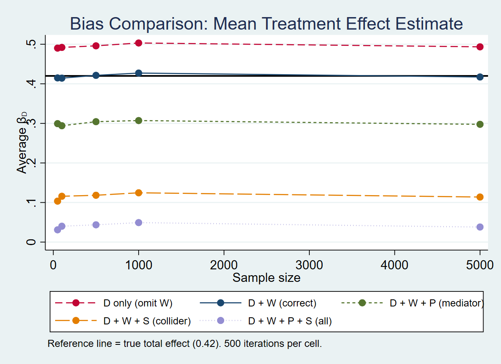
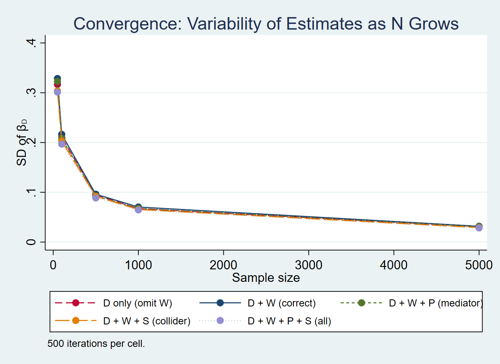

# Part 2: De-biasing a Parameter Estimate Using Controls
# Qingfeng Yu

## 1. Data Generating Process (DGP)

The simulation builds a causal system containing one binary treatment, one outcome, and three covariates that each play a distinct causal role. The underlying DAG can be summarised as:

```         
    W ──→ D ──→ P ──→ Y
    │                 ↑
    └─────────────────┘
          D ──→ S ←── Y
```

Each variable is constructed as follows:

-   **Confounder W** \~ Uniform(0, 1). W directly influences both treatment assignment and the outcome. When W is left out of the regression, the estimated treatment effect is biased upward because W induces a positive spurious correlation between D and Y.
-   **Treatment D** \~ Bernoulli(0.25 + 0.45·W). The likelihood of receiving treatment rises with W, creating a systematic link between D and the confounder.
-   **Outcome Y** = 0.3·D + 0.5·W + 0.3·P + ε, where ε \~ N(0, 1). D has a direct causal effect of 0.3 on Y, and an additional indirect channel runs through the mediator P.
-   **Mediator P** = 0.4·D + η, where η \~ N(0, 1). P sits on the causal pathway D → P → Y. Including P as a control blocks this indirect pathway, attenuating the estimated effect toward the direct-only component.
-   **Collider S** = 0.5·D + 0.5·Y + ν, where ν \~ N(0, 1). S is a common consequence of both D and Y. Conditioning on S artificially opens a non-causal association between D and Y, distorting the estimate downward.

The **true total effect** of D on Y equals 0.3 (direct) + 0.3 × 0.4 (indirect through P) = **0.42**.

## 2. Regression Specifications

Five models are estimated to illustrate how different covariate choices affect the recovery of the treatment effect:

| Spec | Formula | Purpose |
|------------------|---------------------------|---------------------------|
| 1 | Y \~ D | Confounder W omitted → expect upward bias |
| 2 | Y \~ D + W | Correct specification → should recover the total effect (0.42) |
| 3 | Y \~ D + W + P | Mediator included → blocks indirect path, estimate shrinks toward the direct effect (0.30) |
| 4 | Y \~ D + W + S | Collider included → opens a spurious path, introduces downward bias |
| 5 | Y \~ D + W + P + S | Both mediator and collider → compounding distortions, most severe bias |

## 3. Simulation Design

Each specification is estimated 500 times at each of five sample sizes: N ∈ {50, 100, 500, 1000, 5000}. Every iteration draws a fresh dataset from the DGP and runs all five regressions. The coefficient on D is recorded from each.

## 4. Results

### 4.1 Bias (Mean of β̂)



The figure plots the average estimated coefficient on D across 500 iterations for each specification and sample size. The solid black line marks the true total effect of 0.42.

-   **Spec 2 (D + W)** is unbiased: its mean hovers right at 0.42 across all sample sizes, confirming that including the confounder alone is sufficient to identify the total causal effect.
-   **Spec 1 (D only)** is consistently biased upward, averaging around 0.50. Omitting W leaves confounding variation in the error term, inflating the coefficient on D. Critically, this bias does not diminish as N grows — it is a structural misspecification, not a finite-sample problem.
-   **Spec 3 (D + W + P)** settles near 0.30, which is the direct effect of D on Y. By conditioning on the mediator P, the indirect pathway D → P → Y is blocked, so the regression can only capture the direct component. This is not "bias" in the usual sense — the model is consistently estimating a different causal quantity.
-   **Spec 4 (D + W + S)** is biased downward to roughly 0.11. Including the collider S opens a spurious back-door path between D and Y, pulling the estimate well below the truth.
-   **Spec 5 (D + W + P + S)** exhibits the most extreme distortion, with the mean near 0.04. The mediator attenuates the effect while the collider introduces additional negative bias, compounding both problems.

All five curves are essentially flat across N, demonstrating that these biases are properties of the model specification, not the sample size.

### 4.2 Convergence (SD of β̂)



The second figure shows the standard deviation of the estimated treatment effect. All five specifications display the expected convergence behaviour: variability falls at a rate proportional to 1/√N. At N = 50 the SD ranges between 0.20 and 0.33; by N = 5000 all models have converged to an SD below 0.03.

The convergence rates are broadly comparable across specifications, with Spec 1 (D only) showing marginally higher variance at small N because the omitted confounder adds residual noise.

## 5. Key Takeaways

1.  **Omitting a confounder** creates a persistent bias that larger samples cannot resolve. The only fix is to include the relevant variable in the model.
2.  **Including the correct confounder** (Spec 2) eliminates bias and recovers the true total effect at every sample size tested.
3.  **Controlling for a mediator** shifts the estimand from the total effect to the direct effect. Whether this is desirable depends on the research question — researchers must be explicit about which quantity they aim to identify.
4.  **Controlling for a collider** is unambiguously harmful: it manufactures a spurious association that substantially distorts the estimate downward.
5.  **Precision and accuracy are distinct.** All five models converge in variance as N grows, but a precisely estimated wrong number is still wrong. Convergence in SD does not imply convergence to the truth.
