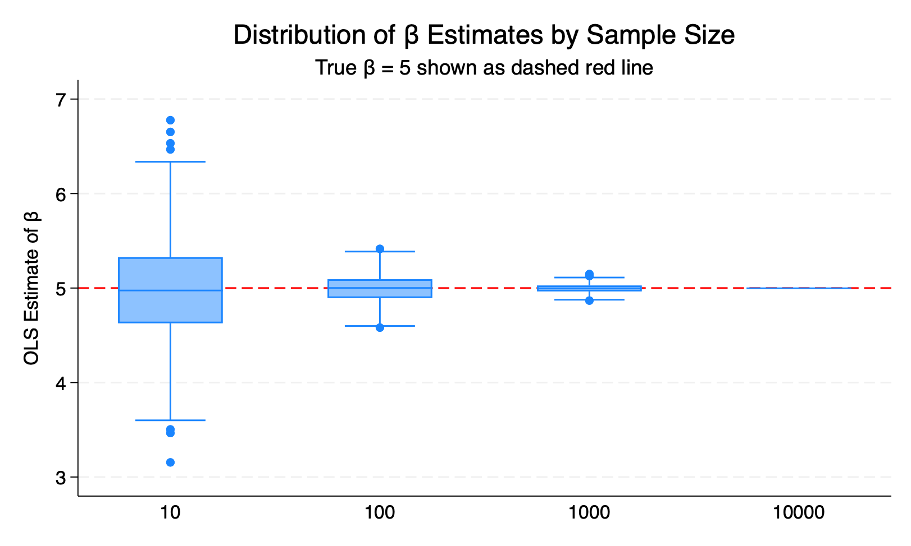
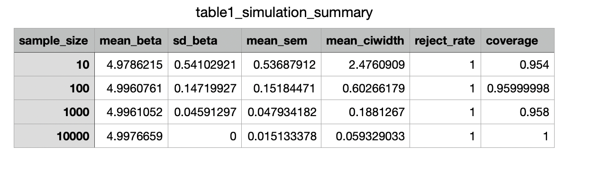

The graph:

The box plot visually confirms the precision findings above. At N = 10, the interquartile range is wide and outliers are common. As N increases, the boxes compress tightly around the true value of 5. By N = 10,000, the box collapses to nearly a single line at β̂ ≈ 5, since all 500 simulations draw the entire population and produce near-identical estimates.

The table:

All sample sizes achieve a 100% rejection rate of H₀: β = 0. This is expected because the true β = 5 is large relative to the noise. Even at N = 10, the signal is strong enough to consistently detect.

Across all sample sizes, the mean β̂ is extremely close to the true value of 5: from 4.9786 (N=10) to 4.9977 (N=10,000). This confirms that OLS is an unbiased estimator regardless of sample size when the classical assumptions hold.