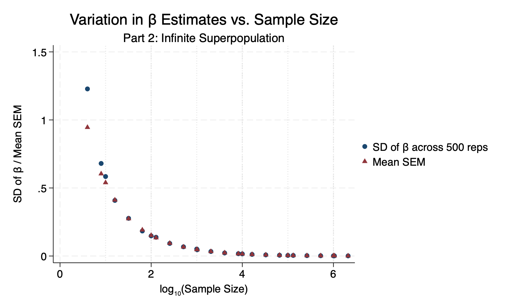
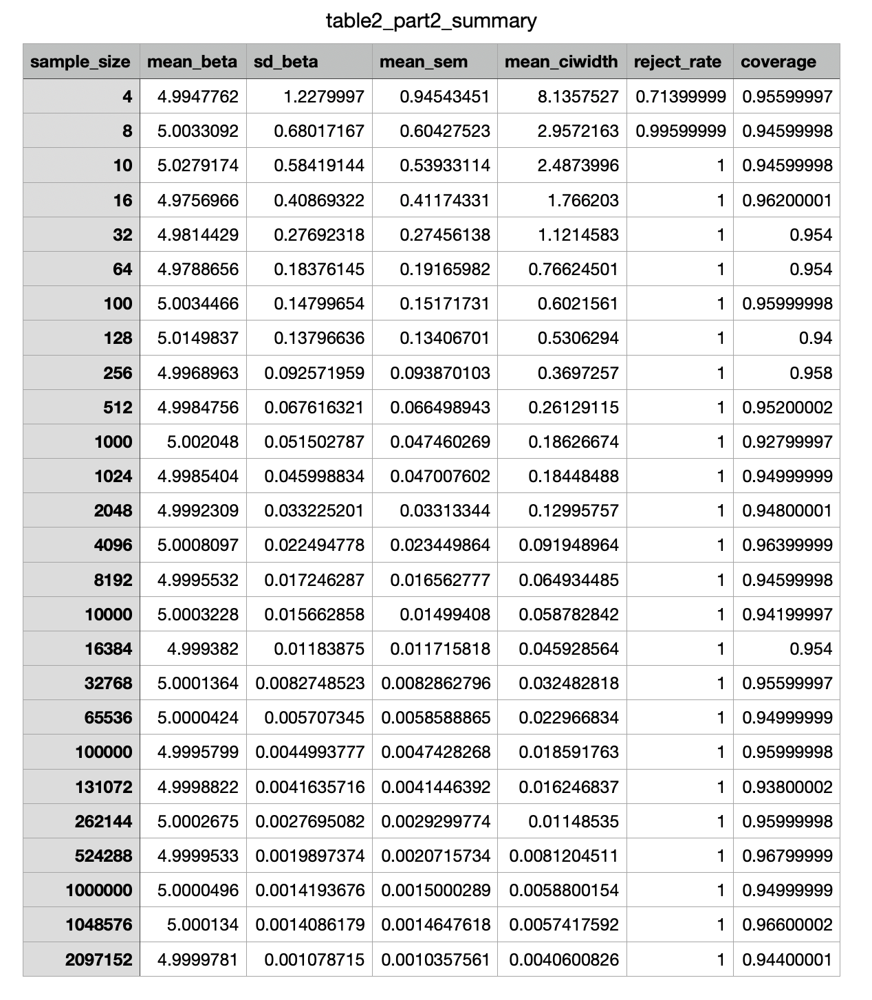

The graph:

Both the SD of β̂ across simulations and the mean SEM decline steadily along a straight line when plotted on a log scale. This confirms the theoretical 1/√N relationship. The two series overlap closely. This validates that the SEM is an accurate estimate of the true sampling variability.

The table:

The mean SEM and CI width are nearly identical between the two parts at N = 10,000 (0.0151 vs. 0.0150), but SD(β̂) is 0.0000 in Part 1 and 0.0157 in Part 2. At smaller N (10, 100, 1,000), the two parts produce very similar SD(β̂) and CI widths. I think it is because a small sample drawn from a large finite population behaves nearly identically to a sample from an infinite one.
At N = 10, 000, and 1,000 the two parts are nearly indistinguishable. This confirms that finite-population and superpopulation sampling agree when the sample is a small fraction of the population.