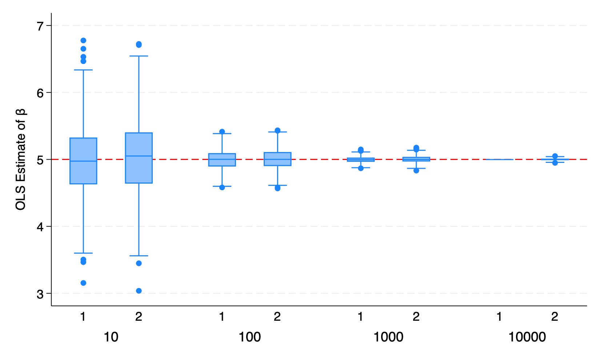
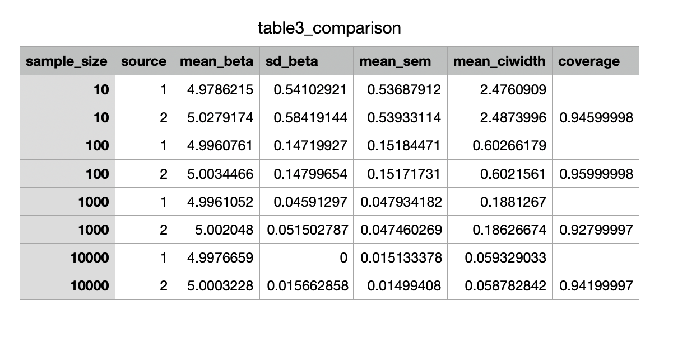

With 15% of enrolled participants attrite before outcome measurement, we need to over-enroll so that enough people remain after attritio to maintain 80% power. This requires enrolling additionally 555 individuals to compensate for expected dropouts. After 15% attrition, approximately 3145 individuals remain.

When treatment is expensive and only 30% of the sample can be treated, the 50:50 allocation is no longer possible. Unequa allocation reduces statistical efficiency because the smaller treatment arm is the binding constraint on power. There are additionally 602 people must be enrolled. 

Comparison:
The graph:

The table:

Unbiasedness holds in both parts at all N. Mean β̂ stays very close to the true value of 5 across every row. This confirms OLS is unbiased regardless of whether data come from a fixed or infinite population.
At N = 10, 100, and 1,000, the two parts are nearly indistinguishable. The SD(β̂), mean SEM, and CI width are essentially identical between source 1 and source 2 at these sample sizes. For example at N = 100: SD = 0.1472 vs 0.1480, CI width = 0.6027 vs 0.6022. This confirms the theoretical expectation: when the sample is a small fraction of the total population (e.g. N=1,000 out of 10,000).
At N = 10,000, the divergence is stark and is the most important finding in the table. Mean SEM is virtually identical: 0.0151 (Part 1) vs. 0.0150 (Part 2), but SD(β̂) is 0.0000 in Part 1 and 0.0157 in Part 2.

The figure shows β̂ distributions at N = 10, 100, 1,000, and 10,000 with source 1 (Fixed Population) and source 2 (Superpopulation) shown side by side within each sample size group.
At N = 10, both boxes are wide and nearly identical, with whiskers stretching from roughly 3.1 to 6.8 and several outliers visible above 6.5. The interquartile ranges overlap closely between source 1 and source 2.
At N = 100, both boxes compress substantially and remain very similar. The boxes span approximately 4.7 to 5.3 with whiskers reaching to about 4.5 and 5.5. A few outliers are visible but rare. Again, source 1 and source 2 are nearly indistinguishable.
At N = 1,000, the boxes are tight and centered precisely on 5, with only a handful of mild outliers. The slight additional spread in Part 2 (SD = 0.052 vs 0.046) is visible as a marginally wider box for source 2, but the difference is subtle. This reflects the growing finite-population correction effect as N = 1,000 represents 10% of the 10,000-person fixed population.