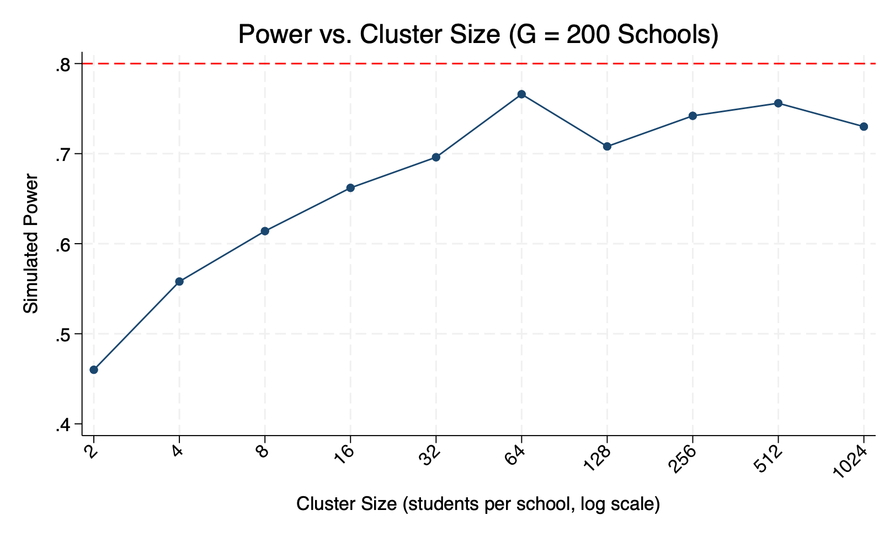
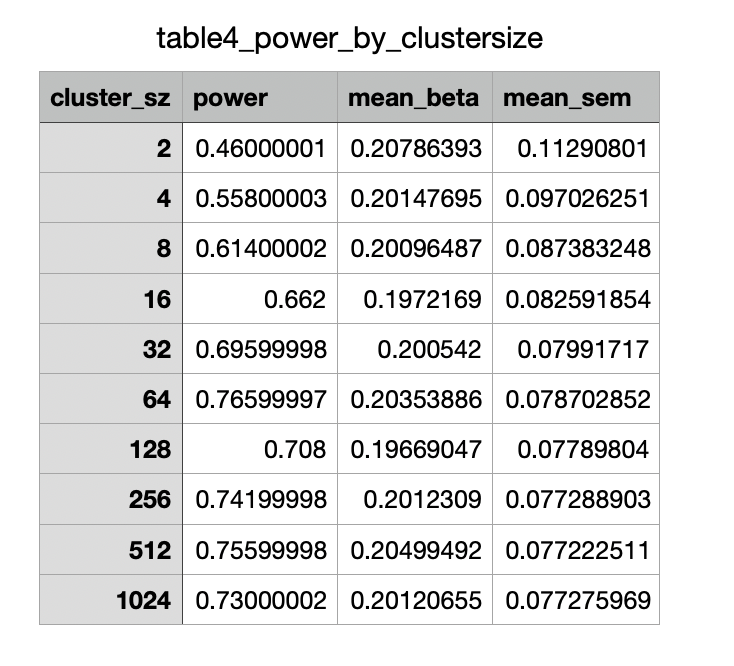
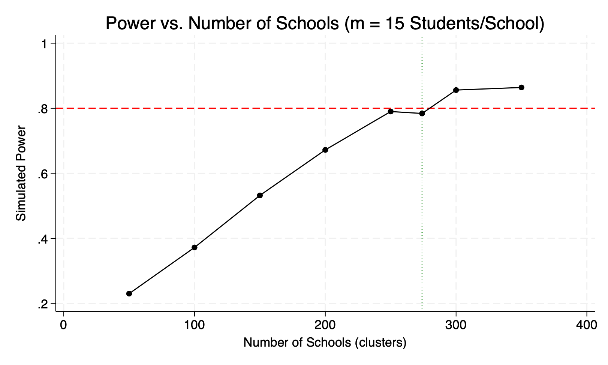
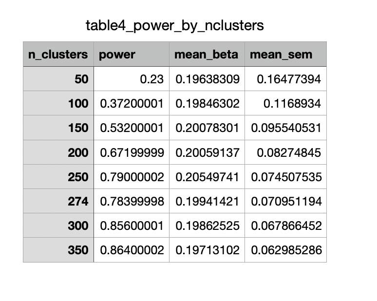
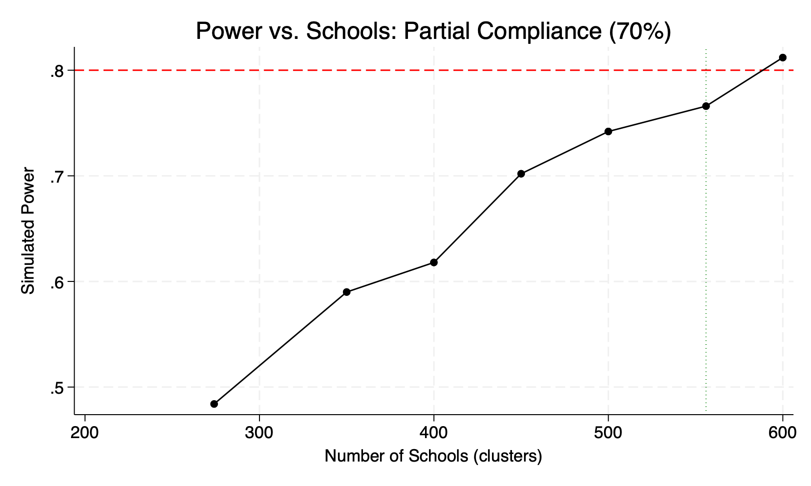
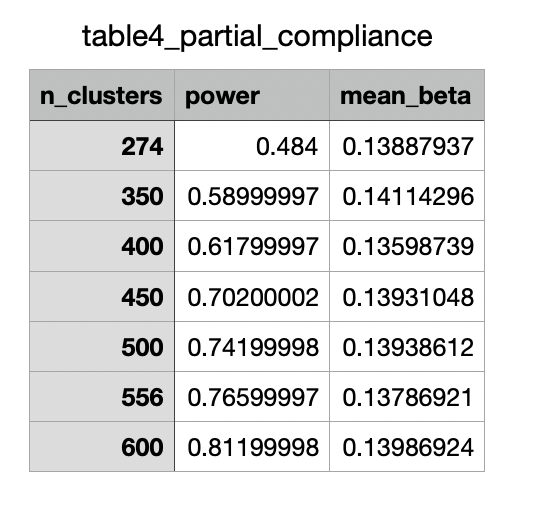

The graph:

The table:

With only 200 schools, power never reaches 80% regardless of cluster size. Power increases quickly at first as m grows, but then decreases. With high ICC, the between-school variance dominates. Recommend m=32-64 students per school. This is where the power curve is still rising meaningfully. Beyond m=64, each additional students per school contributes very little statistical power while adding survey costs linearly.

The graph:

The table:

Fixing cluster size at m=15 students per school, the min number of schools needed for 80%power was 274 schools.

The graph:

The table:

Minimum required: 556 schools (278 per arm)
This is 282 more schools than the full-compliance scenario — more than double the original 274. Partial compliance is extremely costly in cluster RCTs because:
The effect size shrinks;
Cluster RCTs already require many clusters due to the ICC penalty;
These two forces multiply together.