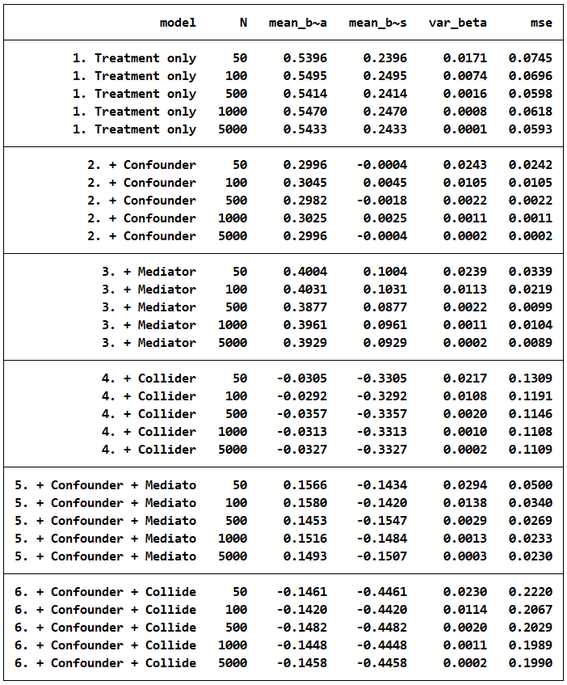
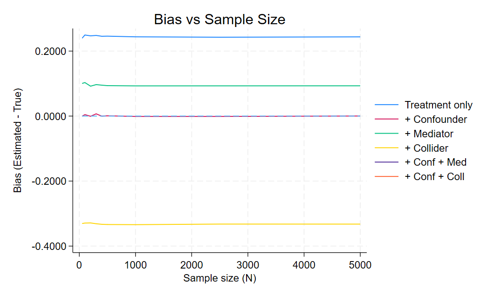
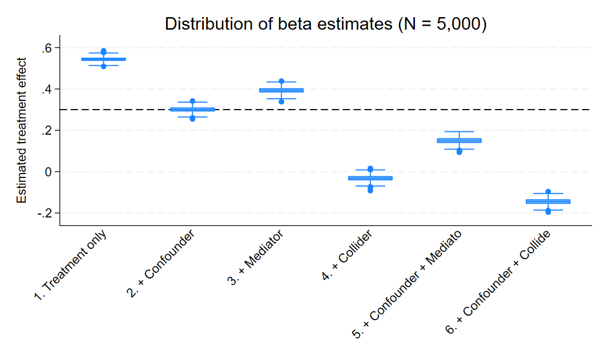

# Stata 4 Part 2

This table shows the effects on beta (the relationship between the treatment and the outcome) depending on the controls. We can see that when the outcome if regressed on the treatment only, there is a consistent upward bias from the true relationship of 0.3. When the confounder is controlled for, the bias goes away. When the mediator is controlled for, there is negative bias (or an underestimat of the true effect of the treatment). When the collider is controlled for there is an even greater negative bias. controlling for combinations of confounder with the other two types result in biases as well. 

This shows that confounders are the only things that should be controlled for to erase bias in our regressions.

This graph shows that sample size doesn't affect the coefficient on beta very much.

This graph shows us the same thing that the table showed us. Regressing the outcome on thre treatment and controlling for confounders results in negating biases.