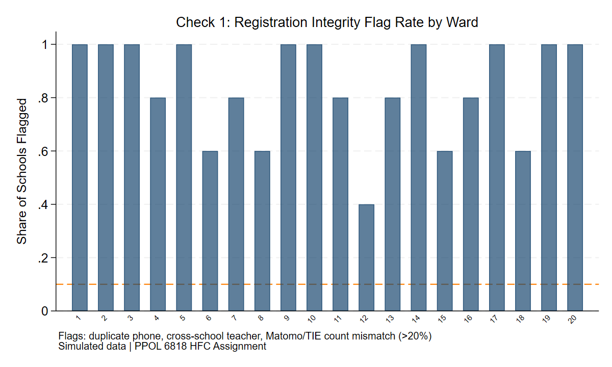
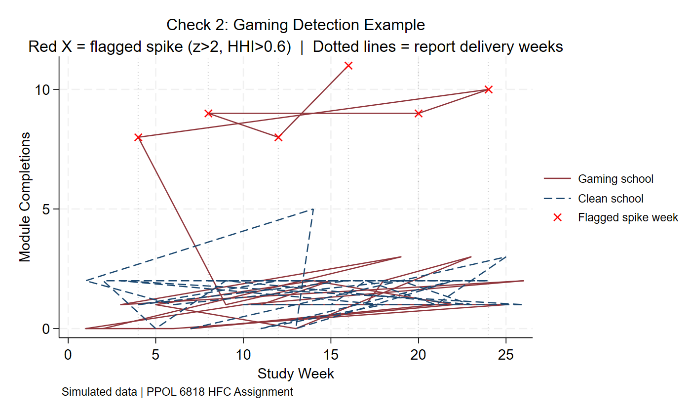
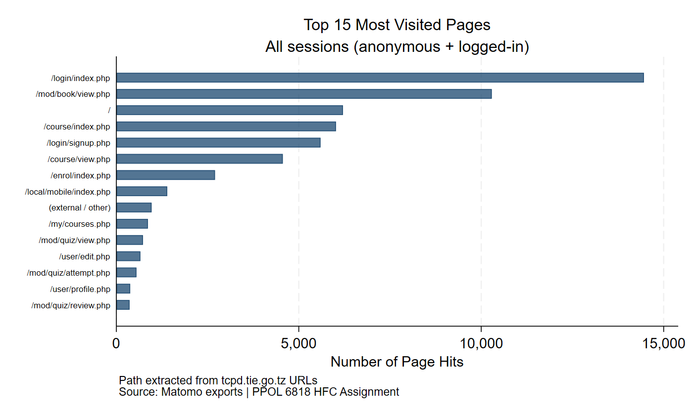
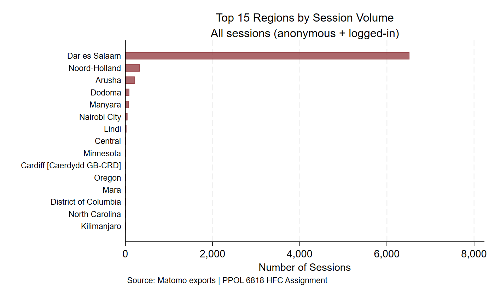
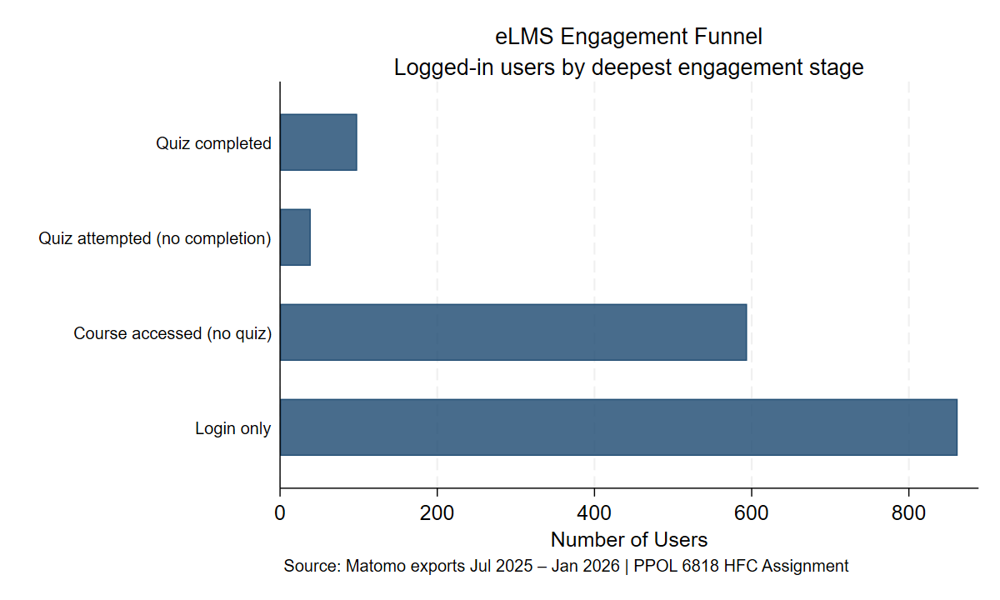
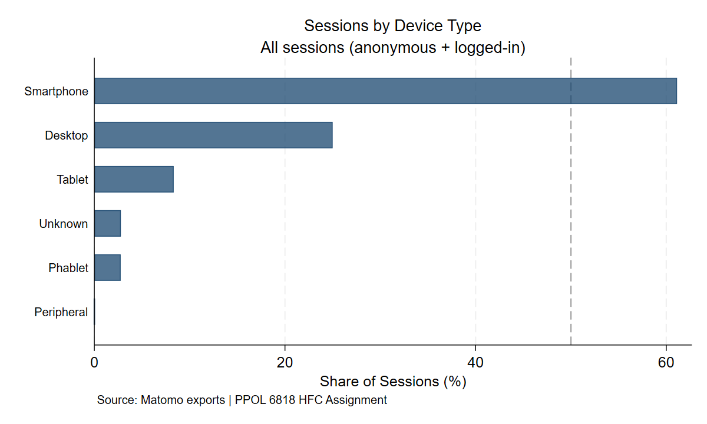
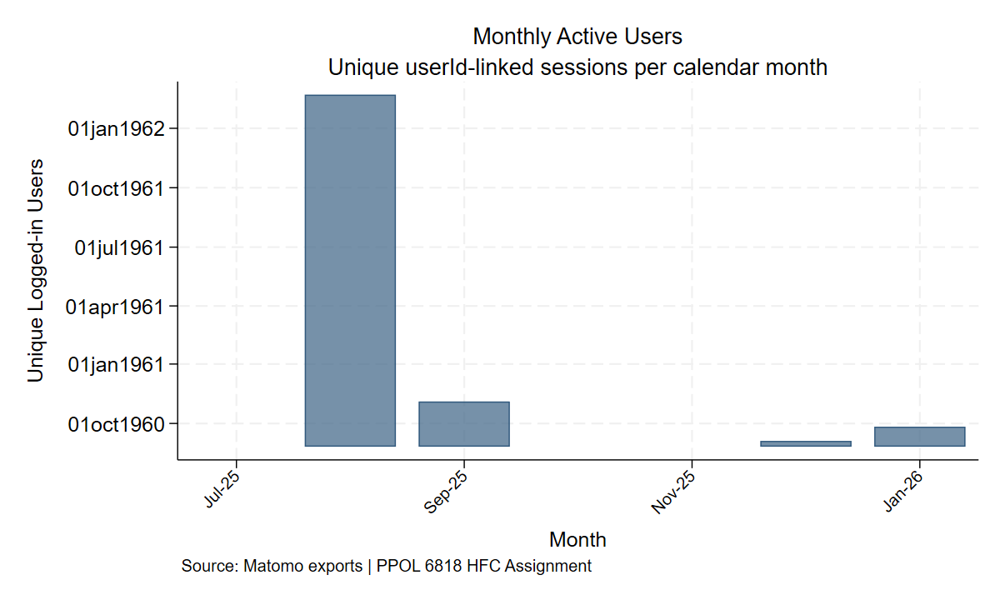
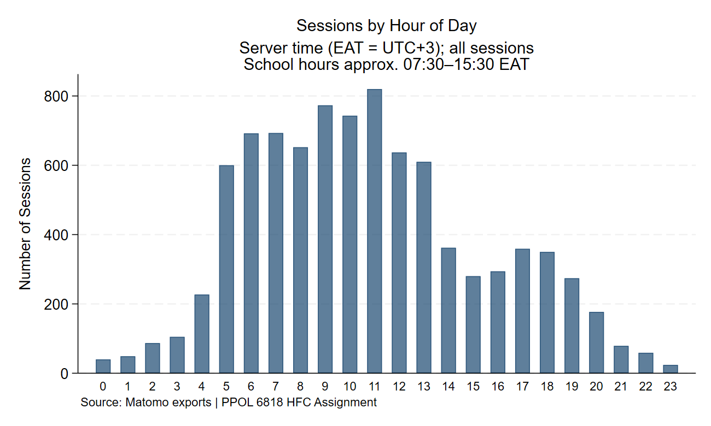
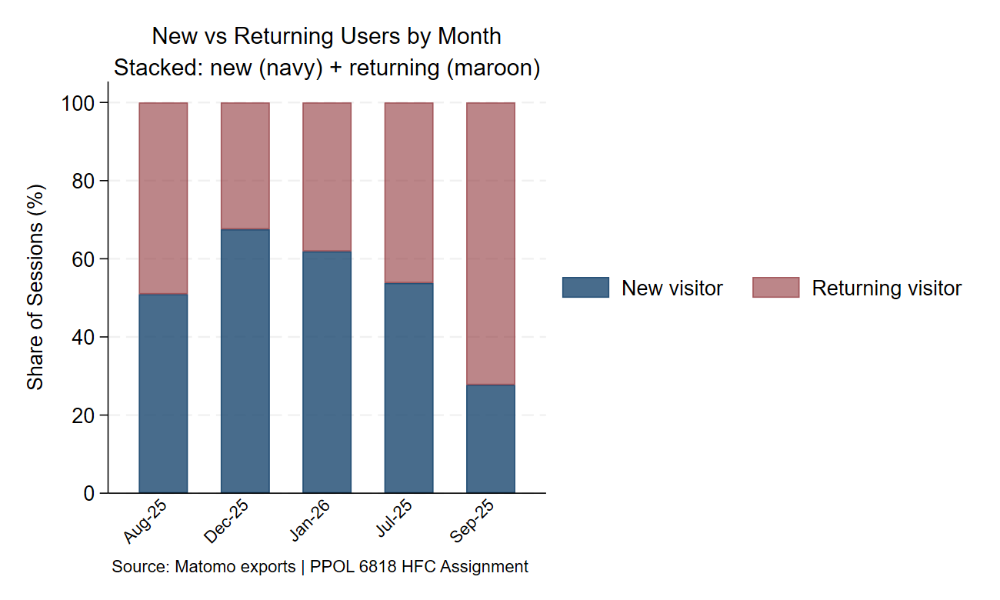
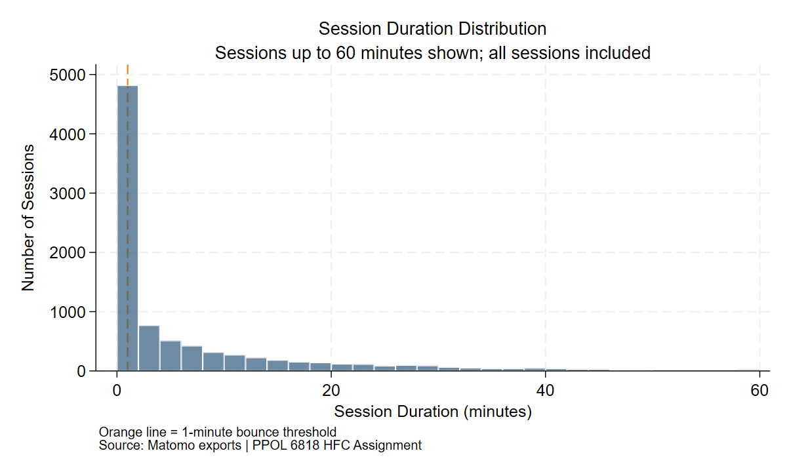

```{r setup, include=FALSE}
# If running Stata chunks live via statamarkdown:
# install.packages("Statamarkdown")
# library(Statamarkdown)
# stataexe <- "C:/Program Files/Stata18/StataSE-64.exe"  # adjust path
# knitr::opts_chunk$set(engine.path = list(stata = stataexe))

# For static display (eval: false), outputs are inserted as pre-rendered images.
library(knitr)
```

## Study Overview

This document presents three **High Frequency Checks (HFCs)** for the Tanzania eLMS RCT described in our Pre-Analysis Plan (PAP). The study evaluates whether a monthly ward-level school ranking — delivered to Ward Education Officers (WEOs) — increases eLMS module completion rates among Tanzanian teachers under the MEWAKA programme. The design is a three-arm cluster-RCT (Control / T1-Visibility / T2-Visibility+Accountability) randomized at the ward level, with 120 wards, ~600 schools, and ~9,000 registered teachers.

Each HFC targets a context-specific data quality issue that, if left undetected, would corrupt either the primary outcome (school-level completion rate), the equity stratification variable (composite resource index), or the post-intervention survey data. The checks are designed to run at regular intervals during data collection and flag problems before analysis.

---

## Check 1: Teacher Registration Integrity

### Issue

Tanzania's eLMS has over 112,000 registered teachers but fewer than 2% have completed a module assessment. A critical data quality risk is **duplicate teacher registrations** — the same teacher appearing under multiple accounts due to name spelling variants, different phone numbers, or re-registration after a school transfer. This inflates the denominator of the school-level completion rate (the primary outcome), systematically understating engagement, potentially differently across treatment arms.

This problem is uniquely damaging for this study because the **composite resource index** — used for stratification and the equity hypothesis H3 — includes "number of registered eLMS teachers per school" from TIE administrative records. If Matomo's teacher count diverges substantially from TIE records due to duplicates or mid-study transfers, the resource index that determines low-resource vs. high-resource ward classification is corrupted. The check flags three patterns: (1) duplicate phone numbers within a school (same person, multiple accounts); (2) a teacher ID appearing in more than one school simultaneously (impossible; indicates a merge error); and (3) Matomo-TIE teacher count mismatches exceeding 20%.

### Code

```{stata check1, engine="stata", eval=false}
* Run standalone: do "check1_duplicates.do"
* Key logic shown below; full simulation and export in the .do file.

use "data/sim_roster.dta", clear

* Flag 1: Duplicate phone within a school
duplicates tag phone school_id, gen(dup_phone_raw)
gen flag_dup_phone = (dup_phone_raw > 0)

* Flag 2: Teacher appearing in >1 school
bysort teacher_id: gen n_schools_per_teacher = _N
gen flag_cross_school = (n_schools_per_teacher > 1)

* Flag 3: Matomo count vs TIE admin count >20% divergence
bysort school_id: gen matomo_count = _N
gen count_ratio = matomo_count / tie_count
gen flag_count_mismatch = (count_ratio > 1.20 | count_ratio < 0.80)

* School-level summary
collapse (max) flag_dup_phone flag_cross_school flag_count_mismatch ///
         (mean) count_ratio (first) ward_id, by(school_id)
gen any_flag = (flag_dup_phone | flag_cross_school | flag_count_mismatch)

export excel using "output/check1_flagged_schools.xlsx", ///
    sheet("Flagged Schools") firstrow(variables) replace

graph bar (mean) any_flag, over(ward_id) ///
    title("Check 1: Registration Flag Rate by Ward") ///
    ytitle("Share of Schools Flagged")
graph export "output/check1_flag_rate.png", replace
```

### Output

The check produces a school-level Excel flag table and a ward-level bar chart. Schools with any flag are prioritised for manual verification against TIE administrative records before the intervention launch.

```{r check1-output, echo=FALSE, eval=true, out.width="80%", fig.cap="Share of schools with at least one registration integrity flag, by ward. Simulated data with ~5% duplicate phones, ~3% cross-school teachers, and ~10% Matomo-TIE count mismatches injected."}
if (file.exists("output/check1_flag_rate.png")) {
  
} else {
  cat("[Run check1_duplicates.do to generate this figure]")
}
```

**Connection to PAP:** Section 2.2.4 uses "number of registered eLMS teachers per school" as a stratification component. Section 3.2.3 constructs the primary outcome as the share of *registered* teachers completing at least one module — making the denominator integrity essential.

---

## Check 2: Post-Report Completion Spike Detection

### Issue

The PAP's threat table (Section 2.3.4) identifies **headteacher gaming** as a key risk: headteachers in treated wards — particularly T2, which includes a structured WEO accountability prompt — may pressure a small subset of teachers to complete modules immediately after the monthly ward-ranking report is delivered. This inflates the school's completion metric without representing genuine engagement.

The PAP uses the Herfindahl-Hirschman Index (HHI) of within-school completions as a post-hoc metric, but a proactive HFC can detect gaming *during* the intervention by examining the **timing** of completions relative to report delivery dates. Genuine behavioral change would manifest as a gradual rise in completions over several weeks; gaming would appear as an abrupt spike in the week immediately following each monthly report, concentrated among the same few teachers. This check combines two signals: a z-score of post-delivery week completions (relative to the school's own non-report-week baseline) and the within-school HHI of those completions. Schools with z-score > 2 **and** HHI > 0.6 in at least two report months are flagged as priority for the endline survey's self-reported coercion module.

### Code

```{stata check2, engine="stata", eval=false}
* Run standalone: do "check2_gaming.do"

use "data/sim_matomo_weekly.dta", clear
keep if arm != "control"
sort school_id week

* Baseline: mean and SD computed over non-report weeks only.
* Using non-report weeks prevents prior gaming spikes from contaminating
* the baseline mean/SD, which would mask future spikes in the z-score.
bysort school_id: egen baseline_mean = mean(completions) if report_week == 0
bysort school_id: egen baseline_sd   = sd(completions)   if report_week == 0

* Propagate to all weeks for the same school (including report weeks)
bysort school_id (baseline_mean): replace baseline_mean = baseline_mean[1] ///
    if missing(baseline_mean)
bysort school_id (baseline_sd): replace baseline_sd = baseline_sd[1] ///
    if missing(baseline_sd)

* Floor SD at 0.5 to avoid division-by-zero in low-variance schools
replace baseline_sd = 0.5 if baseline_sd < 0.5 | missing(baseline_sd)

* Z-score and HHI on report delivery weeks only
gen z_score = (completions - baseline_mean) / baseline_sd if report_week == 1

gen hhi = .
replace hhi = 1 - (n_completing_teachers / completions) ///
    if report_week == 1 & completions > 0
replace hhi = 0 if report_week == 1 & completions == 0

* Flag: spike + concentration; priority if flagged in >=2 report months
gen flag_spike = (z_score > 2 & hhi > 0.60 & !missing(z_score) & !missing(hhi))

bysort school_id: gen max_flags = sum(flag_spike)
gen priority_flag = (max_flags[_N] >= 2)

* Export priority-flagged schools
preserve
    keep if priority_flag == 1
    keep school_id ward_id arm max_flags
    if _N > 0 {
        duplicates drop school_id, force
        export excel school_id ward_id arm max_flags ///
            using "output/check2_gaming_flags.xlsx", ///
            sheet("Priority Schools") firstrow(variables) replace
    }
restore
```

### Output

```{r check2-output, echo=FALSE, eval=true, out.width="90%", fig.cap="Example time-series comparison: a gaming school (red, solid) vs. a clean school (navy, dashed). Report delivery weeks are marked with dotted vertical lines. Red X marks flagged spike events (z>2, HHI>0.6). Simulated data."}
if (file.exists("output/check2_spike_example.png")) {
  
} else {
  cat("[Run check2_gaming.do to generate this figure]")
}
```

The companion Excel file (`output/check2_gaming_flags.xlsx`) lists all priority-flagged schools with their ward, treatment arm, and number of flagged months.

**Connection to PAP:** Directly addresses the "Headteacher gaming" threat in Section 2.3.4. The within-school completion concentration (HHI) is a pre-specified primary outcome (Section 3.2.3), and the endline survey includes a self-reported coercion module (Section 3.2.4) to validate these flags.

---

## Check 3: Automated Matomo Data Cleaning & Descriptive Statistics

### Issue

The study's primary outcome is constructed entirely from Matomo web analytics exports — wide-format CSVs where each row is one user session and each in-session page action generates a separate column block (`actionDetails 0`, `actionDetails 1`, ...). Monthly exports have different column counts because different sessions had different numbers of page actions, making a naive `append` fail with variable type mismatches.

A second structural problem is that approximately 60% of sessions in the raw data have no `userId` — these are anonymous (not-logged-in) visits that cannot be attributed to a specific teacher. Because the eLMS allows browsing before login, and because some schools share devices, the `visitorId` browser cookie may represent multiple teachers. Treating all sessions as valid would inflate total usage estimates; using only `userId`-linked sessions gives a cleaner but conservative picture of registered teacher behaviour. This workflow automates the full cleaning pipeline — import any number of monthly CSV exports, rename, drop, append, clean, URL-match, collapse — and produces descriptive statistics and eight figures that directly inform the power calculation assumptions in Section 4 (baseline completion rate, SD, session frequency).

### Code

```{stata check3, engine="stata", eval=false}
* Run standalone: do "check3_matomo_workflow.do"
* Full pipeline shown below; handles any number of monthly CSV exports.

set maxvar 32767
clear all

* ============================================================
* USER SETTINGS — adjust these two paths only
* csv_dir : folder containing all monthly Matomo CSV exports
* out_dir : hfc_assignment folder for outputs
* ============================================================
local csv_dir "C:\Users\aqsaz\Documents\Georgetown\Spring 2026\Experimental Design\PAP"
local out_dir "C:\Users\aqsaz\Documents\Georgetown\Spring 2026\Experimental Design\PAP\hfc_assignment"

* ---- Program: clean one Matomo CSV in memory ----
capture program drop clean_matomo_csv
program define clean_matomo_csv

    * Rename v* columns via variable label (regex)
    capture rename time_to_initial_playactiondetail ttipactiondetails1
    foreach v of varlist v* {
        local lab : variable label `v'
        if      regexm(`"`lab'"', `"^time_to_initial_play \(actionDetails ([0-9]+)\)$"')     capture rename `v' ttipactiondetails`=regexs(1)'
        else if regexm(`"`lab'"', `"^pageLoadTimeMilliseconds \(actionDetails ([0-9]+)\)$"') capture rename `v' pltmsactiondetails`=regexs(1)'
        else if regexm(`"`lab'"', `"^siteSearchCategory \(actionDetails ([0-9]+)\)$"')       capture rename `v' ssearchcatactiondetails`=regexs(1)'
        else if regexm(`"`lab'"', `"^siteSearchKeyword \(actionDetails ([0-9]+)\)$"')        capture rename `v' ssearchkwactiondetails`=regexs(1)'
    }

    * Drop irrelevant variables
    capture drop *icon* *svg* visitecommerce* *ecommerce* totalabandoned* ///
        campaign* adclick* adprovider* sitecurrency* ///
        regioncode languagecode operatingsystemcode countrycode ///
        browsercode continentcode countryflag fingerprint ///
        pageidactiondetails* idpageviewactiondetails* timestampactiondetails* ///
        plugini* pageviewposition* sitesearchcount* ssearchcatactiondetails* ///
        pltmsactiondetails* ttipactiondetails* ssearchkwactiondetails* ///
        goalconversion* sitename sessionreplayurl events visitconverted* ///
        formconversions idsite
end

* ---- Dynamic import: scan folder for all Export*.csv files ----
local files : dir `"`csv_dir'"' files "Export*.csv"
local nfiles : word count `files'

local i = 1
foreach f of local files {
    import delimited using `"`csv_dir'\\`f'"', ///
        encoding("UTF-16LE") clear varnames(1) ///
        bindquote(strict) maxquotedrows(unlimited)

    clean_matomo_csv
    gen export_file_n = `i'
    save `"`out_dir'\\temp_chunk_`i'.dta"', replace
    local i = `i' + 1
}

* ---- Append all chunks (force handles differing column sets) ----
use `"`out_dir'\\temp_chunk_1.dta"', clear
forvalues j = 2/`nfiles' {
    append using `"`out_dir'\\temp_chunk_`j'.dta"', force
}
forvalues j = 1/`nfiles' {
    erase `"`out_dir'\\temp_chunk_`j'.dta"'
}
duplicates drop idvisit, force

* ---- Session-level cleaning ----
gen visit_date = date(serverdate, "YMD")
format visit_date %td

replace userid = strtrim(userid)
replace userid = "" if inlist(userid, "0", ".", "NA", "na", "N/A") | length(userid) < 5
gen has_userid = (userid != "" & !missing(userid))

* ---- URL pattern matching for module engagement events ----
gen quiz_attempt  = 0
gen quiz_complete = 0
gen course_visit  = 0
gen login_hit     = 0

foreach v of varlist urlactiondetails* {
    replace quiz_attempt  = 1 if regexm(`v', "/mod/quiz/attempt")          & `v' != ""
    replace quiz_complete = 1 if regexm(`v', "/mod/quiz/(summary|review)")  & `v' != ""
    replace course_visit  = 1 if regexm(`v', "/course/view")               & `v' != ""
    replace login_hit     = 1 if regexm(`v', "/login/index")               & `v' != ""
}
gen login_only = (login_hit == 1 & course_visit == 0 & quiz_attempt == 0)

save `"`out_dir'\matomo_sessions_clean.dta"', replace

* ---- Collapse to user level (logged-in sessions only) ----
keep if has_userid == 1
collapse ///
    (sum)   quiz_attempt quiz_complete course_visit login_only ///
    (count) total_sessions = idvisit ///
    (max)   days_since_last = dayssincelastvisit ///
    , by(userid)

gen ever_completed_quiz = (quiz_complete >= 1)
gen multi_session       = (total_sessions >= 2)
gen ever_visited_course = (course_visit >= 1)
gen login_only_user     = (total_sessions == login_only)

save `"`out_dir'\matomo_users_clean.dta"', replace
```

### Output

The workflow produces two cleaned datasets (`matomo_sessions_clean.dta` at session level, `matomo_users_clean.dta` at user level) and eight figures covering platform engagement, geography, device use, and temporal patterns.

#### Figure 1 — Top 15 Most Visited Pages

```{r check3-urls, echo=FALSE, eval=true, out.width="85%", fig.cap="Top 15 most visited URL paths on the eLMS (tcpd.tie.go.tz), by total page hits across all sessions. Source: actual Matomo exports, Jul 2025 – Jan 2026."}
if (file.exists("output/check3_top_urls.png")) {
  
} else {
  cat("[Run check3_matomo_workflow.do to generate this figure]")
}
```

#### Figure 2 — Top 15 Regions by Session Volume

```{r check3-regions, echo=FALSE, eval=true, out.width="85%", fig.cap="Top 15 geographic regions (or cities if region unavailable) by number of sessions. Source: actual Matomo exports, Jul 2025 – Jan 2026."}
if (file.exists("output/check3_top_regions.png")) {
  
} else {
  cat("[Run check3_matomo_workflow.do to generate this figure]")
}
```

#### Figure 3 — eLMS Engagement Funnel

```{r check3-funnel, echo=FALSE, eval=true, out.width="80%", fig.cap="eLMS engagement funnel: logged-in users by deepest stage of platform engagement (quiz completed > quiz attempted > course accessed > login only). Source: actual Matomo exports, Jul 2025 – Jan 2026."}
if (file.exists("output/check3_completion_funnel.png")) {
  
} else {
  cat("[Run check3_matomo_workflow.do to generate this figure]")
}
```

#### Figure 4 — Sessions by Device Type

```{r check3-device, echo=FALSE, eval=true, out.width="75%", fig.cap="Share of sessions by device type (mobile / desktop / tablet). Mobile dominance constrains module completion behaviour in low-connectivity schools. Source: actual Matomo exports."}
if (file.exists("output/check3_device_type.png")) {
  
} else {
  cat("[Run check3_matomo_workflow.do to generate this figure]")
}
```

#### Figure 5 — Monthly Active Users

```{r check3-monthly, echo=FALSE, eval=true, out.width="85%", fig.cap="Unique logged-in users (userId-linked sessions) per calendar month. Provides a real-time baseline trend for H1 and H2 as monthly exports accumulate. Source: actual Matomo exports."}
if (file.exists("output/check3_monthly_users.png")) {
  
} else {
  cat("[Run check3_matomo_workflow.do to generate this figure]")
}
```

#### Figure 6 — Sessions by Hour of Day

```{r check3-hour, echo=FALSE, eval=true, out.width="85%", fig.cap="Number of sessions by server hour (EAT = UTC+3). Spikes outside school hours (approx. 07:30–15:30) indicate self-directed engagement; spikes during school hours may reflect classroom-driven logins. Source: actual Matomo exports."}
if (file.exists("output/check3_hour_of_day.png")) {
  
} else {
  cat("[Run check3_matomo_workflow.do to generate this figure]")
}
```

#### Figure 7 — New vs Returning Users by Month

```{r check3-newret, echo=FALSE, eval=true, out.width="85%", fig.cap="Stacked bar of new (navy) vs returning (maroon) visitor sessions per month. A declining new-user share with stable returning share signals retention; persistent new-user dominance confirms one-visit drop-off. Source: actual Matomo exports."}
if (file.exists("output/check3_new_vs_returning.png")) {
  
} else {
  cat("[Run check3_matomo_workflow.do to generate this figure]")
}
```

#### Figure 8 — Session Duration Distribution

```{r check3-duration, echo=FALSE, eval=true, out.width="80%", fig.cap="Histogram of session duration (minutes, capped at 60). Sessions under 1 minute (orange line) are likely bounces; longer sessions indicate genuine module engagement. Source: actual Matomo exports."}
if (file.exists("output/check3_session_duration.png")) {
  
} else {
  cat("[Run check3_matomo_workflow.do to generate this figure]")
}
```

**Connection to PAP:** Directly builds the primary outcome data source (Section 3.1.3). The completion rate estimate from this workflow updates the baseline rate (~2%) and SD (0.10) assumptions in Section 4.2. The `multi_session` indicator maps to the "sustained engagement rate" outcome in Section 3.2.3. The dynamic import loop handles any number of monthly Matomo exports without code changes, making the workflow operational throughout the study period.

---

## Conclusion

The three checks address distinct layers of the data pipeline:

| Check | Layer | Risk addressed | PAP section |
|-------|-------|---------------|-------------|
| 1. Registration integrity | Input data | Denominator corruption of completion rate; resource index validity | §2.2.4, §3.2.3 |
| 2. Gaming detection | Outcome data | Headteacher gaming; HHI concentration signal | §2.3.4, §3.2.3 |
| 3. Matomo workflow | Primary data source | Structural import failure; anonymous session bias; descriptive baseline | §3.1.3, §4.2 |

Together they operationalise three of the four threat mitigations in Section 2.3.4 (gaming, WEO non-compliance via delivery tracking, differential attrition) and provide the cleaned dataset foundation for the primary analysis.
