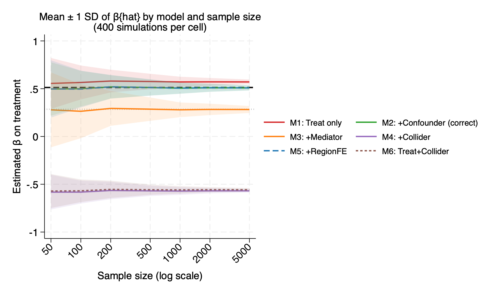
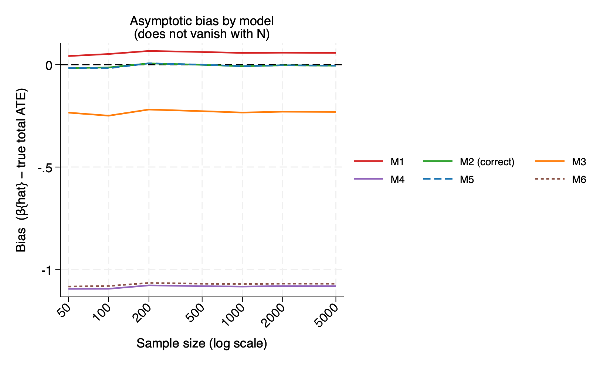
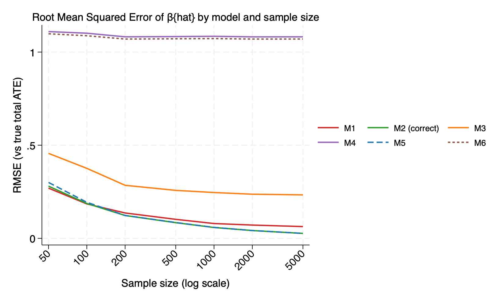
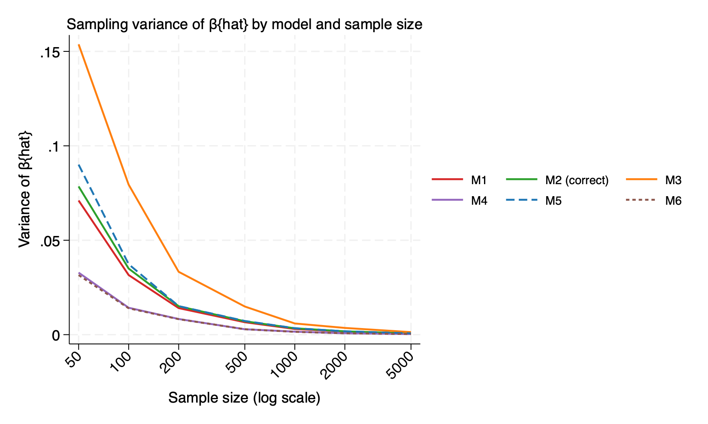
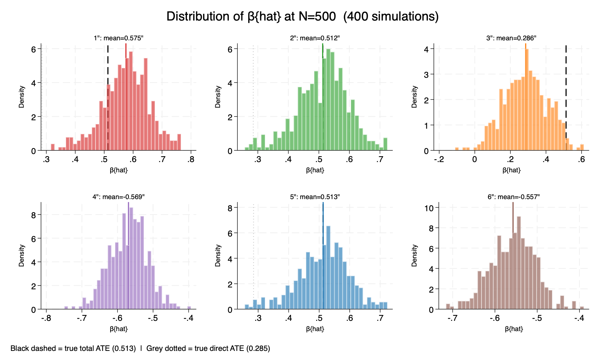
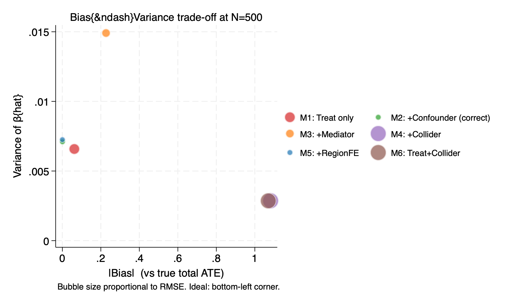

Part 2:
1. Mean and variance of beta as a function of N

Model 2 and model 5 are unbiased. Their means track the black dashed line at 0.513 across all sample sizes. The SD bands narrow steadily. The two lines are indistinguishable. This confirms that the region fixed effects are harmless.
Model 1 is persistently too high. The band narrows but it coverges to the wrong value. Omitting the confounder inflates the estimate by roughly 0.06 SD.
Model 3 converges to direct ATE, not total ATE. Controlling for the mediator answers a valid but different causal question. If the total effect is the target, model 3 is misspecified.
Model 4 and model 6 are wrong. Bothe converge to approximately -0.57. The bands are narrow. These models are precise but incorrect.

2. Bias

Model 1: bias=0.058 at all N. The upward shift from omitting the confounder is small but permanent.
Model 2 and model 5: bias=0.007 across all N. This consistents with sampling noise around an asymptotically unbiased estimator.
Model 3: bias=-0.228 at all N. The gap between total ATE and direct ATE is a structural feature of the DGP, not a finite sample.
Model 4 and model 6: bias=-1.08 at all N. The collider opens a powerful spurious negative association that completely dominates the true positive effect.

3. Root mean squared error

For model 2 and model 5, variance dominates at small N and falls roughlt as 1/N. Therefore, RMSE converges to zero.
Model 4 and model 6 plateau at RMSE=1.08 (by far the worst outcome).
Model 1 plateaus near RMSE=0.06 (modest but permanent).
Model 3 plateaus at RMSE=0.23. This reflects the permanent distance between the total and direct ATE.

4. Sampling variance

All models show variance declining with N.
Model 3 has the highest variance variance at small N. Model 4 and model 6 have the lowest variance of all models.

5. Distribution of beta at N=500

Model 1: Distribution centred around 0.575. It is visibly shifted right of the true total ATE. The bias is moderate and the distribution is reasonably wide.
Model 2: Distribution well-centred on the true total ATE at 0.513. The dotted line is far to the left. This confirms model 2 estimates the total effect.
Model 3: Distribution centred near the grey dotted line but far from the dashed line. The wide spread reflects the high sampling variance seen in figure 4
Model 4: Tight distribution centred at -0.569. The distribution is much narrower than model 2 and model 3. 
Model 5: The region fixed effects leave the treatment estimate unchanged.
Model 6: Tight distribution centred at -0.557. Omitting the confounder and adding the collider compounds two error, but the collider bias so completely dominates that model 6 and model 4 look alike.

6. Bias-variance

Model 1 sits just to the right of model 2 and model 5. This is slightly higher but otherwise well-behaved with a similar bubble size.
Model 2 and model 5 cluster near the origin. The same point confirms both are low bias and moderately low variance. They have the smallest RMSE.
Model 3 has moderate bias and noticeably higher variance than all other models. Its bubble sits high and to the right. The reflects a costly combination of both sources of error.
Model 4 and model 6 occupy the far right cluster. Their bubbles are large. This comfirms that a tight confidence interval around the wrong estimate is not merely unhelpful but actively misleading.

