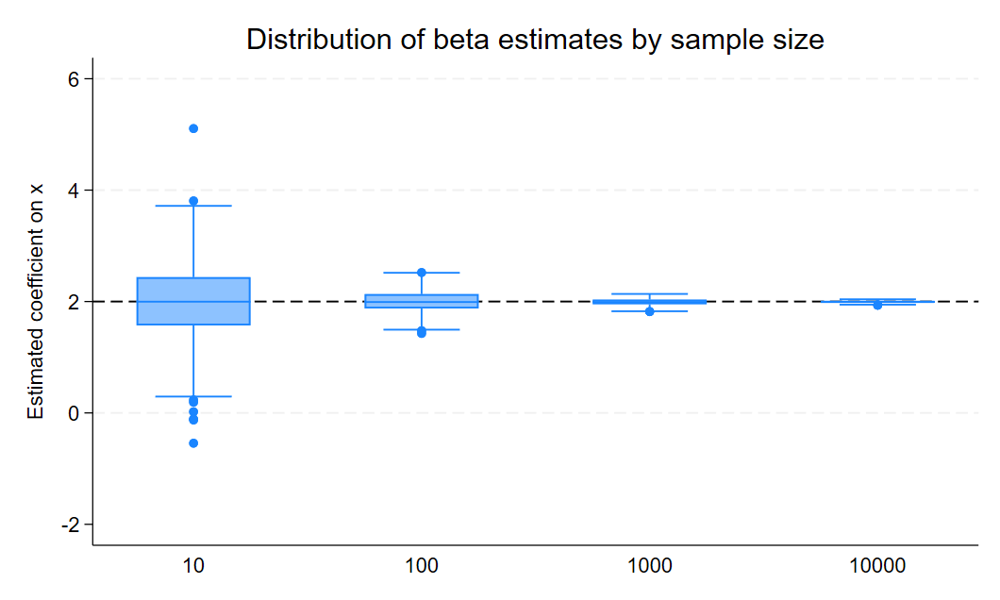
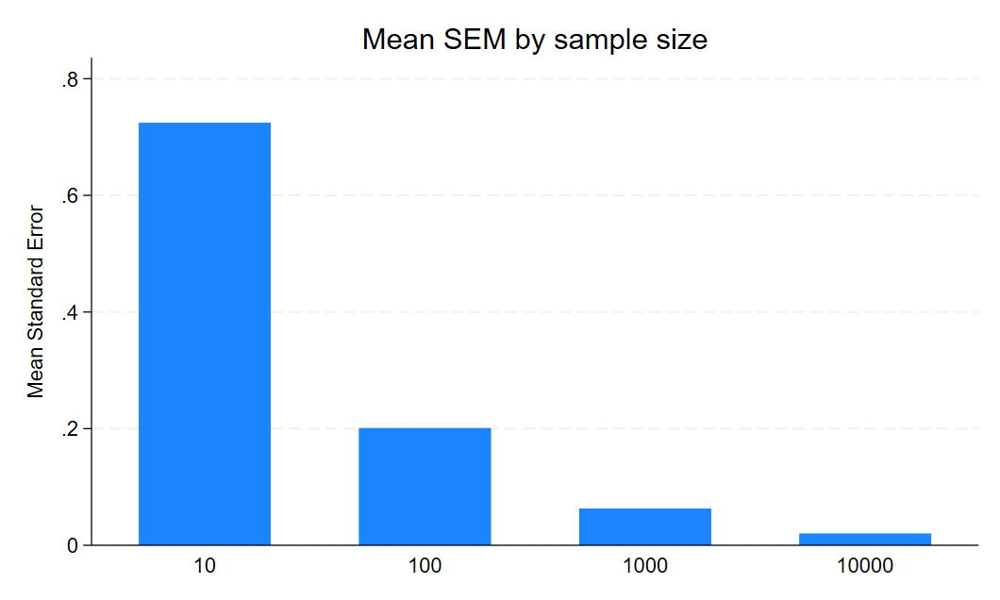
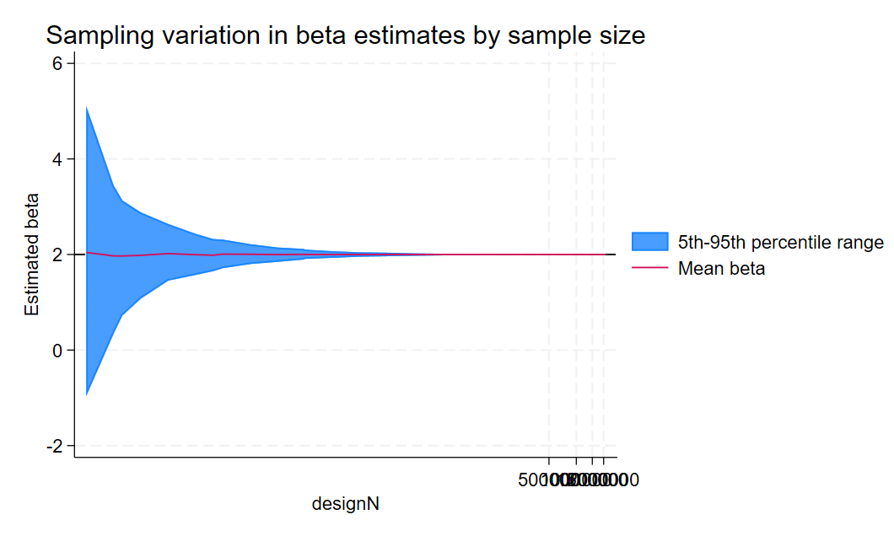
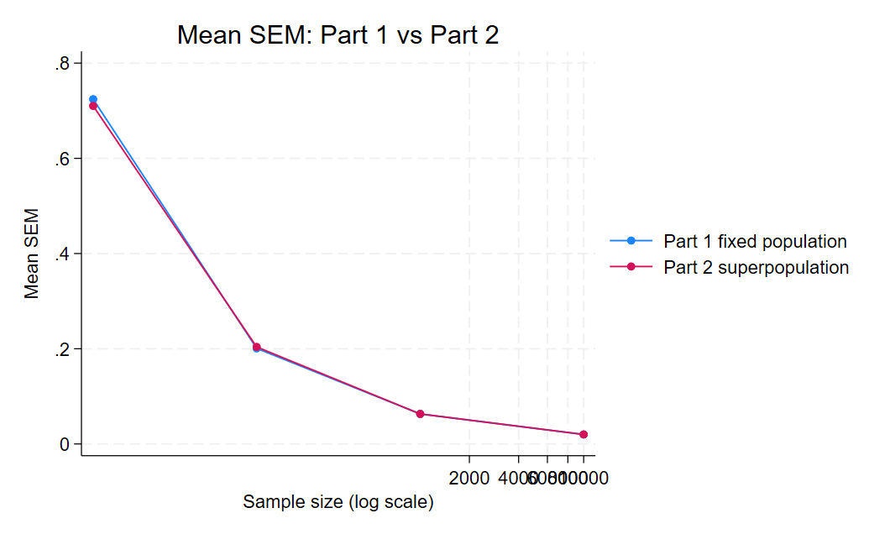
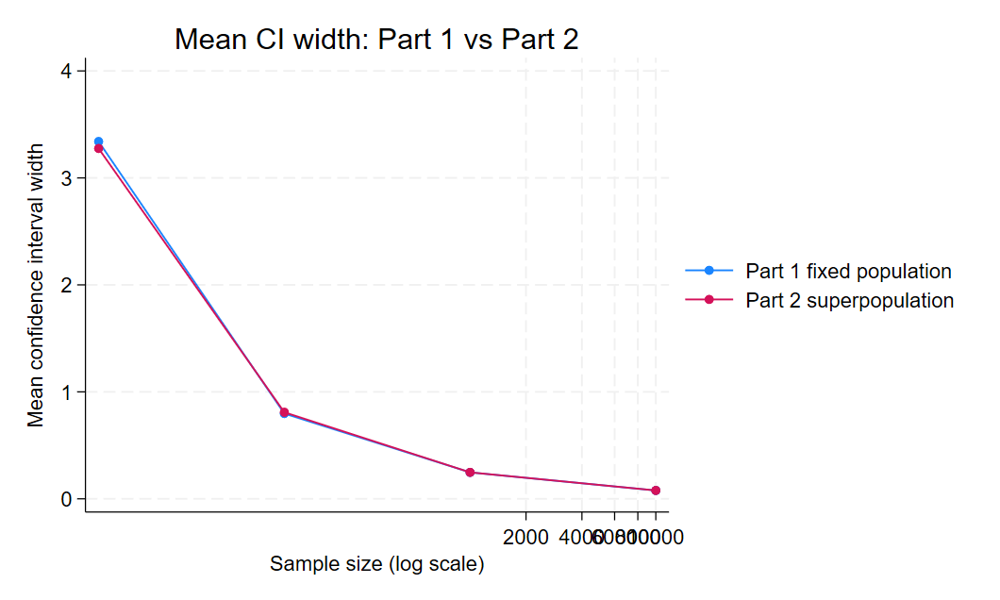
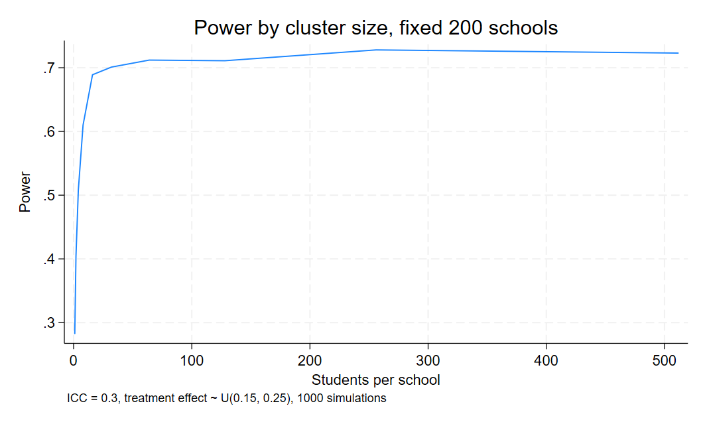
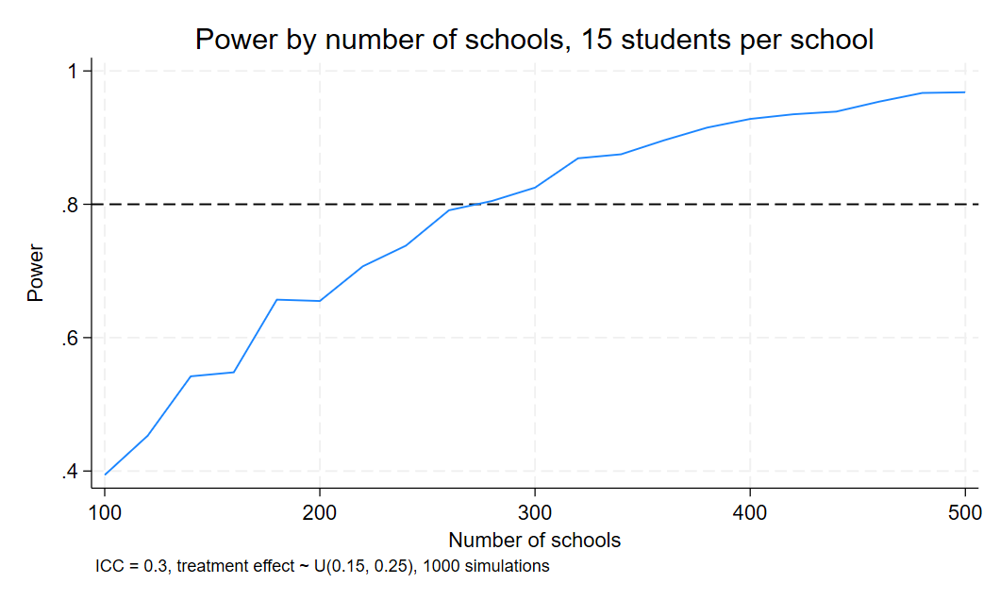
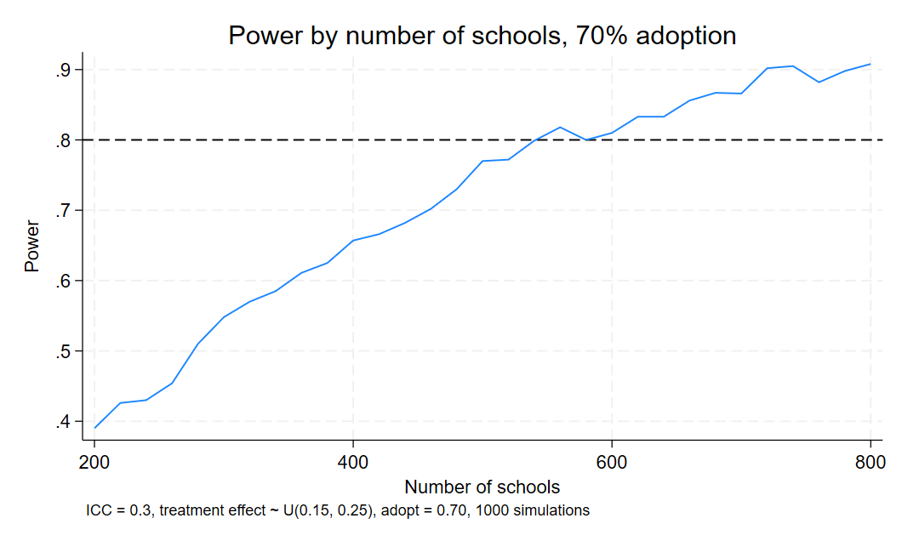

# Part 1: Sampling Noise in a Fixed Population

## Overview

In this part, the data generating process (DGP) is:

-   X \~ N(0,1)
-   u \~ N(0,2)
-   Y = 1 + 2X + u

The true population coefficient on X is **2**.

A fixed population of 100,000 observations is generated, and repeated samples are drawn to estimate the coefficient on X.

------------------------------------------------------------------------

## Simulation Design

For each sample size N = 10, 100, 1000, and 10000:

-   A random sample of size N is drawn from the fixed population
-   A regression of Y on X is estimated
-   The coefficient, standard error, p-value, and confidence interval are stored
-   This process is repeated 500 times

This produces a total of 2,000 regression estimates.

------------------------------------------------------------------------

## Figure 1: Distribution of Beta Estimates

The boxplot shows the distribution of estimated coefficients across sample sizes.

-   **N = 10:**\
    Estimates are widely dispersed, with substantial variation around the true value of 2. Some estimates are far from the true value, indicating high sampling noise.

-   **N = 100:**\
    The distribution becomes tighter, and most estimates are closer to 2.

-   **N = 1000 and N = 10000:**\
    Estimates are highly concentrated around 2, with very little variation.

**Interpretation:**\
As sample size increases, sampling variability decreases and estimates become more precise.

------------------------------------------------------------------------

## Figure 2: Mean Standard Error by Sample Size

This figure shows how the average standard error changes with sample size.

-   The mean standard error decreases sharply as N increases
-   The reduction is especially large when moving from very small to moderate sample sizes
-   At large sample sizes, the standard error becomes very small and stable

**Interpretation:**\
This reflects the statistical property that standard errors decrease with larger sample sizes, leading to more precise estimates.

------------------------------------------------------------------------

## Table: Summary Statistics

| N | Mean Beta | Mean SEM | Mean CI Width | Mean P-value | SD Beta | SD SEM | SD CI Width | Min Beta | Max Beta |
|--------|--------|--------|--------|--------|--------|--------|--------|--------|--------|
| 10 | 2 | 1 | 3 | 0 | 1 | 0 | 1 | -1 | 5 |
| 100 | 2 | 0 | 1 | 0 | 0 | 0 | 0 | 1 | 3 |
| 1000 | 2 | 0 | 0 | 0 | 0 | 0 | 0 | 2 | 2 |
| 10000 | 2 | 0 | 0 | 0 | 0 | 0 | 0 | 2 | 2 |

The table reports the mean, standard deviation, and range of key statistics by sample size.

Key patterns:

-   The mean beta is close to 2 across all sample sizes
-   The standard deviation of beta decreases as N increases
-   Standard errors and confidence intervals shrink with larger samples

This pattern is consistent with statistical theory: as sample size increases, the variance of the estimator decreases, leading to more precise estimates.

------------------------------------------------------------------------

## Conclusion

The results show that increasing sample size reduces sampling noise and improves estimation precision. While the estimator is unbiased even in small samples, larger samples produce more stable estimates, smaller standard errors, and narrower confidence intervals. These findings are consistent with the law of large numbers and the consistency of estimators.

------------------------------------------------------------------------

# Part 2: Sampling Noise in an Infinite Superpopulation

## Overview

Building on Part 1, this section extends the analysis by considering sampling from an infinite superpopulation instead of a fixed dataset.

The data generating process (DGP) remains the same:

-   X \~ N(0,1)
-   u \~ N(0,2)
-   Y = 1 + 2X + u

The true population coefficient on X is **2**.

The key difference is that, instead of repeatedly sampling from a fixed population, each simulation now generates a completely new dataset. This allows us to study sampling variability in a superpopulation setting.

------------------------------------------------------------------------

## Simulation Design

The simulation follows the same structure as Part 1, with one key change: each repetition generates new data.

For each sample size, I:

-   Generate a new dataset of size N
-   Run a regression of Y on X
-   Store the coefficient, standard error, p-value, and confidence interval
-   Repeat this process 500 times

Sample sizes include:

-   Powers of two: 4, 8, 16, ..., up to 2,097,152
-   Powers of ten: 10, 100, 1000, 10000, 100000, 1000000

------------------------------------------------------------------------

## Figure: Sampling Variation in Beta Estimates

This figure shows the mean beta and the 5th–95th percentile range across sample sizes (on a log scale).

Consistent with Part 1, several patterns emerge:

-   At very small sample sizes, the estimates are highly dispersed
-   As N increases, the dispersion shrinks rapidly
-   The mean beta remains close to the true value of 2 across all sample sizes

The percentile band narrows quickly as sample size increases, indicating a reduction in sampling variability.

------------------------------------------------------------------------

## Table: Summary Statistics

The summary statistics table is available in the file:

-   [Part2_Q3.dta](Part2_Q3.dta)

The table reports mean beta, standard deviation, standard error, and confidence interval width.

The results closely mirror those in Part 1:

-   The mean beta is consistently close to 2
-   The standard deviation of beta decreases as N increases
-   Standard errors and confidence intervals shrink with larger samples

These patterns reinforce the same conclusion as before: larger samples lead to more precise estimates.

------------------------------------------------------------------------

## Why Larger Sample Sizes Are Possible in Part 2

A key difference from Part 1 is that sample size is no longer constrained.

-   In Part 1, all samples are drawn from a fixed population of 100,000 observations
-   In Part 2, each simulation generates new data, so there is no upper limit on N

As a result, it is possible to simulate very large sample sizes, including over one million observations.

------------------------------------------------------------------------

## Differences Between Powers of Two and Powers of Ten

Both sets of sample sizes show the same overall pattern of decreasing variability, but they differ in how smoothly this pattern is observed:

-   Powers of two provide a more gradual progression, making it easier to observe how precision improves step by step
-   Powers of ten increase more sharply, leading to larger jumps in precision

At large sample sizes, both sequences converge to nearly identical results.

------------------------------------------------------------------------

## Comparison with Part 1

### Mean Standard Error

Both Part 1 and Part 2 show a clear decline in standard errors as sample size increases. The patterns are very similar, especially at larger sample sizes.

------------------------------------------------------------------------

### Mean Confidence Interval Width

Confidence interval widths shrink with larger sample sizes in both settings. The results converge as N increases.

------------------------------------------------------------------------

### Table for Comparison

| N     | Source                  | Mean Beta | Mean SEM | Mean CI Width | SD Beta |
|-------|-------------------------|-----------|----------|---------------|---------|
| 10    | Part 1 fixed population | 2.01      | 0.72     | 3.34          | 0.69    |
| 10    | Part 2 superpopulation  | 1.97      | 0.71     | 3.28          | 0.77    |
| 100   | Part 1 fixed population | 2.00      | 0.20     | 0.80          | 0.20    |
| 100   | Part 2 superpopulation  | 1.98      | 0.20     | 0.81          | 0.20    |
| 1000  | Part 1 fixed population | 1.99      | 0.06     | 0.25          | 0.06    |
| 1000  | Part 2 superpopulation  | 2.00      | 0.06     | 0.25          | 0.07    |
| 10000 | Part 1 fixed population | 1.99      | 0.02     | 0.08          | 0.02    |
| 10000 | Part 2 superpopulation  | 2.00      | 0.02     | 0.08          | 0.02    |

------------------------------------------------------------------------

### Interpretation

The comparison highlights that the main results from Part 1 carry over to the superpopulation setting:

-   In both cases, increasing sample size improves precision
-   Differences between the two approaches are small and diminish as N grows

The key distinction lies in the data-generating mechanism:

-   Part 1 draws repeated samples from a fixed dataset
-   Part 2 generates new data each time

Despite this difference, both approaches illustrate the same underlying statistical behavior.

------------------------------------------------------------------------

## Conclusion

Extending the analysis to a superpopulation setting confirms the main findings from Part 1. Increasing sample size reduces sampling variability, leading to more stable estimates, smaller standard errors, and narrower confidence intervals. The results demonstrate that these properties hold regardless of whether samples are drawn from a fixed population or generated anew.

------------------------------------------------------------------------

# Part 3: Power Calculations for Individual-Level Randomization

## Overview

Building on Parts 1 and 2, this section examines statistical power in an experimental setting with individual-level randomization.

The data generating process is:

-   Outcome: Y \~ N(0,1)
-   Treatment effect (ATE): uniformly distributed between 0 and 0.2 standard deviations
-   Average treatment effect ≈ 0.1 sd
-   Treatment is randomly assigned

The goal is to determine the sample size required to achieve **80% power** under different scenarios.

------------------------------------------------------------------------

## Simulation Design

For each scenario, I:

-   Generate a dataset of size N
-   Randomly assign treatment
-   Estimate the treatment effect using regression
-   Record whether the effect is statistically significant at the 5% level
-   Repeat this process 1000 times

Power is calculated as the proportion of simulations where the treatment effect is statistically significant.

------------------------------------------------------------------------

## Baseline: 50% Treatment Assignment

Results are stored in:

-   [Part3_Q3.dta](Part3_Q3.dta)

Key result:

-   The minimum sample size required to achieve 80% power is approximately **3300**

**Interpretation:** With balanced treatment and control groups, the design is relatively efficient. The estimator uses information from both groups equally, resulting in lower variance and higher power for a given sample size.

------------------------------------------------------------------------

## With 15% Attrition

Results are stored in:

-   [Part3_Q4.dta](Part3_Q4.dta)

Key result:

-   The minimum sample size required to achieve 80% power increases to approximately **3750–3900**

Note: Due to simulation noise (each power estimate based on 1000 repetitions), the power curve does not increase monotonically. The first N at which power exceeds 80% is 3600, but this is not sustained until around N = 3750. A conservative estimate of the required sample size is therefore approximately **3900**.

**Interpretation:** Attrition reduces the effective sample size, which increases the variance of the estimator. Even though the initial sample size is larger, some observations are lost, requiring a higher starting N to maintain the same level of statistical power. With 15% attrition, the enrolled sample must be inflated by a factor of approximately 1/(1-0.15) ≈ 1.18 relative to the baseline.

------------------------------------------------------------------------

## With 30% Treatment Assignment

Results are stored in:

-   [Part3_Q5.dta](Part3_Q5.dta)

Key result:

-   The minimum sample size required to achieve 80% power increases to approximately **3700**

**Interpretation:** When only 30% of individuals receive treatment, the design becomes unbalanced. This increases the variance of the estimated treatment effect because there is less information in the treated group. As a result, a larger total sample size is required to achieve the same level of power.

------------------------------------------------------------------------

## Overall Interpretation

Across all scenarios, the results highlight key determinants of statistical power:

-   Larger sample sizes increase power
-   Attrition reduces effective sample size and lowers power
-   Imbalanced treatment assignment increases variance and reduces efficiency

Comparing the three cases, the balanced baseline design is the most efficient. Adding 15% attrition raises the required sample size from approximately 3300 to 3900, and reducing treatment assignment from 50% to 30% raises it to approximately 3700. This shows that both data loss and treatment imbalance make it harder to detect the same treatment effect.

------------------------------------------------------------------------

## Conclusion

The simulations show that achieving 80% power depends not only on the total sample size but also on attrition and treatment allocation. Balanced designs without attrition are the most efficient, while attrition and unequal treatment assignment both require larger sample sizes to maintain the same statistical power.

------------------------------------------------------------------------

# Part 4: Power Calculations for Cluster Randomization

## Overview

Building on Part 3, this section considers power calculations when treatment is assigned at the cluster level (schools) rather than the individual level.

The simulation setup is:

-   Treatment is assigned at the school level
-   Students are nested within schools
-   Intra-cluster correlation (ICC) ≈ 0.3
-   Treatment effect is drawn from U(0.15, 0.25)

The outcome includes both:

-   A school-level component (shared within clusters)
-   An individual-level error

This structure introduces correlation within clusters, which affects statistical power.

------------------------------------------------------------------------

## Simulation Design

For each scenario, I:

-   Generate data at the school level
-   Expand to student-level observations
-   Estimate treatment effects using cluster-robust standard errors
-   Record statistical significance at the 5% level
-   Repeat simulations 1000 times

Power is defined as the proportion of significant results.

------------------------------------------------------------------------

## Effect of Cluster Size (Fixed Number of Schools)

This figure shows power as cluster size (number of students per school) increases, holding the number of schools fixed at 200.

Key patterns:

-   Power increases rapidly when cluster size grows from very small values
-   After around 16 students per school, power plateaus at about 0.7–0.73
-   Further increases in cluster size provide minimal gains

**Interpretation:**

Increasing cluster size improves power only up to a point. Because students within the same school are correlated (ICC = 0.3), adding more students in the same cluster yields diminishing returns. Most of the useful variation comes from differences across schools, not within schools. A cluster size of around **16 students per school** is recommended, as power is already close to its ceiling at that point and further increases yield negligible gains at much higher cost.

------------------------------------------------------------------------

## Effect of Number of Schools (Fixed Cluster Size)

This figure shows power as the number of schools increases, holding cluster size fixed at 15 students per school.

Key result:

-   The minimum number of schools required to reach 80% power is **280 schools**

Key patterns:

-   Power increases steadily as the number of schools increases
-   The relationship is much stronger than in the cluster size case
-   The 80% power threshold is first reached at 280 schools

**Interpretation:**

Increasing the number of clusters is much more effective than increasing cluster size. Since treatment is assigned at the school level, the number of independent observations is essentially the number of schools. More clusters provide more independent variation, which directly improves statistical power.

------------------------------------------------------------------------

## Effect of Partial Adoption (70% Compliance)

This figure shows power when only 70% of treated schools actually adopt the intervention.

Key result:

-   The minimum number of schools required to reach 80% power increases to approximately **560 schools**

Key patterns:

-   Power is consistently lower than in the full adoption case
-   More schools are required to achieve the same level of power
-   The gap is substantial compared to the full adoption scenario

**Interpretation:**

Partial adoption reduces the effective treatment effect (intent-to-treat effect is diluted). This lowers the signal-to-noise ratio, making it harder to detect the effect. As a result, a larger number of clusters is required to maintain statistical power. The required number of schools roughly doubles from 280 to 560 compared to the full adoption case, reflecting the attenuation of the effective treatment effect from approximately 0.20 SD to 0.14 SD.

------------------------------------------------------------------------

## Overall Interpretation

Across all scenarios, the results highlight key features of cluster randomized trials:

-   Increasing cluster size has limited impact due to within-cluster correlation
-   Increasing the number of clusters is the most effective way to improve power
-   Imperfect compliance (partial adoption) substantially reduces power

These findings reflect the fact that, in clustered designs, the effective sample size is driven primarily by the number of clusters rather than the number of individuals.

------------------------------------------------------------------------

## Conclusion

The simulations show that power in cluster randomized trials depends heavily on the number of clusters and the degree of within-cluster correlation. While increasing cluster size provides some gains, adding more clusters is far more effective. In addition, imperfect adoption significantly increases the required sample size. These results emphasize the importance of careful design choices when planning clustered experiments.
