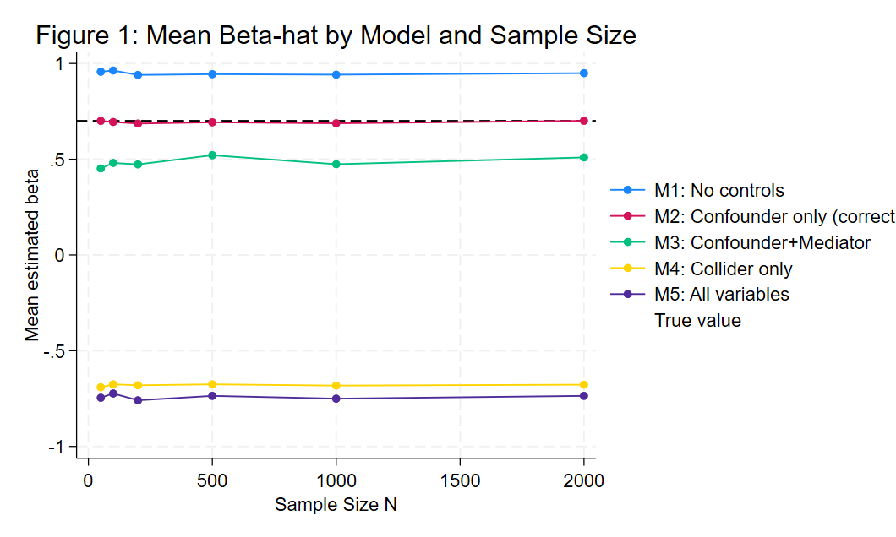
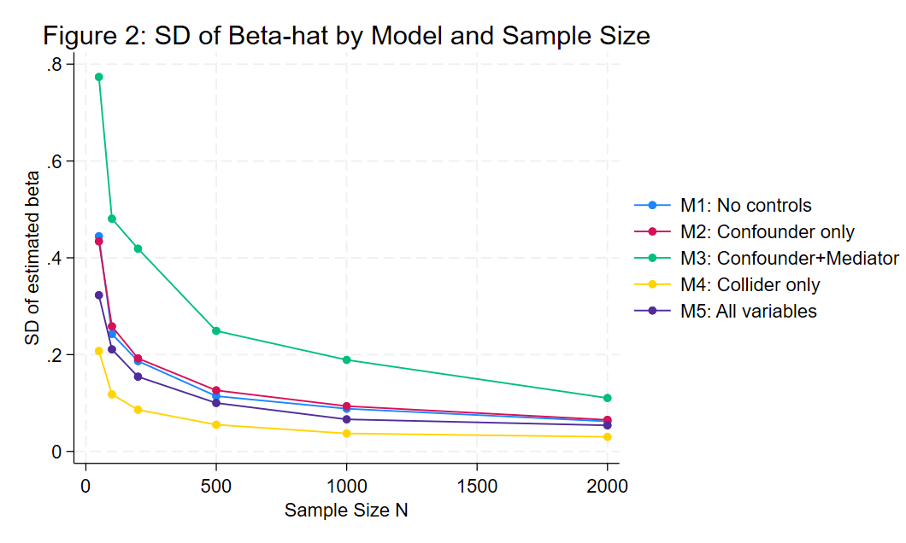

# Part 2: De-biasing a Parameter Estimate Using Controls

## Overview

In this part, we construct a data generating process (DGP) with a known treatment effect and study how different covariate choices affect the bias and convergence of the estimated treatment effect.

The DGP is:

-   `confounder` \~ Uniform(-1, 1)
-   `X_treat` \~ Bernoulli(0.4 + 0.3 × confounder)
-   `mediator` = 0.5 × X_treat + 0.5 × Uniform(0,1)
-   `Y` = 0.3 × noise + 0.5 × X_treat + 0.6 × confounder + 0.4 × mediator + noise
-   `collider` = 0.5 × X_treat + 0.5 × Y + 0.3 × N(0,1)

The benchmark true value of the treatment effect is approximately **0.70**, reflecting both the direct effect of X_treat on Y and the indirect effect through the mediator. This is estimated empirically as the mean beta from Model 2 (the correct specification) at N = 2000.

------------------------------------------------------------------------

## Simulation Design

Five regression models are estimated at six sample sizes: N = 50, 100, 200, 500, 1000, and 2000. At each sample size, the DGP is repeated **100 times**. In each repetition, the coefficient on X_treat is recorded for each model.

This produces a total of 3,000 regression estimates (5 models × 6 sample sizes × 100 repetitions).

The simulation is implemented using two Stata programs:

-   `dgp`: generates one dataset of size N with all five variables
-   `run_sim`: calls `dgp`, runs the five regressions, and posts the beta estimates to a results file

------------------------------------------------------------------------

## Models

Five models are estimated, each controlling for a different combination of covariates:

| Model | Specification | Expected bias |
|----|----|----|
| M1: No controls | `reg Y X_treat` | Upward - confounder omitted (OVB) |
| M2: Confounder only | `reg Y X_treat confounder` | None - correct specification |
| M3: Confounder + Mediator | `reg Y X_treat confounder mediator` | Downward — indirect path blocked |
| M4: Collider only | `reg Y X_treat collider` | Severe negative — collider bias |
| M5: All variables | `reg Y X_treat confounder mediator collider` | Severe negative — collider still contaminates |

------------------------------------------------------------------------

## Figure 1: Mean Beta-hat by Model and Sample Size

This figure plots the mean estimated beta for each model as a function of sample size N. The dashed horizontal line marks the benchmark true value (\~0.70).

-   **M1 (No controls):**\
    The mean estimate is consistently around 0.95, well above the benchmark at all sample sizes. Omitting the confounder causes the regression to attribute the confounder's direct effect on Y to the treatment. This upward bias of approximately +0.25 is stable and does not diminish as N grows.

-   **M2 (Confounder only):**\
    The mean estimate tracks the benchmark closely at all N, confirming that this is the only unbiased specification. Controlling for the confounder removes the OVB without blocking any causal path.

-   **M3 (Confounder + Mediator):**\
    The mean estimate is consistently around 0.50, roughly 0.20 below the benchmark. Including the mediator blocks the indirect causal path X_treat → mediator → Y, so the regression only captures the direct effect. This downward bias persists at all sample sizes.

-   **M4 (Collider only) and M5 (All variables):**\
    Both models produce strongly negative estimates (around −0.68 and −0.74 respectively). Conditioning on the collider opens a spurious backdoor path between X_treat and Y, completely reversing the sign of the estimate. Adding the confounder and mediator alongside the collider (M5) does not fix this since the collider bias dominates.

**Key interpretation:**\
None of the biased models converge toward the true value as N increases. Larger samples do not correct a misspecified model. The bias is structural, not a result of sampling noise.

------------------------------------------------------------------------

## Figure 2: SD of Beta-hat by Model and Sample Size

This figure plots the standard deviation of the estimated beta across 100 simulation runs, as a function of N. This measures estimation variance — how consistent the estimates are across repeated samples.

-   All five models show steeply declining SD as N increases, confirming that all estimators become more precise with larger samples.

-   **M3** has the highest variance at small N (SD ≈ 0.77 at N = 50). This is likely due to multicollinearity introduced by including the mediator, which is itself generated from the treatment variable.

-   **M4** converges the fastest, reaching SD ≈ 0.03 at N = 2000. However, it converges precisely to the wrong answer (\~−0.68 instead of \~0.70).

**Key interpretation:**\
Convergence in variance is not the same as convergence to the true value. A model can produce very consistent estimates across samples while still being systematically wrong. Precision without accuracy is misleading.

------------------------------------------------------------------------

## Table: Mean Beta, SD, and Bias by Model and N

| Model                   | N    | Mean Beta | SD    | Bias   |
|-------------------------|------|-----------|-------|--------|
| M1: No controls         | 50   | 0.957     | 0.445 | +0.256 |
| M1: No controls         | 100  | 0.963     | 0.243 | +0.263 |
| M1: No controls         | 200  | 0.940     | 0.187 | +0.240 |
| M1: No controls         | 500  | 0.944     | 0.114 | +0.244 |
| M1: No controls         | 1000 | 0.942     | 0.088 | +0.241 |
| M1: No controls         | 2000 | 0.950     | 0.062 | +0.249 |
| M2: Confounder only     | 50   | 0.700     | 0.434 | −0.001 |
| M2: Confounder only     | 100  | 0.694     | 0.258 | −0.006 |
| M2: Confounder only     | 200  | 0.686     | 0.192 | −0.014 |
| M2: Confounder only     | 500  | 0.693     | 0.126 | −0.008 |
| M2: Confounder only     | 1000 | 0.688     | 0.094 | −0.013 |
| M2: Confounder only     | 2000 | 0.701     | 0.065 | 0.000  |
| M3: Confounder+Mediator | 50   | 0.452     | 0.774 | −0.249 |
| M3: Confounder+Mediator | 100  | 0.481     | 0.481 | −0.220 |
| M3: Confounder+Mediator | 200  | 0.473     | 0.419 | −0.228 |
| M3: Confounder+Mediator | 500  | 0.521     | 0.249 | −0.180 |
| M3: Confounder+Mediator | 1000 | 0.474     | 0.189 | −0.227 |
| M3: Confounder+Mediator | 2000 | 0.510     | 0.110 | −0.191 |
| M4: Collider only       | 50   | −0.691    | 0.208 | −1.392 |
| M4: Collider only       | 100  | −0.676    | 0.118 | −1.376 |
| M4: Collider only       | 200  | −0.680    | 0.086 | −1.381 |
| M4: Collider only       | 500  | −0.676    | 0.055 | −1.376 |
| M4: Collider only       | 1000 | −0.682    | 0.037 | −1.383 |
| M4: Collider only       | 2000 | −0.677    | 0.030 | −1.378 |
| M5: All variables       | 50   | −0.745    | 0.323 | −1.446 |
| M5: All variables       | 100  | −0.723    | 0.211 | −1.424 |
| M5: All variables       | 200  | −0.759    | 0.154 | −1.459 |
| M5: All variables       | 500  | −0.736    | 0.100 | −1.436 |
| M5: All variables       | 1000 | −0.750    | 0.066 | −1.451 |
| M5: All variables       | 2000 | −0.736    | 0.054 | −1.436 |

Bias is measured relative to the mean beta of M2 (correct specification) at N = 2000 (\~0.701).

Key patterns:

-   The mean beta for M2 is close to the benchmark across all sample sizes, with near-zero bias
-   The bias for M1 is positive and stable at around +0.25, confirming persistent OVB
-   The bias for M3 is negative and stable at around −0.20, confirming over-control bias
-   The bias for M4 and M5 is severely negative (around −1.38 and −1.44), driven by collider bias
-   The SD decreases for all models as N grows, confirming that all estimators converge in variance

------------------------------------------------------------------------

## Conclusion

The results show that controlling for the right variables is essential for recovering an unbiased treatment effect estimate. More controls is not always better:

-   Omitting the confounder (M1) causes upward bias due to omitted variable bias
-   Including the mediator (M3) causes downward bias by blocking part of the causal effect
-   Including the collider (M4, M5) causes severe negative bias by opening a spurious backdoor path

None of these biases disappear as sample size grows. They are structural and cannot be resolved by collecting more data. The correct approach is to reason carefully about the causal structure before selecting control variables — controlling for the confounder alone (M2) is sufficient to recover the true treatment effect.

------------------------------------------------------------------------
