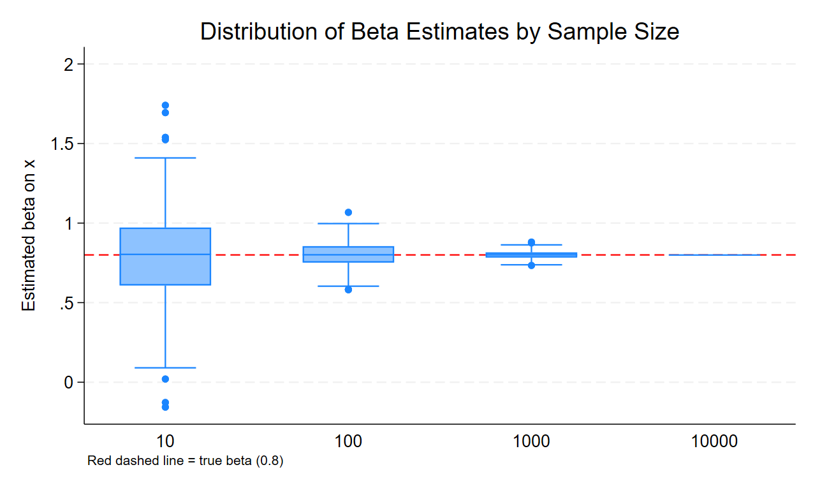
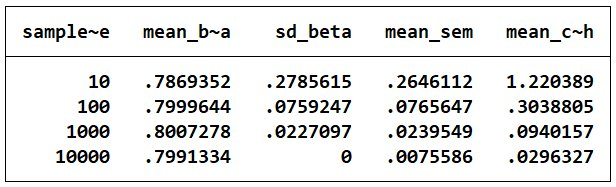
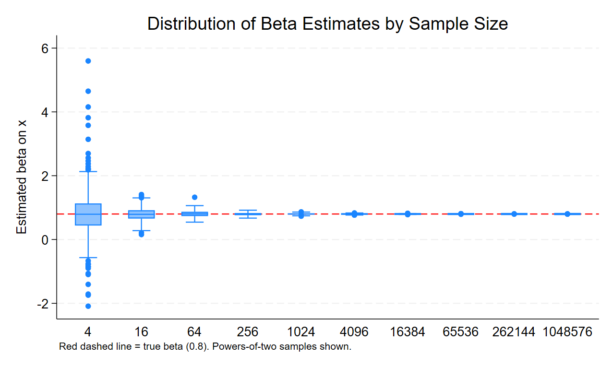
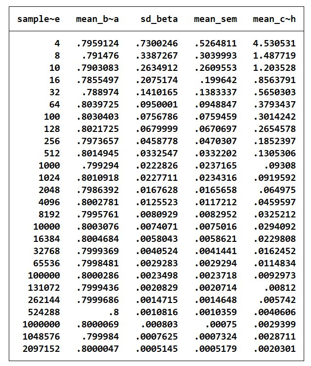

# Stata3-Qingfeng Yu_qy111

## Part 1: Sampling Noise in a Fixed Population

### Data Generating Process

I construct a fixed population of 10,000 observations using the following DGP:

-   $X \sim N(0, 4)$ (mean 0, standard deviation 2)
-   $\epsilon \sim N(0, 2.25)$ (mean 0, standard deviation 1.5)
-   $Y = 3 + 0.8X + \epsilon$

The true coefficient of interest is $\beta = 0.8$. The intercept and the distributions of $X$ and $\epsilon$ are fixed for all simulations. I use `set seed 2024` to ensure the population is always identical across runs.

------------------------------------------------------------------------

### Simulation Design

I define a Stata program that loads this fixed population, draws a random sample of a user-specified size $n$, and estimates a simple OLS regression of $Y$ on $X$. The program returns the sample size, estimated coefficient, standard error, p-value, and 95% confidence interval bounds into `r()`.

Using the `simulate` command, I run this program **500 times** at each of four sample sizes: $N = 10, 100, 1000, 10000$. This produces a combined dataset of **2,000 regression results**.

------------------------------------------------------------------------

### Figure: Beta Estimate Distributions Across Sample Sizes

Each box summarizes the distribution of $\hat{\beta}$ across 500 draws at a given $N$. The red dashed line marks the true value of 0.8.

Several patterns stand out:

-   At $N = 10$, estimates range from below zero to nearly 1.8, reflecting extreme sampling variability from a population of 10,000. The interquartile range spans roughly 0.65 to 0.95.
-   At $N = 100$, the spread narrows substantially. Most estimates fall between 0.6 and 1.1, and the median is close to 0.8.
-   At $N = 1000$, estimates are tightly clustered around the true value, with only a few outliers beyond 0.85.
-   At $N = 10000$, the box collapses to a flat line — every simulation draws the entire population, so $\hat{\beta}$ is identical across all 500 runs. There is no sampling variability left.

------------------------------------------------------------------------

### Table: Precision Metrics by Sample Size

Three takeaways:

1.  **Unbiasedness holds at all sample sizes.** Mean $\hat{\beta}$ is close to 0.8 whether $N = 10$ or $N = 10000$, confirming that OLS is unbiased even with small samples from this DGP.
2.  **Precision improves roughly in line with** $1/\sqrt{N}$. The SD of $\hat{\beta}$ falls from 0.279 at $N=10$ to 0.076 at $N=100$ (a tenfold increase in $N$ yields a roughly threefold reduction in spread), consistent with the theoretical $\text{SE} \propto 1/\sqrt{N}$ relationship.
3.  **At** $N = 10000$, sampling variance disappears entirely. Because the sample equals the full population, every draw yields the same estimate. This is a feature unique to the fixed-population setting: once you observe everyone, there is no sampling uncertainty — only model uncertainty remains. The reported SEM of 0.008 reflects regression standard errors computed within the complete dataset, not variation across draws.

------------------------------------------------------------------------

### Summary

These results confirm that sampling noise in a fixed population decreases predictably with sample size. Larger samples reduce variability and narrow confidence intervals, but the gains plateau once the sample approaches the population. The limiting case — sampling the full population of 10,000 — eliminates between-simulation variance altogether, a behavior that will not occur in Part 2, where each simulation draws from an infinite superpopulation.

## Part 2: Sampling Noise in an Infinite Superpopulation

### Data Generating Process

The DGP is identical to Part 1:

-   $X \sim N(0, 4)$ (mean 0, standard deviation 2)
-   $\epsilon \sim N(0, 2.25)$ (mean 0, standard deviation 1.5)
-   $Y = 3 + 0.8X + \epsilon$

The true coefficient is $\beta = 0.8$. The key difference from Part 1 is that each simulation now **generates a fresh dataset** rather than sampling from one fixed population.

------------------------------------------------------------------------

### Simulation Design

I define a program that creates a new dataset of size $n$ from scratch in each call, runs OLS of $Y$ on $X$, and returns the same six scalars as Part 1. Using `simulate` with 500 repetitions, I run this program at:

-   The **first twenty powers of two**: $N = 4, 8, 16, \ldots, 2{,}097{,}152$
-   Six additional benchmarks: $N = 10, 100, 1{,}000, 10{,}000, 100{,}000, 1{,}000{,}000$

This produces **13,000 regression results** in total. I use `set seed 2025` before defining the program.

------------------------------------------------------------------------

### Figure: Beta Estimate Distributions Across Sample Sizes

The figure plots box distributions for every other power of two (4, 16, 64, ..., 1,048,576) to keep the x-axis readable. Key observations:

-   At $N = 4$, estimates are wildly dispersed — the whiskers extend from roughly $-1.5$ to $2.2$, with outliers reaching beyond $\pm 5$. This is expected: with only 4 observations, a single unusual draw can dominate the regression.
-   By $N = 64$, the box has narrowed considerably and is visually centered on 0.8.
-   From $N = 256$ onward, the distribution collapses toward the true value. By $N = 1{,}024$ the box appears as a thin line on the plot.
-   Unlike Part 1, even at the largest sample sizes there remains a small but nonzero spread — because the superpopulation is infinite, drawing more observations always adds new information.

------------------------------------------------------------------------

### Table: Precision Metrics by Sample Size

Three patterns stand out:

1.  **Persistent unbiasedness.** Mean $\hat{\beta}$ stays close to 0.8 at every sample size from 4 to 2,097,152, confirming that OLS remains unbiased regardless of $N$.
2.  **Continuous precision gains.** SD($\hat{\beta}$) and mean SEM keep shrinking at all sample sizes — they never collapse to zero the way they did at $N = 10{,}000$ in Part 1. This is the direct consequence of drawing from an infinite superpopulation: there is always more variation left to average away.
3.  **The** $1/\sqrt{N}$ pattern holds cleanly. Moving from $N = 64$ (SD = 0.095) to $N = 256$ (SD = 0.046) is a fourfold increase in $N$ and roughly a twofold reduction in spread, exactly as the theory predicts.

------------------------------------------------------------------------

### Why Larger Sample Sizes Are Possible Here

In Part 1, the population was fixed at 10,000 observations. Sampling beyond that limit was impossible — and sampling the entire population eliminated all between-simulation variance. Part 2 imposes no such ceiling because each simulation **draws fresh observations from a theoretical distribution**. The superpopulation has infinite size by construction, so $N$ can grow arbitrarily large without exhausting it.

------------------------------------------------------------------------

### Comparison with Part 1

At overlapping sample sizes ($N = 10, 100, 1{,}000, 10{,}000$), the two parts produce similar SD($\hat{\beta}$) and SEM values because the DGP is identical. The critical difference appears at $N = 10{,}000$:

| Sample Size | Part 1 SD($\hat{\beta}$) | Part 2 SD($\hat{\beta}$) |
|------------:|-------------------------:|-------------------------:|
|          10 |                    0.279 |                    0.263 |
|         100 |                    0.076 |                    0.076 |
|       1,000 |                    0.023 |                    0.022 |
|      10,000 |                **0.000** |                **0.007** |

In Part 1, drawing $N = 10{,}000$ from a population of exactly 10,000 is a census — every simulation returns the same dataset, so SD drops to zero. In Part 2, $N = 10{,}000$ still represents a sample from an infinite population, so meaningful variance remains. This comparison illustrates the fundamental conceptual difference between finite-population sampling and superpopulation inference.

## Part 3: Power Calculations for Individual-Level Randomization

### Data Generating Process

The baseline outcome is drawn from a standard normal distribution:

-   $Y_0 \sim N(0, 1)$
-   Individual treatment effects: $\tau_i \sim \text{Uniform}(0.0,\ 0.2)$, so the average treatment effect (ATE) is **0.1 standard deviations**
-   Observed outcome: $Y_i = Y_0 + \tau_i \cdot \mathbb{1}[\text{treated}]$

Treatment is assigned independently at the individual level. I simulate power by running OLS of $Y$ on a binary treatment indicator 200 times per sample size and recording the share of replications where $p < 0.05$.

------------------------------------------------------------------------

### Scenario A: 50% Treated, No Attrition

|    N |     Power |
|-----:|----------:|
| 2500 |     0.740 |
| 2750 |     0.750 |
| 3000 |     0.790 |
| 3250 | **0.805** |
| 3500 |     0.855 |

The minimum sample size that achieves 80% power is **N = 3,250**.

------------------------------------------------------------------------

### Scenario B: 50% Treated, 15% Attrition

Attrition is applied uniformly and independently across treatment and control arms after treatment assignment, reducing the effective sample size.

|    N |     Power |
|-----:|----------:|
| 3000 |     0.715 |
| 3250 |     0.770 |
| 3500 | **0.810** |
| 3750 |     0.830 |

With 15% attrition, the required sample size rises to **N = 3,500**.

------------------------------------------------------------------------

### Scenario C: 30% Treated, No Attrition

Only 30% of the sample receives treatment. The treatment-control ratio of 30:70 is less statistically efficient than the balanced 50:50 split.

|    N |     Power |
|-----:|----------:|
| 3250 |     0.745 |
| 3500 | **0.815** |
| 3750 |     0.795 |

With the unbalanced assignment, the required sample size is also **N = 3,500**.

------------------------------------------------------------------------

### Summary

| Scenario | Assignment  | Attrition | Min N for 80% Power |
|----------|-------------|-----------|--------------------:|
| A        | 50% treated | None      |               3,250 |
| B        | 50% treated | 15%       |               3,500 |
| C        | 30% treated | None      |               3,500 |

**Attrition (Scenario B)** increases the required sample size because it reduces the number of observations available for analysis. Even if attrition rates are equal across arms, fewer observations mean less statistical power, requiring a larger enrolled sample to compensate.

**Unbalanced assignment (Scenario C)** also increases the required sample size. With equal group sizes, both arms contribute equally to estimating the treatment effect. When only 30% receive treatment, the smaller treated group becomes the limiting factor, and the variance of the estimator rises. The result is the same required N as Scenario B despite no data loss — the inefficiency of unequal assignment is roughly equivalent in cost to losing 15% of an otherwise balanced sample.

## Part 4: Power Calculations for Cluster Randomization

### Data Generating Process

The outcome is a student-level math score generated with a two-level random effects structure designed to produce ICC ≈ 0.3:

-   School-level random effect: $u_j \sim N(0,\ 0.6)$
-   Student-level random effect: $e_{ij} \sim N(0,\ 1.4)$
-   ICC $= \frac{0.6}{0.6 + 1.4} = 0.30$ ✓
-   Treatment assigned at the school level; schools split evenly between treatment and control
-   Individual treatment effects: $\tau_{ij} \sim \text{Uniform}(0.15,\ 0.25)$, ATE = **0.2 sd**
-   Outcome: $Y_{ij} = u_j + e_{ij} + \tau_{ij} \cdot D_j \cdot \mathbb{1}[\text{adopts}]$

Power is estimated via 500 simulation replications per condition using cluster-robust standard errors.

------------------------------------------------------------------------

### Step 5: Power by Cluster Size (200 Schools Fixed)

| Students/School | Power |
|----------------:|------:|
|               2 | 0.224 |
|               4 | 0.296 |
|               8 | 0.336 |
|              16 | 0.390 |
|              32 | 0.432 |
|              64 | 0.406 |
|             128 | 0.466 |
|             256 | 0.414 |
|             512 | 0.458 |
|            1024 | 0.464 |

Power increases as cluster size grows from 2 to 32, reaching a local peak of **0.432** at 32 students per school. Beyond that point, power levels off and fluctuates between 0.41 and 0.47, never exceeding 0.50 even at 1,024 students per school.

This plateau is a direct consequence of the high ICC (0.3). When the intra-class correlation is large, students within the same school provide correlated information — adding more students to each school yields diminishing returns because each additional student shares much of their outcome variation with their schoolmates. The binding constraint on power is the **number of independent units**, which is the number of schools (200), not the number of students per school.

**Recommendation:** A cluster size of **32 students per school** is the practical optimum. Power is near its highest attainable level at this point, and further increases in cluster size provide no meaningful gains while substantially raising data collection costs. Reaching 80% power in this design would require increasing the number of schools, not the cluster size.

------------------------------------------------------------------------

### Step 6: Number of Schools Required for 80% Power (15 Students/School, Full Adoption)

| Schools |     Power |
|--------:|----------:|
|     460 |     0.742 |
|     500 |     0.740 |
|     540 |     0.798 |
|     560 | **0.818** |
|     580 |     0.830 |
|     600 |     0.852 |

With 15 students per school and full treatment adoption, **560 schools** are required to achieve 80% power.

------------------------------------------------------------------------

### Step 7: Number of Schools Required for 80% Power (70% Adoption)

| Schools | Power |
|--------:|------:|
|     660 | 0.580 |
|     700 | 0.602 |
|     740 | 0.644 |
|     780 | 0.654 |
|     800 | 0.688 |

When only 70% of treated schools actually adopt the intervention, power does not reach 80% within the search range of 800 schools. The highest observed power at 800 schools is **0.688**, well below the target.

This result illustrates how partial adoption severely undermines the power of cluster-randomized trials. Incomplete adoption reduces the effective treatment contrast between arms — treated schools that do not adopt look like control schools — which dilutes the ITT estimate and dramatically inflates the required sample size. To reach 80% power under 70% adoption, a substantially larger number of schools (likely exceeding 1,000) would be required. In practice, this would make the trial prohibitively expensive, and researchers should either invest in improving implementation fidelity or design the trial around a realistic adoption rate from the outset.

------------------------------------------------------------------------

### Summary

| Question | Condition | Result |
|----|----|----|
| Recommended cluster size | 200 schools fixed | **32 students/school** (power plateaus beyond this) |
| Min schools for 80% power | 15 students, full adoption | **560 schools** |
| Min schools for 80% power | 15 students, 70% adoption | **\> 800 schools** (not achieved in search range) |
