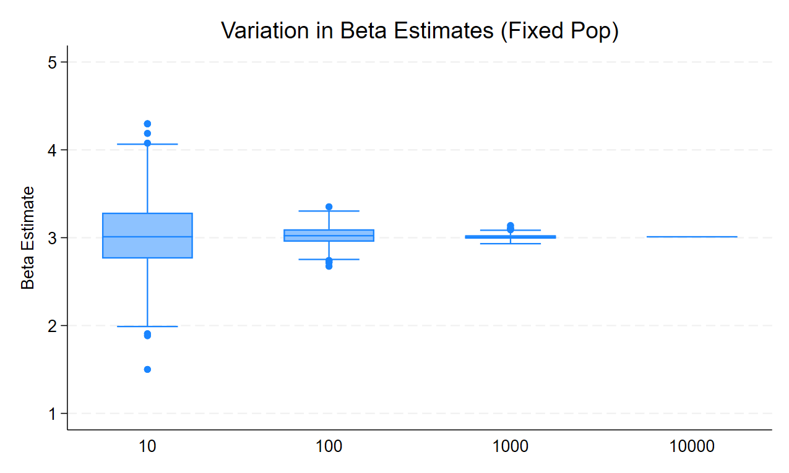
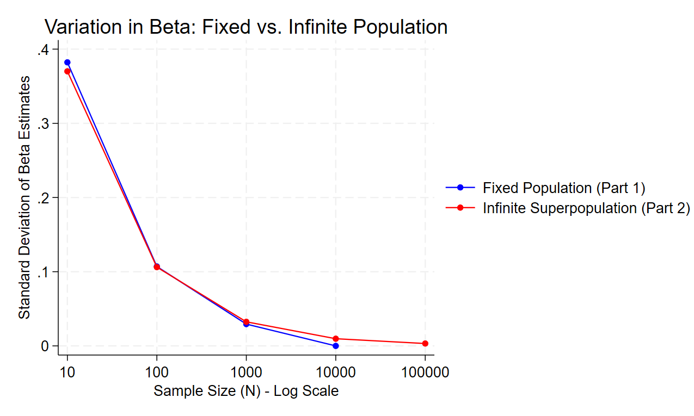

# Part 1: Sampling Noise in a Fixed Population

## 1. Data Generating Process (DGP) Overview
For this simulation, I created a fixed population of $N=10,000$ observations. The independent variable $x$ was generated using a standard normal distribution, and the outcome variable $y$ was generated with a true $\beta$ coefficient of 3 and an additive normal error term ($y = 2 + 3x + \epsilon$). I then simulated 500 random draws from this fixed population at four different sample sizes ($N = 10, 100, 1000, 10000$) to observe how sampling noise behaves. 

## 2. Simulation Results: Beta Estimates and SEM
The table below summarizes the mean and standard deviation of the $\beta$ estimates and the Standard Error of the Mean (SEM) across the 500 simulations for each sample size.

| Sample Size ($N$) | Mean Beta Estimate | SD of Beta Estimates | Mean SEM | SD of SEM |
| :--- | :--- | :--- | :--- | :--- |
| **10** | 3.022 | 0.382 | 0.354 | 0.131 |
| **100** | 3.021 | 0.107 | 0.102 | 0.010 |
| **1,000** | 3.008 | 0.029 | 0.032 | 0.001 |
| **10,000** | 3.010 | **0.000** | 0.010 | **0.000** |

## 3. Visualizing the Variation

The box plot below visually demonstrates the narrowing spread of the $\beta$ estimates as the sample size increases. At $N=10$, the estimates are widely dispersed. By $N=1000$, the estimates are tightly clustered around the true population parameter of 3.0. At $N=10000$, there is no variation.

## 4. Discussion: The Behavior of SEM and Confidence Intervals
As $N$ gets larger, we observe two critical statistical phenomena regarding the SEM and Confidence Intervals:

* **Shrinking Variance:** As expected by the Law of Large Numbers, as the sample size increases from 10 to 1,000, the Standard Error of the Mean (SEM) consistently shrinks, dropping from a mean of 0.354 to 0.032. Consequently, the confidence intervals become progressively narrower, indicating higher precision in our estimates. 
* **The $N=10,000$ Limit:** Because this simulation draws from a *fixed* population of exactly 10,000 observations, sampling $N=10,000$ means we are selecting the entire population in every single one of the 500 simulations. Because there is no longer any random sampling variation—we are just running a regression on the exact same 10,000 people 500 times—the Standard Deviation of the $\beta$ estimates and the Standard Deviation of the SEM drop to exactly **0.000**. The confidence interval for the variation across samples completely collapses because the "sampling noise" has been entirely eliminated.

# Part 2: Sampling Noise in an Infinite Superpopulation

## 1. Data Generating Process (DGP) Overview
In this section, instead of drawing from a fixed static dataset, the program mathematically generates new data from scratch for every single observation using the underlying DGP ($x \sim N(0,1)$ and $y = 2 + 3x + \epsilon$). This simulates drawing randomly from an infinite superpopulation. We ran the simulation 500 times for sample sizes corresponding to powers of 2 (up to 1,048,576) and powers of 10.

## 2. Comparison Table: Fixed vs. Infinite Population
The table below contrasts the variation (Standard Deviation of the Beta estimates) and the mean Standard Error of the Mean (SEM) between Part 1 (Fixed) and Part 2 (Infinite) at various powers of 10.

| Sample Size ($N$) | Part 1: Beta SD (Fixed) | Part 2: Beta SD (Infinite) | Part 1: Mean SEM | Part 2: Mean SEM |
| :--- | :--- | :--- | :--- | :--- |
| **10** | 0.382 | 0.370 | 0.354 | 0.353 |
| **100** | 0.107 | 0.106 | 0.102 | 0.100 |
| **1,000** | 0.029 | 0.032 | 0.032 | 0.032 |
| **10,000** | **0.000** | **0.010** | 0.010 | **0.010** |
| **100,000** | N/A | 0.003 | N/A | 0.003 |
| **1,000,000**| N/A | 0.001 | N/A | 0.001 |

## 3. Visualizing Part 1 and Part 2 Together
The figure below plots the Standard Deviation of the beta estimates across different sample sizes for both populations.

## 4. Discussion and Conceptual Differences

**Why can we draw a larger sample size in Part 2?**
In Part 1, our population was physically constrained by a fixed dataset of exactly 10,000 observations. We cannot sample more than 10,000 individuals without sampling with replacement (duplicating them). In Part 2, the dataset is dynamically generated by a mathematical formula (the DGP). Because the DGP can create endless independent draws from the theoretical distribution, the superpopulation is functionally infinite. This is why we are able to easily draw samples of $N=100,000$ or even $N=1,000,000$ without running out of unique observations.

**Why are the SEM and Confidence Intervals different at N=10,000?**
At smaller sample sizes ($N=10$ to $N=1000$), the behavior of the Beta variation and SEM between the two populations is almost identical. A small sample drawn from 10,000 looks statistically similar to a small sample drawn from infinity. 

However, a major divergence occurs at $N=10,000$:
* **In Part 1 (Fixed Population):** Sampling 10,000 individuals means we are surveying the *entire* population. Because nobody is left out, there is no longer any random sampling error. The variation (SD) in beta across 500 simulations drops to exactly 0, and the confidence intervals collapse entirely because we have captured the true population parameter perfectly.
* **In Part 2 (Infinite Superpopulation):** A sample of $N=10,000$ is still just a tiny fraction of an infinite population. Therefore, random sampling noise still exists. As shown in the table, the Standard Deviation of Beta remains at 0.010, and the confidence intervals do not collapse to zero. While the SEM and CIs will continue to shrink asymptotically towards zero as $N$ scales into the millions (proportional to $1/\sqrt{N}$), they will never hit absolute zero because the population itself is infinite.

# Part 3: Power Calculations for Individual-Level Randomization

This section explores how sample size requirements change under different real-world trial constraints when attempting to detect a 0.1 standard deviation treatment effect with 80% power. 

## 1. Baseline Scenario (50/50 Split)
Assuming perfect compliance, zero attrition, and a perfectly balanced allocation (50% treatment, 50% control), Stata's `power twomeans` calculation indicates we need a total sample size of **3,142** individuals (1,571 per group) to achieve 80% power.

## 2. Adjusting for Attrition
In field experiments, participants often drop out of studies. Assuming a 15% attrition rate across both arms, we must inflate our baseline sample size to ensure we still have 3,142 individuals by the endline survey. The formula for this adjustment is $N_{adjusted} = N_{base} / (1 - \text{attrition rate})$. Therefore, we must enroll $3142 / 0.85 =$ **3,697** individuals at baseline.

## 3. Adjusting for Unbalanced Allocation (30/70 Split)
If budget constraints limit the treatment to only 30% of the sample, the trial design becomes unbalanced. Statistically, a 50/50 split is the most mathematically efficient design for maximizing power. Moving to a 30/70 split decreases this statistical efficiency, meaning we need a larger overall sample size to maintain that same 80% power. Under this unbalanced constraint, our required total sample size increases to **3,740** individuals (1,122 in treatment, 2,618 in control).

# Part 4: Power Calculations for Cluster Randomization

In Cluster Randomized Trials (CRTs), treatment is assigned at the group level (e.g., schools) rather than the individual level. This introduces an Intraclass Correlation Coefficient (ICC or $\rho$), meaning students within the same school have correlated outcomes. For this simulation, the Data Generating Process (DGP) was designed with a school-level variance of 0.3 and student-level variance of 0.7, resulting in an ICC of 0.3. We aimed to detect a 0.2 SD treatment effect.

## 1. Increasing Cluster Size vs. Number of Clusters
When holding the total number of schools fixed at 200 (100 per arm) and increasing the number of students per school using powers of 2, we observe a rapid plateau in statistical power:
* $m=2$: Power = 41.8%
* $m=16$: Power = 67.4%
* $m=128$: Power = 72.5%
* $m=1024$: Power = 73.2%

Because the ICC is relatively high (0.3), adding more students to an already sampled school provides steeply diminishing marginal returns. Even with over 1,000 students per school, we cannot reach 80% power. 

## 2. Required Schools for 80% Power
If we fix the cluster size at a realistic $m = 15$ students per school, Stata calculates that we need **274 total schools** (137 in the treatment group, 137 in the control group) to achieve 80% power. This equates to a total sample size of 4,110 students.

## 3. Adjusting for 70% Compliance
If only 70% of the assigned schools actually adopt the treatment (a compliance rate of $c = 0.70$), our statistical power drops significantly. To correct for this non-compliance, we must inflate the required number of clusters by a factor of $1/c^2$ (which is $1 / 0.49 \approx 2.04$). Consequently, our required sample size more than doubles: we now need **560 total schools** to maintain 80% power.
