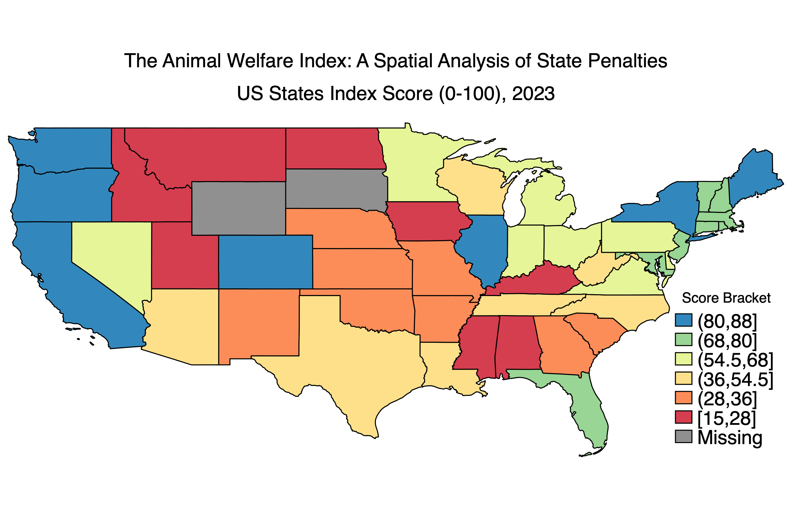

# Stata04_Assignment_ReadMeFile_as5376

# Part 1
### Answer Q1 
Unchanged Wards: 2705
### Answer Q2
Parentless Wards: 440
### Answer Q3
Orphan Wards: 616
### Answer Q4
Split into 2: 488
### Answer Q5
Split into 3+: 45

### Answer Q6    
     +------------------------------------------------+
     | region_g~2012   base_w~s   split_~l   split_~o |
     |------------------------------------------------|
  1. |         rukwa         63         25   .3968254 |
  2. |      morogoro        150         52   .3466667 |
  3. |        katavi         42         12   .2857143 |
  4. |        mtwara        144         41   .2847222 |
  5. |        arusha        121         31   .2561983 |
     |------------------------------------------------|
  6. |        mwanza        153         34   .2222222 |
  7. |         geita         97         20   .2061856 |
  8. |        kigoma        109         22   .2018349 |
  9. |        tabora        164         31   .1890244 |
 10. |        simiyu        109         20   .1834862 |
     |------------------------------------------------|
 11. |          mara        150         25   .1666667 |
 12. |        ruvuma        137         22   .1605839 |
 13. |       manyara        120         19   .1583333 |
 14. |         tanga        204         30   .1470588 |
 15. | dar es salaam         89         13   .1460674 |
     |------------------------------------------------|
 16. |         mbeya        207         28   .1352657 |
 17. |         pwani        106         12   .1132075 |
 18. |        dodoma        187         21   .1122995 |
 19. |         lindi        130         14   .1076923 |
 20. |        njombe         95         10   .1052632 |
     |------------------------------------------------|
 21. |        iringa         90          9         .1 |
 22. |   kilimanjaro        151         14   .0927152 |
 23. |     shinyanga        117         10   .0854701 |
 24. |       singida        123          9   .0731707 |
 25. |        kagera        180          9        .05 |
     +------------------------------------------------+

# Part 2

#### Table 1: Final Simulation Summary at N = 2500
| Model Specification | Mean Beta Estimate | Variance of Estimate |
| :--- | :--- | :--- |
| **Model 1 (Simple)** | 0.5659 | 0.000187 |
| **Model 2 (Confounder Only)** | 0.2990 | 0.000201 |
| **Model 3 (+ Mediator)** | 0.3001 | 0.000349 |
| **Model 4 (Collider)** | 0.1538 | 0.000217 |
| **Model 5 (All)** | 0.0398 | 0.000333 |

### 1. Analysis of Models
As seen in the **"Mean of Treatment Effect Estimates by Model"** figure (graph2), only Model 2 specifications successfully recover the true treatment effect parameter of 0.3.

* Model 1 (red dashed line) is severely biased upwards, estimating an effect of ~0.56. 

* Model 4 (The orange line) demonstrates that controlling for a collider biases the estimate downwards to ~0.15. 

* Model 5 (The purple dotted line) shows the danger of throwing every available variable into a regression. By including both the omitted variable and the collider, the estimate is completely attenuated down to ~0.04.

* Model 3 (The green line) tracking the model with the mediator remains unbiased. However, looking at the data table reveals the hidden cost of including this unnecessary post-treatment variable: Model 3 has a significantly higher variance compared to the correct Model 2. 

### 2. Analysis of Variance
* For all five models, the variance is highest at small sample sizes (e.g., N=50) and rapidly decays toward zero as the sample size approaches N=2500. 

* The most critical takeaway from comparing the two figures is that standard errors shrink regardless of whether the model is specified correctly. Model 1 and Model 5 both have extremely low variance at N=2500, meaning they are highly confident in their estimates. However, the Mean plot shows that they are wrong. A large sample size cannot fix structural bias caused by bad controls.

# Part 3
SPATIAL DATA for 

