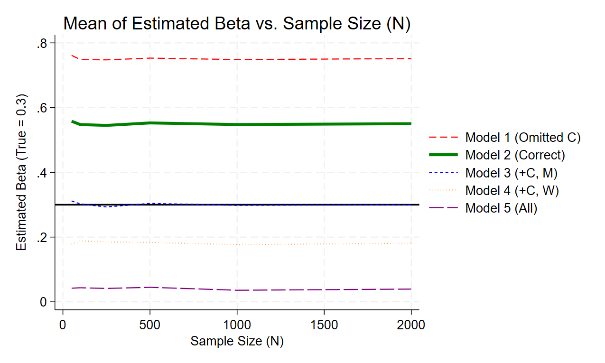
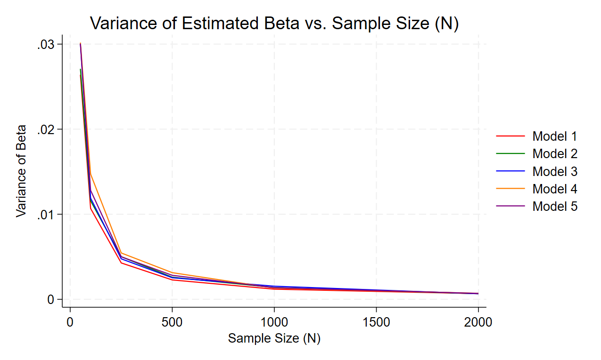
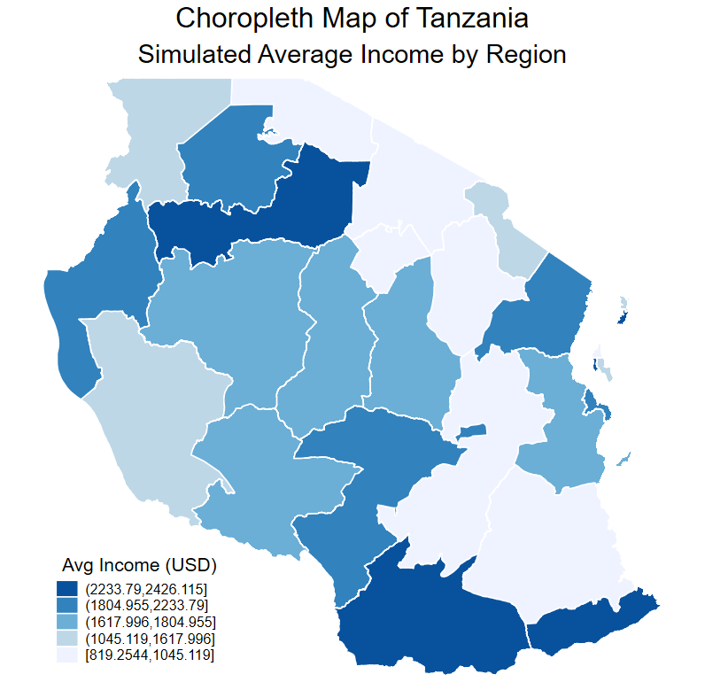

# PPOL6818 Stata4

**Author:** [Ziqiao Shan / zs352]  

## Part 1: Fuzzy Matching (Tanzania Wards 2010 vs. 2015)
Between 2010 and 2015, the number of wards in Tanzania increased significantly due to administrative divisions. To track these changes and match 2015 wards to their corresponding 2010 parent wards, I utilized a GIS intersection dataset containing the percentage of overlapping areas. I matched each 2015 ward to the 2010 ward with the largest overlapping percentage to establish a crosswalk.

**Key Findings based on the merged electoral and spatial datasets:**
* **Stable Wards:** **2,773** wards exist both in 2010 and 2015 without undergoing any division.
* **"Parentless" Wards:** **319** wards exist in the 2015 clean dataset but could not be matched to any 2010 parent ward in the GIS crosswalk.
* **"Orphan" Wards:** **272** wards exist in the 2010 clean dataset but did not transition into any 2015 ward according to our matching algorithm.
* **Ward Divisions:** * **466** wards from 2010 were divided into exactly two new wards by 2015.
  * **37** wards from 2010 were divided into three or more new wards.
* **Regional Division Rate:** The region with the highest ward division rate is **Rukwa** at **39.68%** (25 out of its 63 wards were divided). Other highly divided regions include Morogoro (32.89%) and Katavi (28.57%).

---

## Part 2: De-biasing a Parameter Estimate using Controls
To demonstrate how controlling for different types of variables affects parameter estimation, I developed a Monte Carlo simulation with a specific Data Generating Process (DGP).

### The Data Generating Process (DGP)
The true direct treatment effect of Treatment (T) on Outcome (Y) is set to **0.3**. The DGP includes the following covariates:
* **Confounder (C):** `C = rnormal()`. Affects both T and Y.
* **Treatment (T):** `T = 0.5 * C + rnormal()`. The independent variable.
* **Mediator (M):** `M = 0.5 * T + rnormal()`. Lies on the causal pathway from T to Y.
* **Outcome (Y):** `Y = 0.3 * T + 0.5 * C + 0.5 * M + rnormal()`. 
* **Collider (W):** `W = 0.5 * T + 0.5 * Y + rnormal()`. Jointly caused by T and Y.

### Model Comparison & Convergence Results
I ran 5 different regression models, iteratively expanding the sample size (N = 50 to 2000) with 200 repetitions each. 

**1. Mean of Estimated Beta vs. Sample Size (N)**

* **Model 1 (`reg Y T`):** Exhibits severe upward bias. By failing to control for the confounder (C), the model suffers from Omitted Variable Bias (OVB).
* **Model 2 (`reg Y T C`):** Converges to **~0.55**. This model correctly controls for the confounder and successfully captures the **Total Effect** of T on Y (Direct effect 0.3 + Indirect effect through M (0.5 * 0.5 = 0.25) = 0.55).
* **Model 3 (`reg Y T C M`):** Converges perfectly to the true value of **0.3**. By controlling for the confounder (C) and "blocking" the mediator (M), this model cleanly isolates the true **Direct Effect** (0.3) specified in the DGP.
* **Models 4 & 5 (Including Collider W):** Both models exhibit significant bias (converging near 0.2 and 0 respectively). Controlling for a collider opens a non-causal path, introducing severe endogenous selection bias.

**2. Variance of Estimated Beta vs. Sample Size (N)**

* As the sample size (N) grows, the variance of the Beta estimates in all 5 models strictly decreases and approaches zero. This visually confirms the statistical principle of consistency: larger sample sizes increase precision and stabilize the estimate, even if the model itself is fundamentally biased.

---

## Part 3: Spatial Analysis

For the final spatial analysis component, I generated a choropleth map for Tanzania at the regional (Admin 1) level. 
* **Data Sources:** I utilized the administrative shapefile for Tanzania (from DIVA-GIS) and successfully merged it (`_merge == 3` for all 26 regions) with a simulated public dataset representing "Average Income (USD)".
* **Visualization:** Using the `spmap` package in Stata, the resulting map categorizes the simulated income into 5 quantiles using a sequential blue color palette (`fcolor(Blues)`). This effectively illustrates the spatial distribution and variance of the regional data across Tanzania.