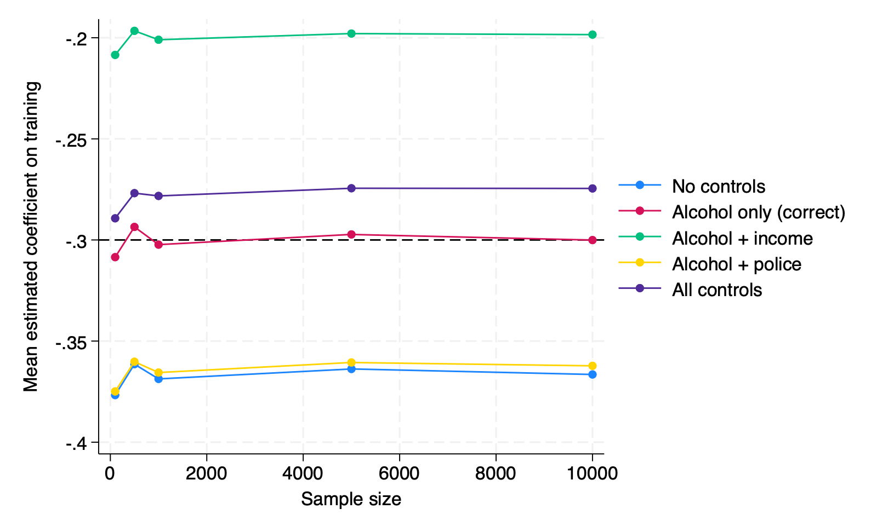
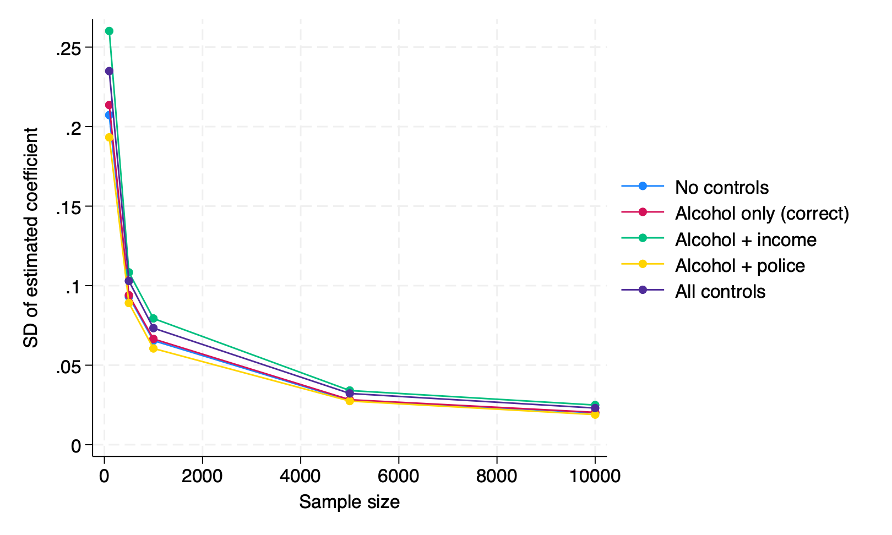
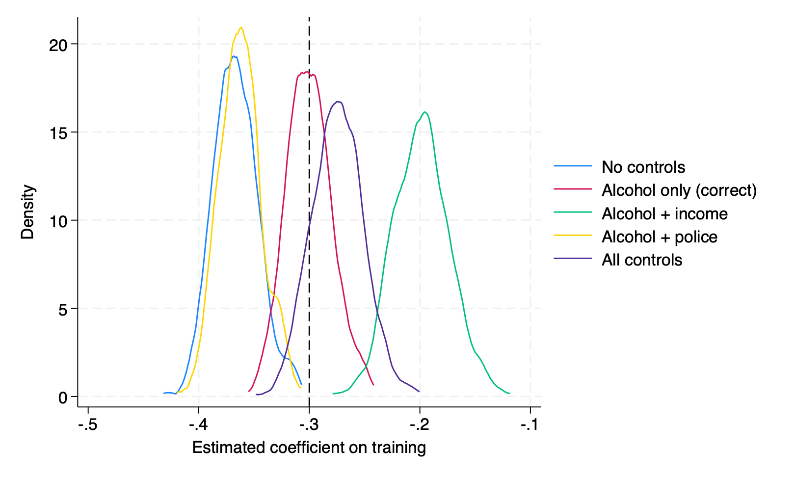

# Part 2: De-biasing a Parameter Estimate

## Setup

I simulated a scenario where a job training program aims to reduce domestic violence (DV). The data generating process includes:

- **Alcohol use** (confounder): affects both whether someone joins the program and their DV severity
- **Training** (treatment): binary, whether the person enrolled in the program
- **Income** (mediator): training increases income, which in turn reduces DV
- **DV score** (outcome): severity of domestic violence
- **Police report** (collider): influenced by both training (more monitoring) and DV severity

## Data Generating Process

```
alcohol  = Uniform(0, 1)
training = 1 if Uniform(0,1) > 0.3 + 0.4 * alcohol, else 0
income   = 0.4 * training + Uniform(0, 1)
dv_score = -0.2 * training + 0.5 * alcohol - 0.25 * income + Normal(0, 1)
police   = 0.3 * training + 0.4 * dv_score + Normal(0, 1)
```

The true total effect of training on DV score:
- Direct effect: -0.2
- Indirect effect via income: -0.25 × 0.4 = -0.1
- **Total effect: -0.3 SD**

## Models

I ran five regression models with different sets of controls:

| Model | Controls | What it estimates |
|-------|----------|-------------------|
| 1 | None | Biased by confounding |
| 2 | Alcohol | Total causal effect (correct) |
| 3 | Alcohol + income | Direct effect only (blocks mediator) |
| 4 | Alcohol + police | Biased by collider |
| 5 | All variables | Biased by both mediator and collider |

Each model was run 500 times at sample sizes of 100, 500, 1000, 5000, and 10000.

## Results

### Bias (Figure 1)



Only Model 2 (controlling for alcohol alone) converges to the true value of -0.3. The other models converge to wrong values no matter how large the sample gets:

- **Model 1** (~-0.37): overstates the effect because alcohol is omitted
- **Model 3** (~-0.20): understates the effect because income absorbs part of it
- **Model 4** (~-0.36): overstates the effect due to collider bias
- **Model 5** (~-0.27): a mix of mediator and collider distortions

This shows that bias does not go away with more data. A misspecified model stays wrong.

### Convergence (Figure 2)



All five models show decreasing variance as N grows, which is expected. But lower variance just means the estimate is more precise — it does not mean it is correct. Models 1, 3, 4, and 5 precisely converge to the wrong number.

### Sampling Distribution at N = 10,000 (Figure 3)



At the largest sample size, each model's distribution is tight and well-separated. Model 2's peak sits right on the true value (-0.3). The other peaks are clearly shifted away from it.

## Takeaway

Controlling for the right variables matters more than having a large sample. Adding controls is not always better — controlling for a mediator removes part of the effect you want to estimate, and controlling for a collider introduces new bias. The correct strategy is to control only for confounders.