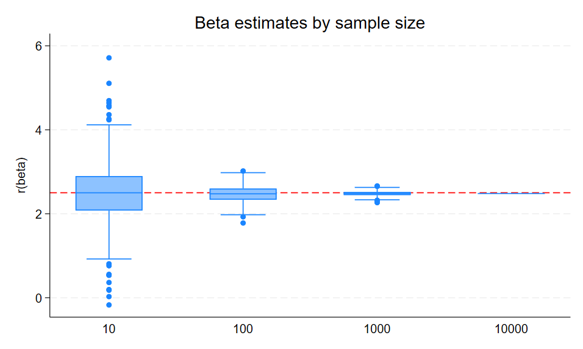
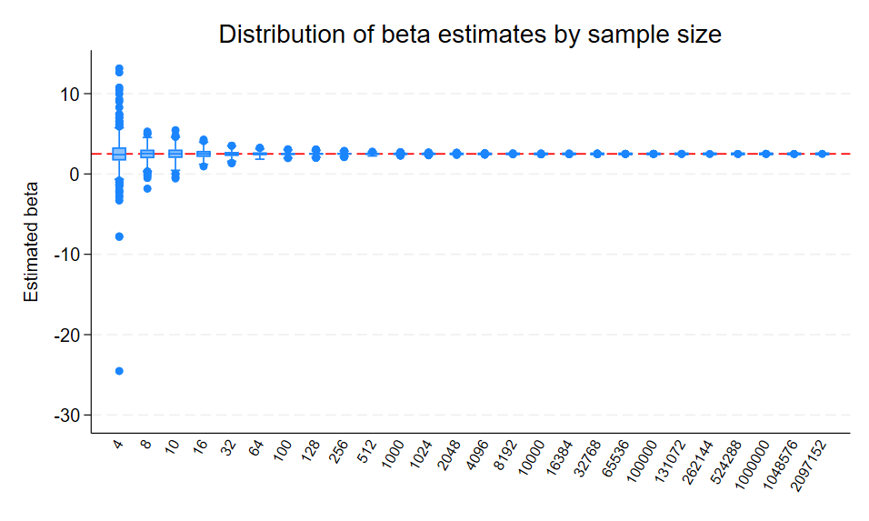
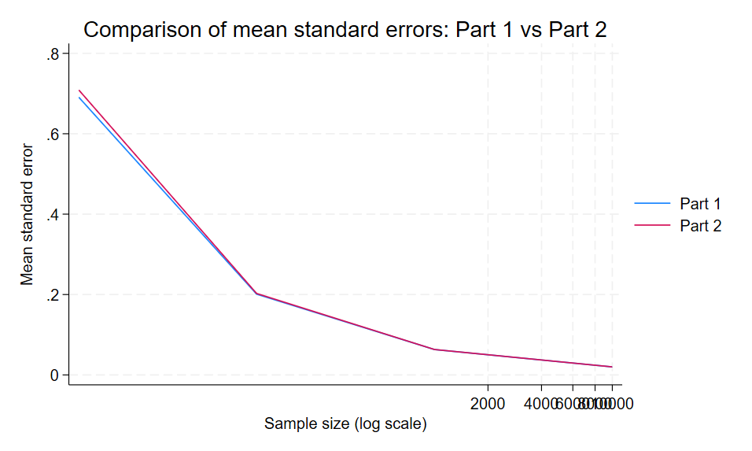
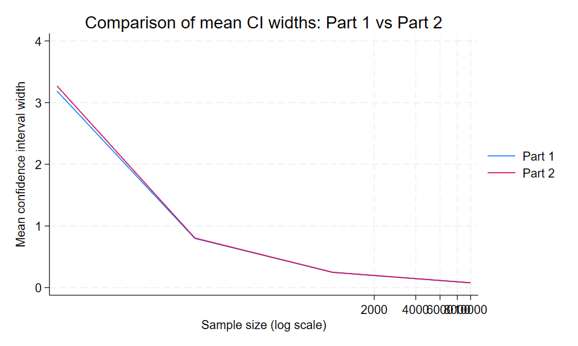

# Part1

# Sampling Noise in a Fixed Population

## 1. Data Generating Process

In this exercise, I constructed a fixed population of 10,000 observations using a known data generating process. The independent variable `x` was drawn from a standard normal distribution, and the error term `u` was randomly generated.

The outcome variable `y` is defined as:

y = 1 + 2.5x + u

where the true coefficient on `x` is **2.5**. This allows us to evaluate how estimated coefficients vary across samples.

## 2. Simulation Design

Using this fixed population, I repeatedly drew random samples and estimated the regression of `y` on `x`.

A Stata program was written to:
- Load the fixed population  
- Randomly sample N observations  
- Run a regression  
- Return key statistics:
  - beta (coefficient)
  - standard error (SEM)
  - p-value
  - confidence intervals  

The simulation was repeated **500 times** for each sample size:

- N = 10  
- N = 100  
- N = 1,000  
- N = 10,000  

This produced a total of **2,000 regression results**.

## 3. Results

### 3.1 Variation in Beta Estimates

As sample size increases, the variation in estimated coefficients decreases significantly.

- At N = 10, estimates are highly dispersed and often far from the true value.
- At N = 100, estimates become more stable but still show variability.
- At N = 1,000, estimates cluster closely around 2.5.
- At N = 10,000, estimates are tightly concentrated around the true value.

This pattern is shown in the figure below.

### 3.2 Standard Errors and Confidence Intervals

Standard errors and confidence intervals shrink as sample size increases.

- Small samples produce large uncertainty.
- Larger samples produce more precise estimates.

This confirms that estimation precision improves with sample size.

### 3.3 Statistical Significance

The likelihood of detecting a statistically significant effect increases with sample size.

- Small samples sometimes fail to detect the true effect.
- Large samples consistently produce statistically significant results.

## 4. Interpretation

This simulation illustrates **sampling noise**. Even with a known true relationship, small samples can produce misleading estimates.

As sample size increases:
- Estimates become more accurate  
- Estimates become more precise  
- Statistical inference becomes more reliable  

This reflects the law of large numbers.

## 5. Conclusion

The results show that sampling variability is large in small samples but decreases as sample size increases. Larger samples lead to more stable estimates, smaller standard errors, and narrower confidence intervals.

This highlights the importance of sufficient sample size in empirical research.

# Part 2: Sampling Noise in an Infinite Superpopulation

## 1. Data Generating Process

In Part 2, data are generated from an infinite superpopulation using the same data generating process as in Part 1:

y = 1 + 2.5x + u

where:
- x ~ N(0,1)
- u ~ N(0,2)

Unlike Part 1, each simulation creates a new dataset, meaning every sample is an independent draw from the underlying population distribution.

## 2. Simulation Design

A Stata program was written to:
- Generate a dataset of size N  
- Estimate a regression of y on x  
- Return:
  - beta (coefficient estimate)
  - standard error (SEM)
  - p-value
  - confidence interval bounds  

The simulation was repeated 500 times for each sample size.

The sample sizes include:
- The first 20 powers of two (from 4 up to 2,097,152)
- Additional powers of ten (10, 100, 1,000, 10,000, 100,000, 1,000,000)

This produces a total of 13,000 regression results.

## 3. Results

### 3.1 Variation in Beta Estimates

The boxplot below shows the distribution of beta estimates across different sample sizes.

The results show a clear pattern:
- At small sample sizes (e.g., N = 4, 8), the estimates are highly dispersed and often far from the true value of 2.5.
- As sample size increases, the estimates become more concentrated.
- At very large sample sizes, the estimates cluster tightly around the true parameter.

This indicates that sampling variability decreases as sample size increases.

### 3.2 Summary Table

The summary table reports:
- Mean of beta  
- Standard deviation of beta  
- Mean standard error (SEM)  
- Mean confidence interval width  

The table confirms that:
- The **standard deviation of beta decreases** as N increases  
- The **mean SEM decreases**, indicating improved precision  
- The **confidence interval width becomes smaller**, showing reduced uncertainty  

## 4. Comparison with Part 1

To compare Part 1 and Part 2, I focus on the shared sample sizes:

- N = 10  
- N = 100  
- N = 1,000  
- N = 10,000  

A comparison table is constructed using these sample sizes.

In addition, the following figures compare the behavior of uncertainty across the two settings.

### Comparison of Standard Errors

### Comparison of Confidence Interval Widths

The results show that:
- In both Part 1 and Part 2, standard errors and confidence intervals decrease as sample size increases.
- However, Part 1 tends to show slightly smaller uncertainty at large sample sizes.

## 5. Interpretation

### Why larger sample sizes are possible in Part 2

In Part 1, sampling is conducted from a fixed population of 10,000 observations, which limits the maximum possible sample size.

In Part 2, each simulation generates a new dataset from the underlying distribution. This represents an infinite superpopulation, allowing arbitrarily large sample sizes.

### Why SEM and confidence intervals differ from Part 1

The difference arises from how samples are generated:

- Part 1: sampling without replacement from a finite population  
- Part 2: independent draws from an infinite population  

Because of this:
- In Part 1, variability decreases more quickly when the sample size approaches the population size  
- In Part 2, variability follows standard statistical theory without finite population constraints  

## 6. Conclusion

Overall, the results show that increasing sample size reduces sampling noise and improves the precision of estimates.

The boxplot and summary table demonstrate that estimates become more stable as N increases. The comparison with Part 1 further highlights how population structure affects statistical uncertainty.

This exercise illustrates both the importance of sample size and the difference between finite population and superpopulation frameworks in statistical analysis.

# Part 3: Power Calculations for Individual-Level Randomization

## 1. Data Generating Process

We construct a data generating process where the outcome variable is normally distributed with mean 0 and standard deviation 1:

- Baseline outcome: \( Y_0 \sim N(0,1) \)
- Individual treatment effects are heterogeneous and drawn from a uniform distribution: \( \tau \sim U(0, 0.2) \)
- Observed outcome: \( Y = Y_0 + \text{treat} \times \tau \)

This implies an average treatment effect (ATE) of 0.1 standard deviations.

## 2. Treatment Assignment

Individuals are randomly assigned into treatment and control groups.

- Baseline case:
  - 50% treatment
  - 50% control

This balanced design maximizes statistical efficiency.

## 3. Baseline Power Calculation (80% Power)

Using a two-sample t-test with:

- Effect size = 0.1 standard deviations  
- Standard deviation = 1  
- Significance level = 0.05  
- Power = 0.80  

The required sample size is:

| Group      | Sample Size |
|-----------|------------|
| Treatment | 3,142      |
| Control   | 3,142      |
| **Total** | **6,284**  |

## 4. Effect of Attrition on Sample Size

Introducing a 15% attrition rate increases the required sample size:

| Scenario                        | Total N | Treatment | Control |
|--------------------------------|--------|----------|--------|
| 50/50 allocation               | 6,284  | 3,142    | 3,142  |
| 50/50 + 15% attrition          | 7,393  | 3,697    | 3,697  |

Attrition reduces the effective sample size. To maintain statistical power, the initial sample must be inflated:

\[
N_{adjusted} = \frac{N}{1 - 0.15}
\]

Thus, attrition introduces inefficiency and increases required sample size.

## 5. Effect of Unequal Treatment Assignment (30% Treated)

When only 30% of individuals receive treatment, the required sample size increases:

| Scenario                        | Total N | Treatment | Control |
|--------------------------------|--------|----------|--------|
| 30/70 allocation               | 10,814 | 3,244    | 7,570  |
| 30/70 + 15% attrition          | 12,722 | 3,817    | 8,906  |

Compared to the balanced design, unequal allocation reduces efficiency because the treatment group becomes smaller, increasing the variance of the estimated treatment effect.

## 6. Key Insights

- Balanced designs (50/50) are the most efficient and require the smallest sample size  
- Attrition increases required sample size by reducing usable observations  
- Unequal treatment allocation (30/70) reduces efficiency and requires larger samples  
- Combining attrition and imbalance leads to a substantial increase in required sample size  

Overall, these results highlight the importance of careful experimental design when planning studies to ensure sufficient statistical power.

# Part 4: Power Calculations for Cluster Randomization

## 1. Data Generating Process

In this part, I model a cluster-randomized trial where treatment is assigned at the **school level** and the outcome is each student's **math score**.

I generate the outcome using two sources of variation:

- a **school-level random effect**
- an **individual-level random error**

The data generating process is:

\[
Y_{ij} = u_j + \varepsilon_{ij} + \text{treat}_j \tau_j
\]

where:

- \(u_j\) is the school-level effect
- \(\varepsilon_{ij}\) is the student-level error
- \(\tau_j\) is the school-level treatment effect

To make the intraclass correlation coefficient (ICC) approximately 0.3, I set:

- school-level variance = 0.3
- student-level variance = 0.7

so that total variance is approximately 1 and

\[
ICC = \frac{0.3}{0.3 + 0.7} = 0.3
\]

Treatment effects are heterogeneous and drawn from a uniform distribution:

\[
\tau_j \sim U(0.15, 0.25)
\]

which gives an average treatment effect of 0.2 standard deviations.

## 2. Cluster Assignment

Schools are divided evenly between treatment and control groups. Treatment is assigned at the school level, not the student level.

The simulation program allows both of the following to vary:

- the **number of clusters** (schools)
- the **cluster size** (students per school)

For estimation, I regress student math scores on treatment status and use **cluster-robust standard errors at the school level**.

## 3. Simulation Design

I use simulation to evaluate power under different cluster-randomized designs.

First, I hold the number of schools fixed at 200 and vary the cluster size using the first 10 powers of 2:

- 2, 4, 8, 16, 32, 64, 128, 256, 512, 1024

Second, I hold cluster size fixed at 15 students per school and vary the number of schools to determine how many are needed to achieve 80% power.

Finally, I repeat the school-count exercise under imperfect treatment adoption, assuming that only 70% of treated schools actually adopt the intervention.

Each design is simulated 500 times, and power is estimated as the proportion of simulations in which the treatment effect is statistically significant at the 5% level.

## 4. What Happens to Power When Cluster Size Increases?

Holding the number of schools fixed at 200, power increases as cluster size rises from very small values, but the gains become quite limited after that.

The estimated power values are:

| Cluster Size | Power |
|-------------|-------|
| 2   | 0.408 |
| 4   | 0.504 |
| 8   | 0.612 |
| 16  | 0.718 |
| 32  | 0.682 |
| 64  | 0.706 |
| 128 | 0.704 |
| 256 | 0.730 |
| 512 | 0.718 |
| 1024| 0.728 |

The main pattern is that increasing cluster size from 2 to 16 meaningfully improves power, but after that the returns are small and somewhat noisy.

This happens because the ICC is relatively high (about 0.3). Students within the same school are correlated, so adding more students to an already-sampled school does not provide as much new information as adding more schools would.

### Recommended Cluster Size

I would recommend a cluster size of about **15 to 16 students per school**.

The reason is that power rises substantially up to this point, but beyond that the marginal improvement is very small. A cluster size around 15 or 16 seems to capture most of the gains without collecting a large number of additional students per school. This is a more efficient design than trying to greatly increase cluster size.

## 5. How Many Schools Are Needed for 80% Power When Cluster Size = 15?

Holding cluster size fixed at 15 students per school, the first design that reaches at least 80% power is:

- **280 schools**, with estimated power = **0.822**

Nearby values confirm this threshold:

| Schools | Power |
|--------|-------|
| 260 | 0.786 |
| 280 | 0.822 |
| 300 | 0.816 |

So, I would conclude that the experiment needs approximately **280 schools** to achieve 80% power under full treatment adoption.

## 6. What If Only 70% of Schools Actually Adopt the Treatment?

When only 70% of schools assigned to treatment actually adopt it, the required number of schools increases.

With cluster size fixed at 15, the first design that reaches at least 80% power is:

- **350 schools**, with estimated power = **0.866**

Nearby values are:

| Schools | Power |
|--------|-------|
| 300 | 0.774 |
| 350 | 0.866 |
| 400 | 0.908 |

Thus, under incomplete adoption, I would recommend approximately **350 schools** to achieve 80% power.

This increase is expected because imperfect adoption dilutes the effective treatment contrast between treatment and control groups, making the intervention harder to detect statistically.

## 7. Key Takeaways

The simulation results highlight three main lessons.

- Increasing **cluster size** helps at first, but the gains become limited once cluster size is moderate because students within the same school are correlated.
- Increasing the **number of schools** is much more effective for improving power in a cluster-randomized trial.
- Imperfect treatment adoption substantially increases the number of schools required to maintain the same power.

Overall, with ICC around 0.3, the most efficient strategy is to prioritize **more schools rather than much larger schools**.