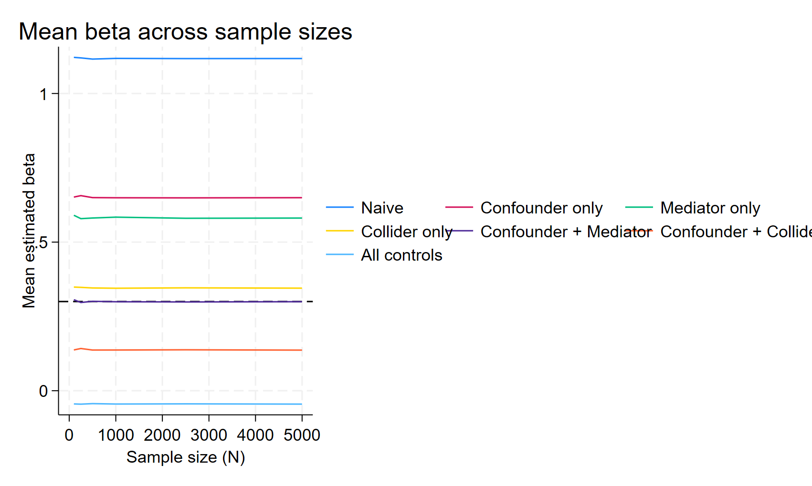
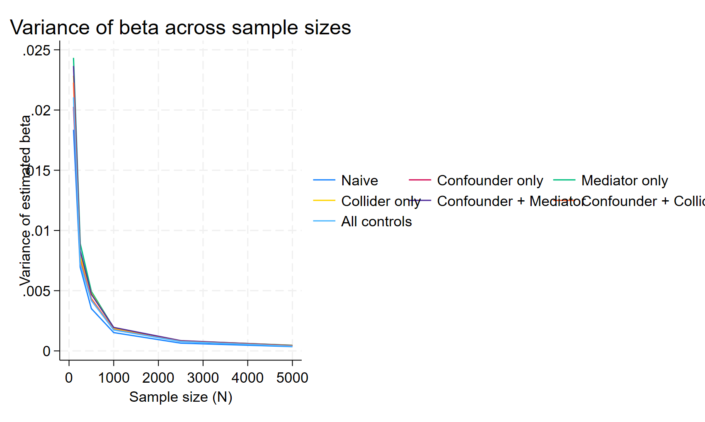
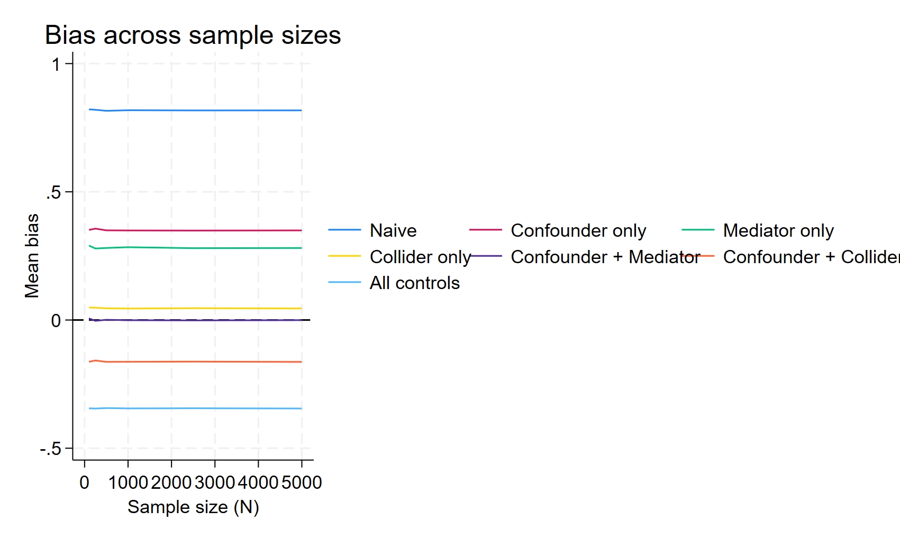
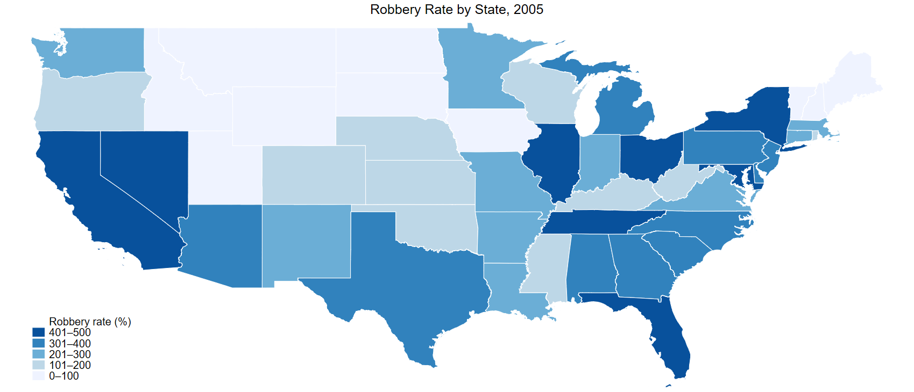

## Part 2 Explanation

In this part, I used a simulation to show how different control variables can change the estimate of a treatment effect. I set the true effect of treatment on the outcome Y to 0.3. Then I created three special variables: a confounder, a mediator, and a collider.

The confounder affects both treatment and the outcome. So if I do not control for it, the regression mixes up the real treatment effect with the effect of the confounder. That makes the estimate biased.

The mediator is different. It is caused by treatment, and then it affects the outcome. So it is part of the pathway through which treatment changes Y. If I control for the mediator, I am removing part of the treatment effect, so the estimated coefficient becomes too small.

The collider is also a bad control, but for a different reason. It is caused by both treatment and the outcome. When I control for it, I create a false relationship between treatment and Y, which also biases the estimate.

I ran several regression models with different combinations of these variables to see which model gives the best estimate of the true effect.

## Figure 1. Mean beta by sample size

This graph shows the average estimated treatment effect for each model as the sample size gets larger. The dashed horizontal line is the true value, 0.3. The model that controls for the confounder only is the one that stays closest to 0.3, so it performs the best. The naive model and the models with mediator or collider controls stay away from the true value, which means they are biased.

## Figure 2. Variance of beta by sample size

This graph shows how much the estimated treatment effect varies across simulations. As the sample size increases, the variance becomes smaller for all models. This means all estimates become more stable with larger samples. However, being more stable does not mean being correct.

## Figure 3. Bias by sample size

This graph makes the pattern even clearer. The confounder-only model has bias closest to zero, which means it is the most accurate. The other models remain biased even when the sample size becomes large. So increasing N helps with precision, but it does not fix a bad model.

Overall, the main lesson from this simulation is that more controls are not always better. The best model is the one that controls for the right variable. In this case, controlling for the confounder only gives the best estimate of the true treatment effect. Controlling for the mediator or collider makes the estimate worse.

## Part 3:

