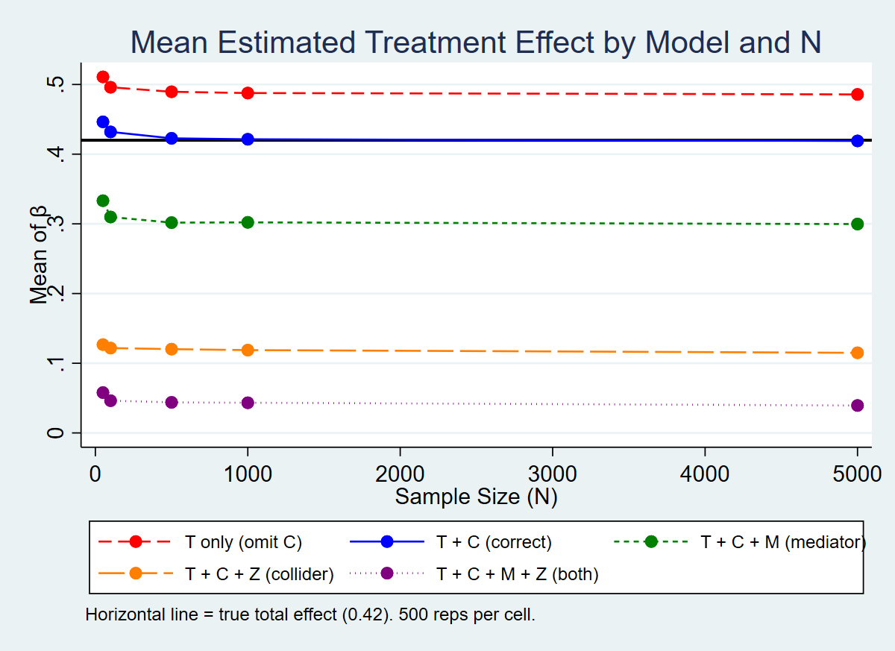
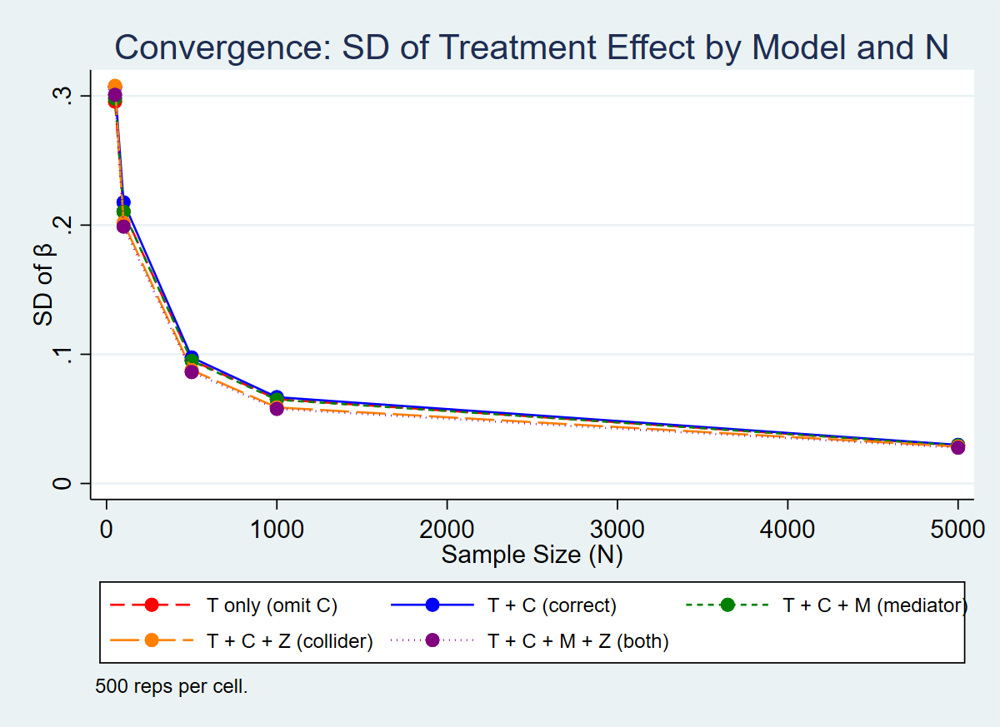

# Part 2: De-biasing a Parameter Estimate Using Controls

## 1. Data Generating Process (DGP)

The simulation constructs a causal system with one treatment variable and three types of covariates. The directed acyclic graph (DAG) is:

```
    C ──→ T ──→ M ──→ Y
    │                 ↑
    └────────────────-┘
          T ──→ Z ←── Y
```

The variables are generated as follows:

- **Confounder C** ~ Uniform(0,1). C causes both T and Y. If omitted from the regression, the estimate of the treatment effect is biased upward because C is positively correlated with both T and Y.
- **Treatment T** ~ Bernoulli(0.3 + 0.4·C). The probability of treatment increases with C, inducing a correlation between T and C.
- **Outcome Y** = 0.3·T + 0.5·C + 0.3·M + ε, where ε ~ N(0,1). The direct effect of T on Y is 0.3, and there is an additional indirect pathway through the mediator M.
- **Mediator M** = 0.4·T + η, where η ~ N(0,1). M lies on the causal path from T to Y (T → M → Y). Controlling for M blocks part of the total treatment effect.
- **Collider Z** = 0.5·T + 0.5·Y + ν, where ν ~ N(0,1). Z is caused by both T and Y. Conditioning on Z opens a spurious back-door path between T and Y, introducing bias.

The **true total effect** of T on Y is 0.3 (direct) + 0.3 × 0.4 (indirect via M) = **0.42**.

## 2. Regression Models

Five models are estimated, each including a different combination of covariates:

| Model | Specification | Rationale |
|-------|--------------|-----------|
| 1 | Y ~ T | Omits confounder C → upward bias expected |
| 2 | Y ~ T + C | Correct specification → recovers true total effect |
| 3 | Y ~ T + C + M | Controls for mediator → absorbs indirect effect, estimates shrink toward direct effect (0.30) |
| 4 | Y ~ T + C + Z | Controls for collider → opens spurious path, introduces downward bias |
| 5 | Y ~ T + C + M + Z | Both mediator and collider controlled → compounding distortions |

## 3. Simulation Design

Each model is estimated 500 times at each of five sample sizes: N ∈ {50, 100, 500, 1000, 5000}. For each run, a fresh dataset is drawn from the DGP and all five regressions are estimated. The coefficient on T is recorded from each regression.

## 4. Results

### 4.1 Bias (Mean of β̂)



The figure above plots the average estimated treatment effect across 500 simulations for each model and sample size. The black horizontal line marks the true total effect (0.42). Key findings:

- **Model 2 (T + C)** is unbiased. Its mean estimate sits on the true value at all sample sizes, confirming that controlling for the confounder alone recovers the total causal effect.
- **Model 1 (T only)** is biased upward (~0.49). Omitting the confounder C inflates the treatment effect because C is positively correlated with both T and Y. This bias does not shrink with N — it is a specification error, not a sampling problem.
- **Model 3 (T + C + M)** converges to approximately 0.30, which is the direct effect of T on Y. By controlling for the mediator, the indirect pathway (T → M → Y) is blocked. This is not "bias" in the traditional sense — the model is consistently estimating a different estimand (the direct rather than total effect).
- **Model 4 (T + C + Z)** is biased downward (~0.11). Conditioning on the collider Z opens a non-causal association between T and Y, severely distorting the estimate.
- **Model 5 (T + C + M + Z)** shows the most severe distortion (~0.04), combining the attenuating effect of the mediator with the collider bias.

All biases are stable across N, confirming that they arise from misspecification rather than finite-sample issues.

### 4.2 Convergence (SD of β̂)



The second figure plots the standard deviation of the estimated treatment effect. All five models exhibit the expected convergence pattern: variance decreases at rate proportional to 1/√N. By N = 5000, the SD is below 0.03 for all models.

The convergence rates are roughly similar across models, with Model 1 (T only) showing slightly higher variance at small N due to the residual variance not explained by C.

## 5. Key Takeaways

1. **Omitting a confounder** produces a persistent bias that does not disappear with larger samples. The only remedy is to include the confounder in the model.
2. **Controlling for the correct confounder** (Model 2) eliminates bias and recovers the true causal effect.
3. **Controlling for a mediator** does not introduce bias per se, but changes the estimand from the total effect to the direct effect. Researchers should be clear about which quantity they intend to estimate.
4. **Controlling for a collider** introduces severe bias — in this case reducing the estimate to roughly one-quarter of the true value. This is a well-known but often overlooked pitfall.
5. **All models converge** in terms of variance as N grows, but convergence in precision is not the same as convergence to the truth. A biased estimator converges precisely to the wrong value.
