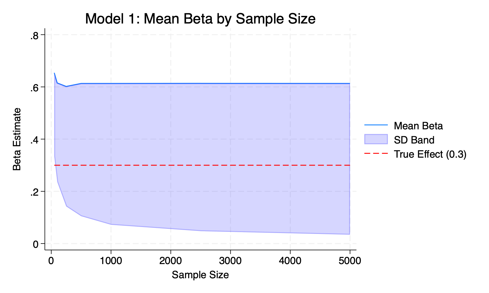
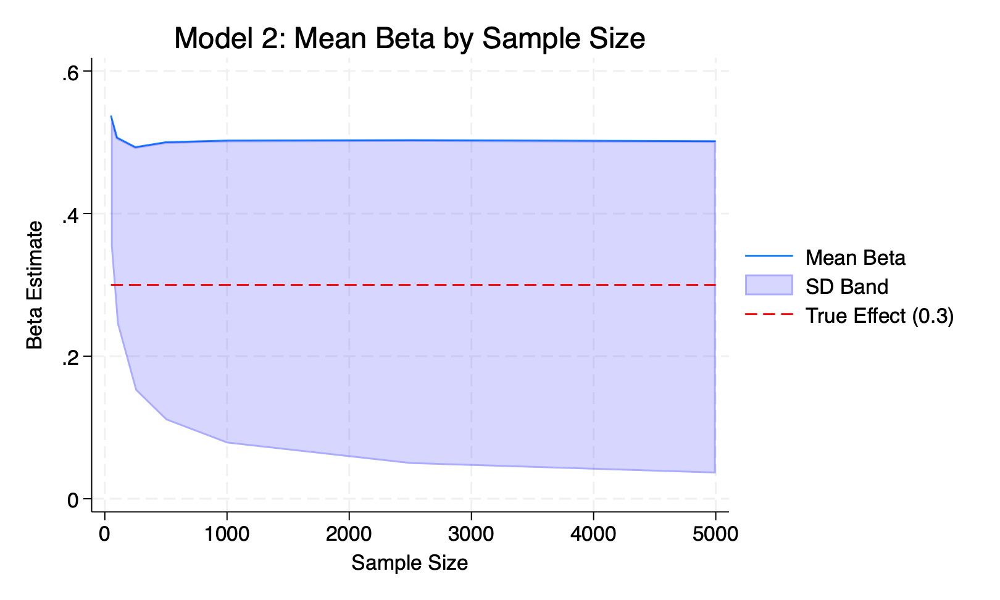
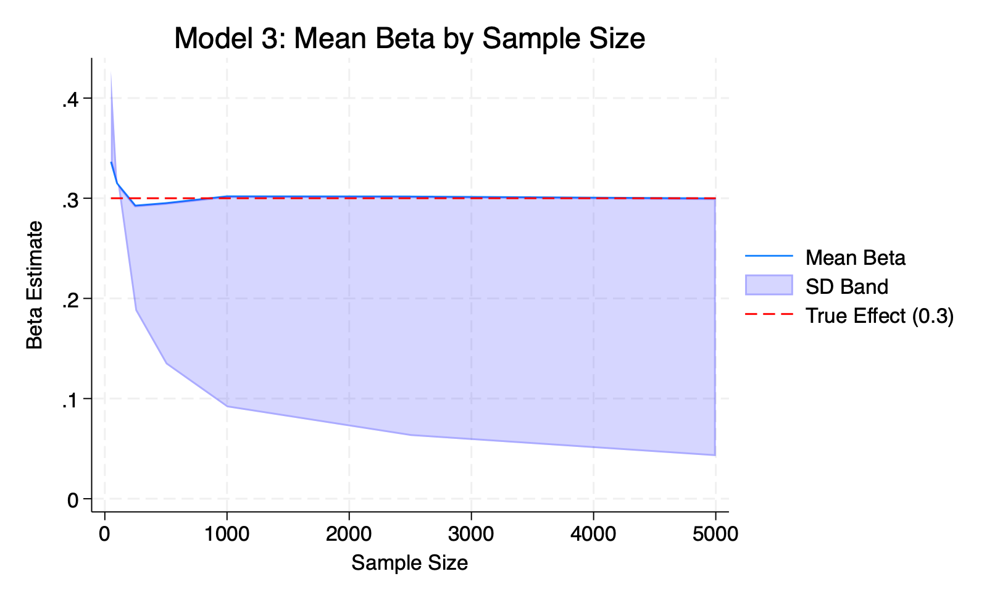
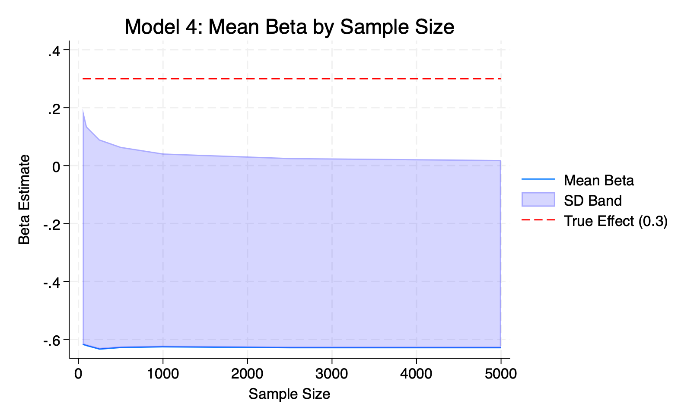
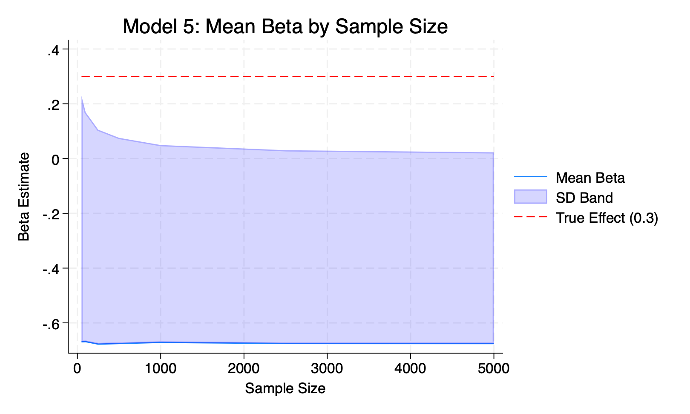
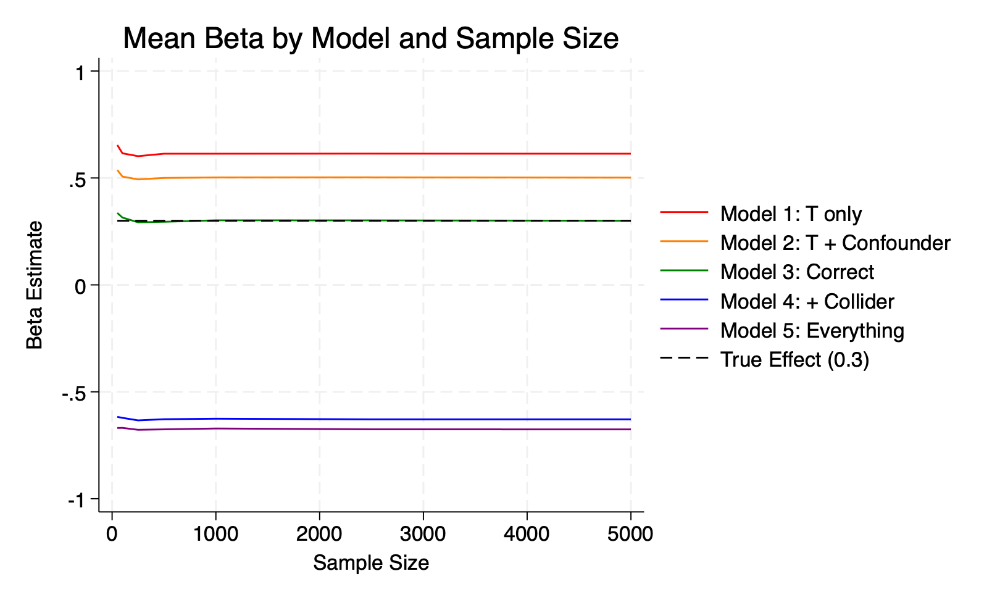
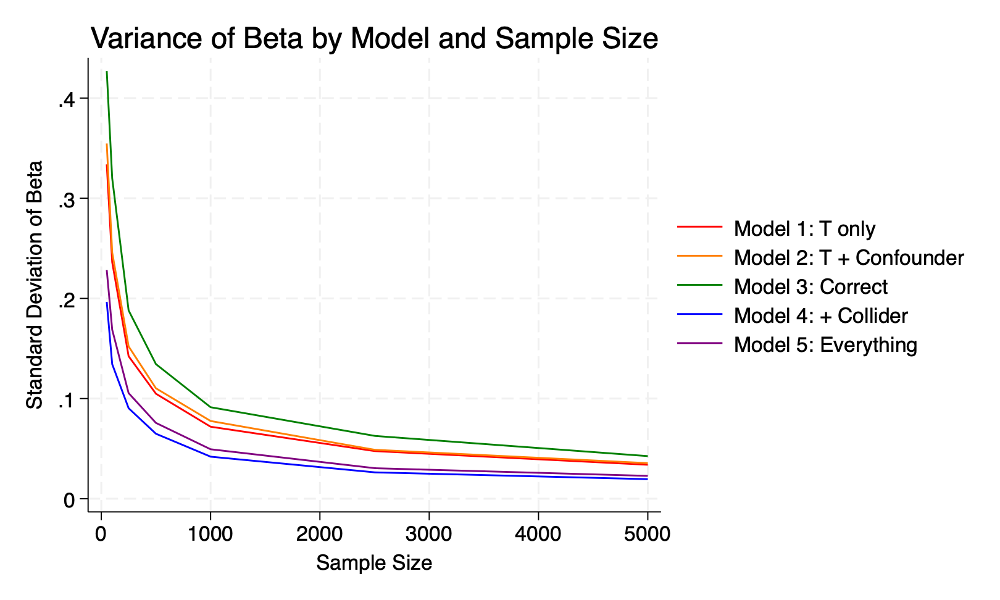

# Part 2: De-biasing a Parameter Estimate Using Controls

## Overview

This analysis uses Monte Carlo simulation to demonstrate how the inclusion or exclusion of different types of control variables affects the bias and precision of a regression estimate. We construct a data generating process (DGP) with a known true treatment effect of **0.3 standard deviations**, then compare five regression models across sample sizes ranging from 50 to 5,000 observations, with 500 simulation repetitions per sample size.

---

## Data Generating Process

The DGP is built around four variables — a confounder, a mediator, and a collider — each of which has a distinct causal relationship to treatment and/or the outcome Y.

## Regression Models

I ran five different regression models, each adding or removing different control variables to see how it affects the estimate:

| Model | Specification | Expected behavior |
|-------|--------------|-------------------|
| 1 | Y ~ Treatment | No controls, should be biased upward since the confounder is omitted|
| 2 | Y ~ Treatment + Confounder | Controls for confounder but not the mediator — picks up indirect path, still biased |
| 3 | Y ~ Treatment + Confounder + Mediator | Correct specification — isolates direct effect, converges to 0.3 |
| 4 | Y ~ Treatment + Confounder + Collider | Adding the collider should add negative bias |
| 5 | Y ~ Treatment + Confounder + Mediator + Collider | Controls for everything, collider bias dominates again  |

---

## Results

### Results Table: Mean beta estimate by model and sample size

| N | Model 1 | Model 2 | Model 3 | Model 4 | Model 5 | True Effect |
|---|---------|---------|---------|---------|---------|-------------|
| 50 | 0.654 | 0.538 | 0.336 | -0.617 | -0.669 | 0.3 |
| 100 | 0.615 | 0.507 | 0.315 | -0.622 | -0.669 | 0.3 |
| 250 | 0.602 | 0.493 | 0.293 | -0.633 | -0.678 | 0.3 |
| 500 | 0.613 | 0.500 | 0.295 | -0.628 | -0.676 | 0.3 |
| 1,000 | 0.613 | 0.502 | 0.302 | -0.626 | -0.671 | 0.3 |
| 2,500 | 0.614 | 0.503 | 0.302 | -0.629 | -0.675 | 0.3 |
| 5,000 | 0.613 | 0.502 | 0.300 | -0.629 | -0.676 | 0.3 |

### Key findings

The true treatment effect is 0.3. The table shows the average beta estimate from 500 simulation runs at each sample size. The closer a model's estimates are to 0.3, the less biased it is. Additionally, more controls does not mean a better model.

**Model 1 (Y ~ Treatment only):** Without any controls, the estimate comes out around 0.61 — roughly double the true value. Even at N = 5,000 it stays at 0.61, showing that a bigger sample doesn't fix a model that's missing an important variable.

#### Model 1: Omitted confounder

**Model 2 (Y ~ Treatment + Confounder):** Adding the confounder helps fix Model 1's problems — the estimate drops to around 0.50 — but it's still too high. This is because the mediator is still missing, so the model is picking up more than just the direct treatment effect.

#### Model 2: Confounder controlled, mediator omitted

**Model 3 (Y ~ Treatment + Confounder + Mediator):** This model is most accurate: The estimate sits at 0.3 across all sample sizes, which matches the true effect I built into the DGP. Controlling for both the confounder and the mediator is necessary to isolate the direct effect of treatment.

#### Model 3: Correct specification

**Model 4 (Y ~ Treatment + Confounder + Collider):** Adding the collider backfires — the estimate drops to around -0.63, which is not only wrong but the wrong sign entirely. This happens because controlling for a collider opens up a spurious relationship between treatment and Y that wasn't there before.

#### Model 4: With collider 

**Model 5 (Y ~ Treatment + Confounder + Mediator + Collider):** Including everything makes things even worse. The collider bias dominates and the estimate sits around -0.68. 

#### Model 5: All variables included

---

## Additional figures

### Figure 1: Mean Beta by Model and Sample Size

This figure shows the average beta estimate for all five models plotted together, with the true effect of 0.3 shown (the black dashed line).
The most important thing to notice is that Model 3 (green) sits right on top of the true effect line across all sample sizes—this model included both confounder and mediator. Models 1 (red) and 2 (orange) are consistently too high, while Models 4 (blue) and 5 (purple) are not just too low — they're negative, which is the opposite sign from the true effect.
What's also striking is that none of the biased models get closer to 0.3 as N grows. Their lines stay flat no matter how large the sample gets. A bigger sample size can't fix a model that has the wrong variables in it.

### Figure 2: Standard Deviation of Beta by Model and Sample Size

This figure plots the standard deviation of beta estimates across 500 simulation repetitions for each model as a function of sample size. It captures the convergence story — how precision improves with N — separately from the bias story shown in Figure 1.

Several patterns stand out. First, all five models show declining variance as N grows, confirming that every model becomes more precise with larger samples regardless of whether it is correctly specified. This is the definition of consistency in terms of variance. Second, Model 3 (green) has the highest standard deviation at small sample sizes — a cost of correctly controlling for more variables, which uses degrees of freedom and introduces additional sampling variability at small N. By N = 1,000, however, all models have converged to similarly low variance. Third, Models 4 and 5 (blue and purple) have the lowest standard deviations across all sample sizes. The collider models are paradoxically very precise — they converge quickly to a tight, stable estimate. The problem is that the estimate they converge to is incorrect. From this we can see that low variance is not the same as low bias, and a very precise estimate can still be very misleading.

---

## Conclusions

The simulation demonstrates three core lessons:

1. **Bias does not diminish with sample size.** Models 1, 2, 4, and 5 all converge precisely — but to the wrong value. Larger samples make a misspecified model more confidently wrong.

2. **Controlling for the right variables matters more than controlling for more variables.** Model 5 includes the most covariates but produces the worst estimates. Thoughtless inclusion of controls can actively harm inference.

3. **Collider bias is severe and underappreciated.** The negative estimates in Models 4 and 5 are striking — controlling for the collider not only fails to discover the true effect, it reverses its sign entirely. In other words, even a large sample size cannot save research projects that have not accounted for the relationships inherent in the chosen variables. 

# Part 3: Choropleth Map
