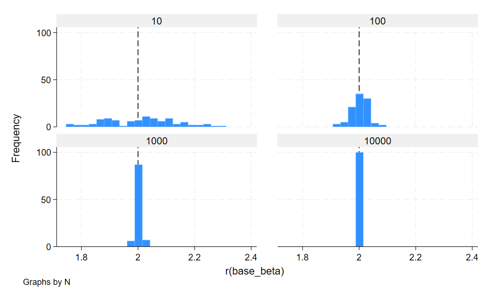
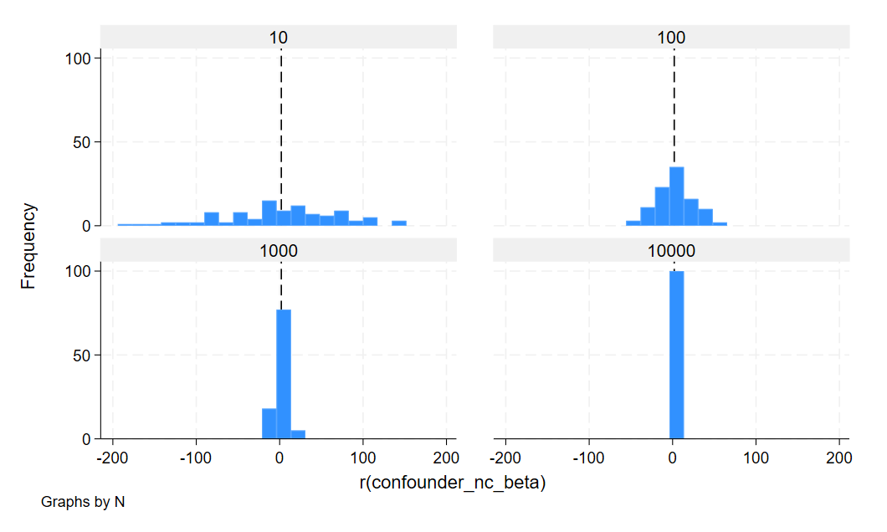
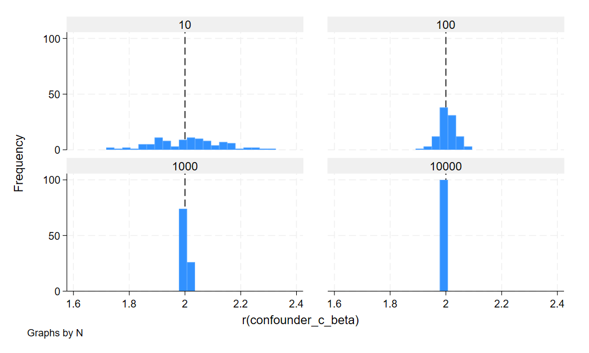
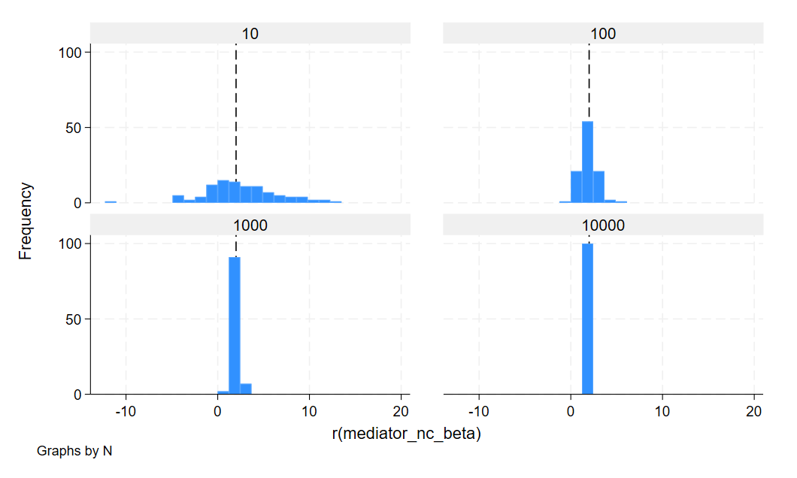
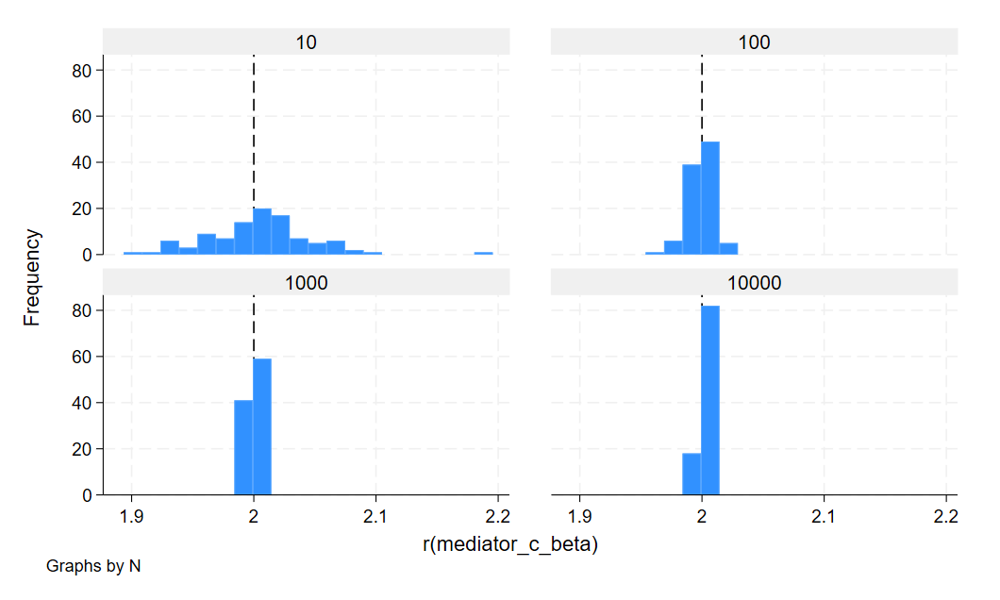
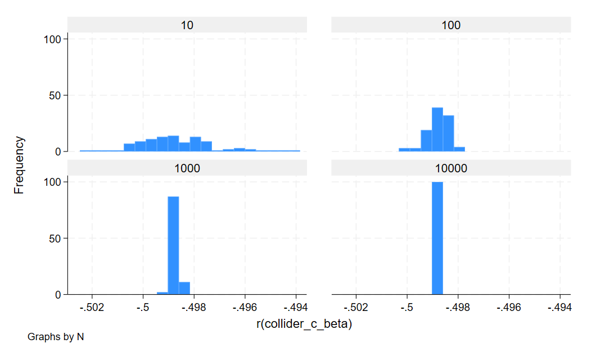

# Question 2.3

---------------------------------------------------------------------------------
                                                   N                             
                            10             100           1000           10000    
---------------------------------------------------------------------------------
r(base_beta)           2.009 (0.126)  2.004 (0.031)  2.002 (0.009)  2.000 (0.003)
r(confounder_nc_beta) 1.119 (70.217) 2.716 (21.093)  2.102 (7.080)  2.296 (2.078)
r(confounder_c_beta)   2.012 (0.125)  2.005 (0.031)  2.002 (0.009)  2.000 (0.003)
r(mediator_nc_beta)    2.524 (4.073)  1.914 (0.935)  1.995 (0.310)  2.011 (0.089)
r(mediator_c_beta)     2.005 (0.043)  2.000 (0.010)  2.000 (0.003)  2.000 (0.001)
r(collider_c_beta)    -0.499 (0.002) -0.499 (0.000) -0.499 (0.000) -0.499 (0.000)
---------------------------------------------------------------------------------

Original regression (Dependent variable Y and independent variable X):
The beta value is centered around 2 since we coded our regression equation as y=2x + error

Regression with confounder where confounder is NOT controlled for:
Lots of variation in beta value since the confounder is impacting both the treatment effect and the outcome. The effect of the confounder decreases as N increases. 

Regression with confounder where confounder is controlled for:
Controlling for the confounder gets rid of the confounding effect and the coefficient gets closer to the true model value.

Regression with mediator where mediator is NOT controlled for:
A good amount of variation in beta value (less variation than in the confounder case). The mediator is caused by the treatment effect and subsequently impacts the outcome. The effect of the mediator decreases as N increases.

Regression with mediator where mediator is controlled for:
Controlling for the mediator gets rid of the mediator effect and the coefficient gets closer to the true model value. (Note that controlling for the mediator is a decision that must be made on a case by case basis and is not always recommended)

Regression with a collider variable added (Collider is caused by both treatment variable and outcome variable):
Controlling for the collider leads to a false correlation between the outcome and treatment variables. A spurious relationship is generated and our beta value is nowhere near the true model value.
