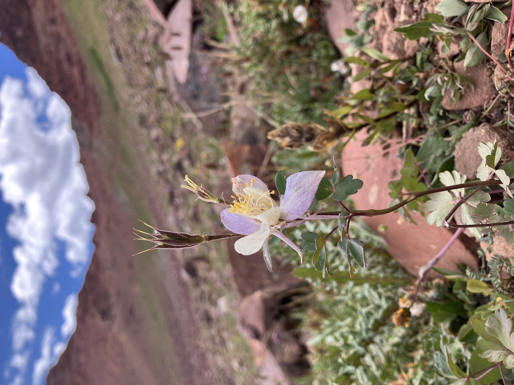

# Bio: Kate Morris

## Academic interests
Nice to meet you all! My name is Kate, and I am a second-year MPP in the evening program. I look forward to becoming more conversant in the following through this class:
- Data manipulation
- Stata
- Survey design

## Personal note
On a more personal note, here is a photo from one of the most beautiful places I visited this summer - the Maroon Bells Wilderness in Colorado. I felt lucky to come across a mountain columbine at such a high altitude. If you ever want to go for a long hiking adventure at high altitude, I really recommend the Maroon Bells. You can learn all about it [here](https://www.visitmaroonbells.com/).

## Addressing my reviewer's question
I was asked which piece of music I would choose if I could only listen to one song for the rest of my life. It would probably have to be a classical piece, because nothing is as beautiful in contemporary music, even if modern music is more exciting and energizing. Perhaps Strauss' Eine Alpensinfonie, or Debussy's Claire de Lune? Or Vivaldi's Four Seasons? You can tell I'd struggle with this decision.
