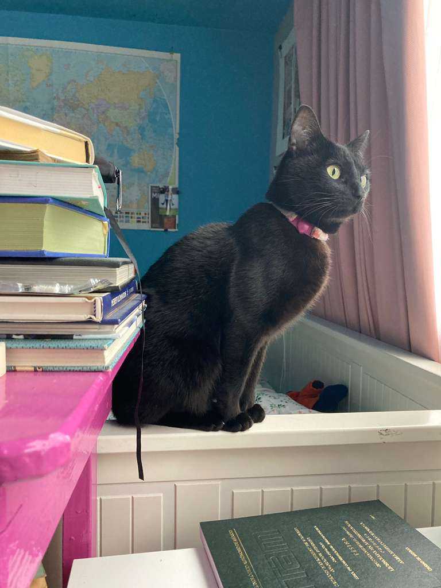

# Emilia Antúnez

## Fritz Fellow in the Tech & Society program

## MPiP Co-President

She is a policy analyst with experience in economic analysis, international affairs, and environmental projects. Her roles span from the Global Environment Facility, Mexico’s Secretariat of Finance and Secretariat of Economy, and private investment firm Prodensa. She is currently a Master of Public Policy candidate at Georgetown University’s McCourt School. Her research as a Fritz Fellow focuses on building digital tools to support sustainability transitions in food systems.

More personally:
- I am a fan of rock/pop spanish-speaking music.
- I know intermediate Italian because my grandmother was Italian.
- I love movies, some of my favorites are: Cinema Paradiso (Italy), An Officer and a Spy (France), and All About My Mother (Spain)
- I have a twin sister and my cat's name is Salem 

[Chicken recipe] (https://www.gimmesomeoven.com/easy-lime-chicken/)

