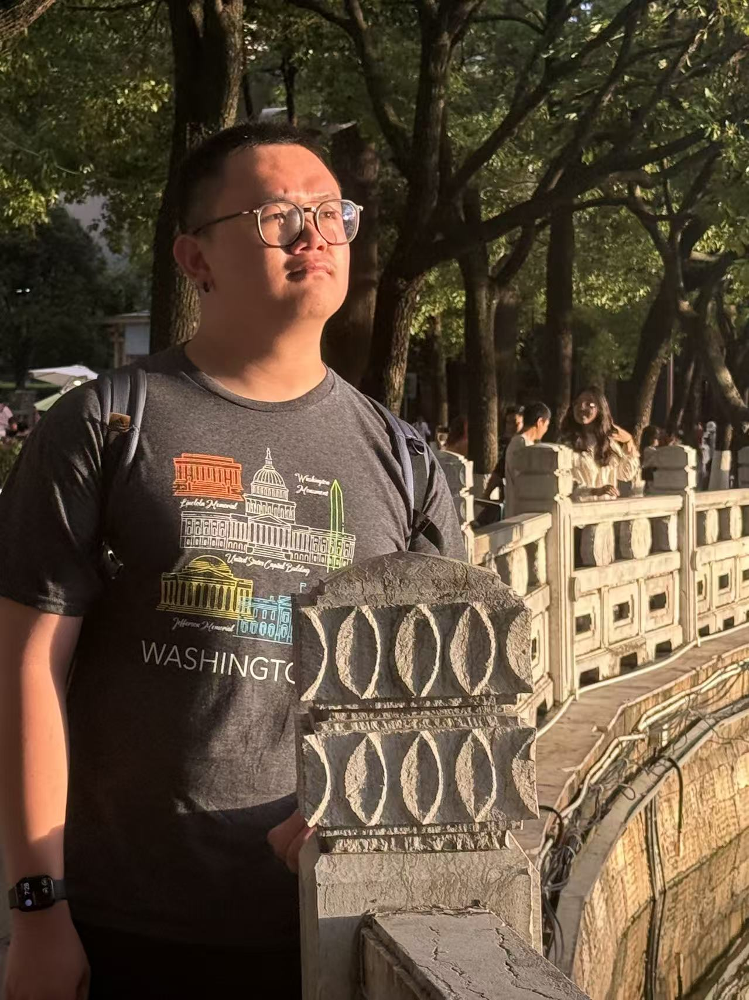
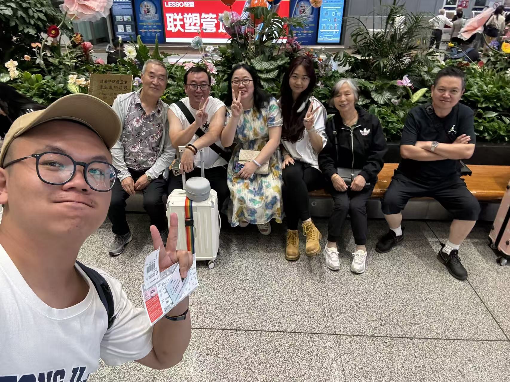
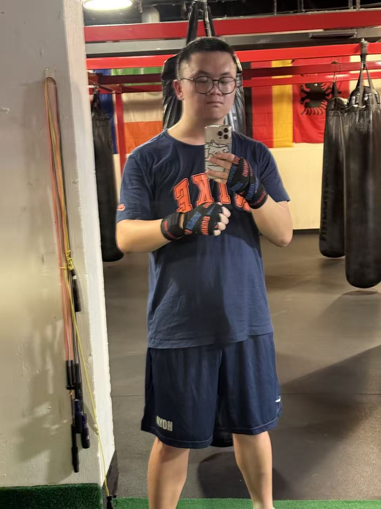

#Harold Shi_week2 Assignment

##Personal Bios

### My Hometown & Family

I am Haoyu Shi (石昊宇) and I also go by Harold. I come from Kunming in southwest China, which is named as "Spring City" in Chinese since the weather there is like the spring all year around.\
My falimy has lived in Kunming for generations and we loved our city. We are a large and closed family that usually meet in weekends and holidays to have dinner together.\

### My University & Research Interests

- LL.B. in Sociology (Tongji University)
- LL.B. in Jurisprudence (East China University of Political Science and Law)

I completed my undergraduate at Tongji University in Shanghai. My major was sociology, which I became deeply interested in, and I am now applying for PhD programs in the field.\
I am particularly interested in the consequences of modernization in developing countries in sociology. To gain more knowledge about governmental actions in developing countries is also the reason why I came to Georgetown.\
After years of exploration, the most attractive topics to me is how modern notions justify themselves in people's daily lives. Specifically, how "development" turns to be the consensus in a community, or how a sense of "nation" keeps powerful in global generations.\
Overall, instead of treating "modern" as a granted circumstance, I am more interested in figuring out the formation of it, which I believe is important to know the evolution of it in the future.

### My Hobbies

I love travelling around during the vacation. Until now, I have been to two thirds of provinces in China, and four countries around the world.\
In daily lives, I like boxing, painting, and writing. Although it's physically exhausted, boxing usually gives me a sense of peace in mind after training.\

Here is a link to my personal website on Xiaohongshu, feel free to follow me!
<https://www.xiaohongshu.com/user/profile/650e906e00000000170235d9>