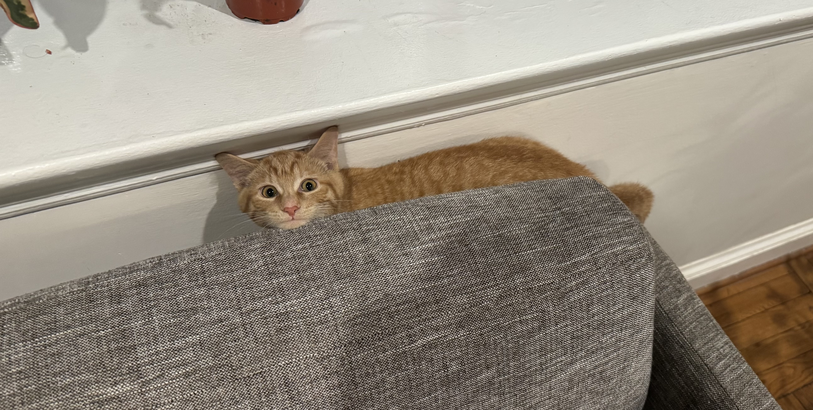

# Bio: Maren Sautter

### About Me
Hi, I’m Maren, a second-year MPP student from Germany, originally from a small town called [Münsingen](https://en.wikipedia.org/wiki/M%C3%BCnsingen,_Germany), possibly the most boring town in the world. A few facts about me:
- I went to school in Stuttgart, Germany, started playing the violin at age five, and was (and still am, admittedly) a horse girl. I stopped playing the violin competitively after turning 18, but I hope to pick it up again after graduate school, just for myself.
- I moved to the United States in 2019 to attend the University of Virginia, where I rowed for the team and majored in History and Sociology.
- I am currently interning on AARP's policy development team. Since that keeps me fairly busy, my current hobbies include reading, listening to podcasts and audiobooks (particularly the new Harry Potter audiobooks), and taking care of my many houseplants, which I love propagating.

### My Cat, Pumpkin
Recently, my boyfriend and I adopted a four-month-old orange kitten named Pumpkin. He’s incredibly sweet (and sometimes vicious). He loves watching The Great British Bake Off with us, zooming around the apartment, watching birds from the windowsill, and clawing at my hair whenever he gets the chance (esepcially at 3 AM in the morning while I'm sleeping).
