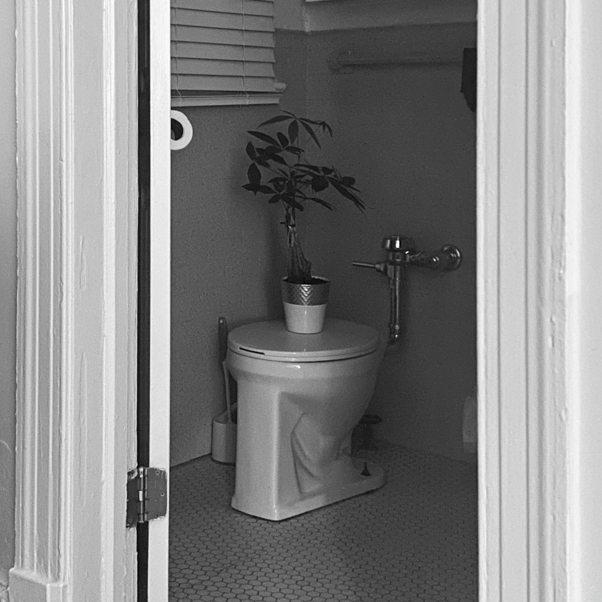

# A Short Bio for PPOL6818

## About me
I'm Puran Dou, currently a second year MPP student at McCourt. My main policy interests are environment & energy policy and labor policy. Recently I've been looking into steel industry decarbonization.

## Interests and other things
- The book I'm currently reading is **The Art of Trader Joe’s** by Julie Averbach. She visited 150+ Trader Joe’s stores across the U.S. and documents the artwork “hidden in plain sight” from product packaging to murals and hand writen signs. 10/10 would recommend.
  - [The Art of Trader Joe’s (official site)](https://theartoftraderjoes.com/)
- My two favorite things in my apartment are a fake skeleton I got last Halloween for no particular reason, and a money tree I got from TJ last year. Here is a photo of her taking a bathroom break in a very melancholy fashion:

- Here's a link to a DC local shelter **Brandywine Valley SPCA** that follows a no-kill standard. They have a great foster program and host regular adoption events. Go check it out!
  - [Brandywine Valley SPCA (DC)](https://bvspca.org/dc)