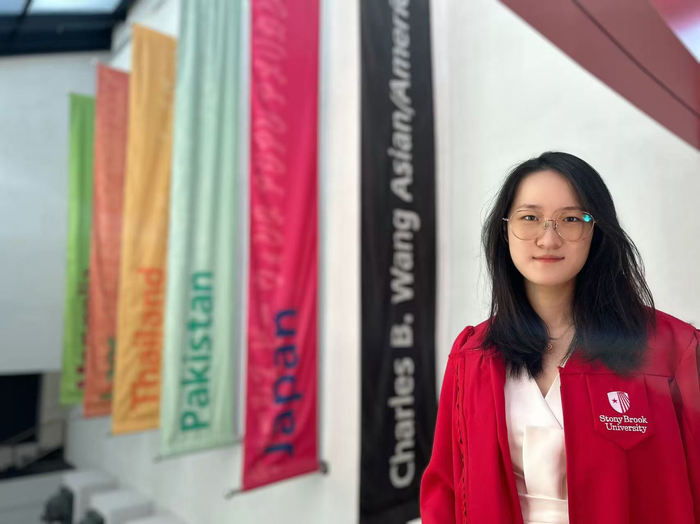

# Peggy's bio
I'm Peggy Wang. I'm a second year MPP student. I'm an international student from China. I spent one year as an exchange student at Verde Valley School in Sedona, Arizona during my high school years. Then I spent four years of my undergrad at Stony Brook University in New York.

I think my life in New York and Arizona is completely different. Life in Arizona is more relaxed. Every weekend, we have different activities in different places. Our school is on a mountain, so there are often outdoor activities. The life of teachers and students is more closer and the atmosphere is more friendly. Students have their own dorms. We can chat and live together with friends in the dorm every day. Life in New York is not as rich as high school. The entire dorm community has expanded. It's hard to make friends with others except the roommates. If we want to go out, we have to drive ourselves. Life is no longer like it was in high school. But it is a bit more free. We can go anywhere we want at any time. University is not like a high school with only 50 students. It has more different cultures. We can meet different people in almost every class. This makes every semester very interesting.

## My Linkedin
This is [my linkedin page](https://www.linkedin.com/in/peiqi-wang-138260247/).

### Interested Thing
- Video Games!!!!!!!! Hollow knight!!!!!!!!!
- Teaching/Tutoring: TA in many stuff
- Playing piano
- Cooking

### Picture
