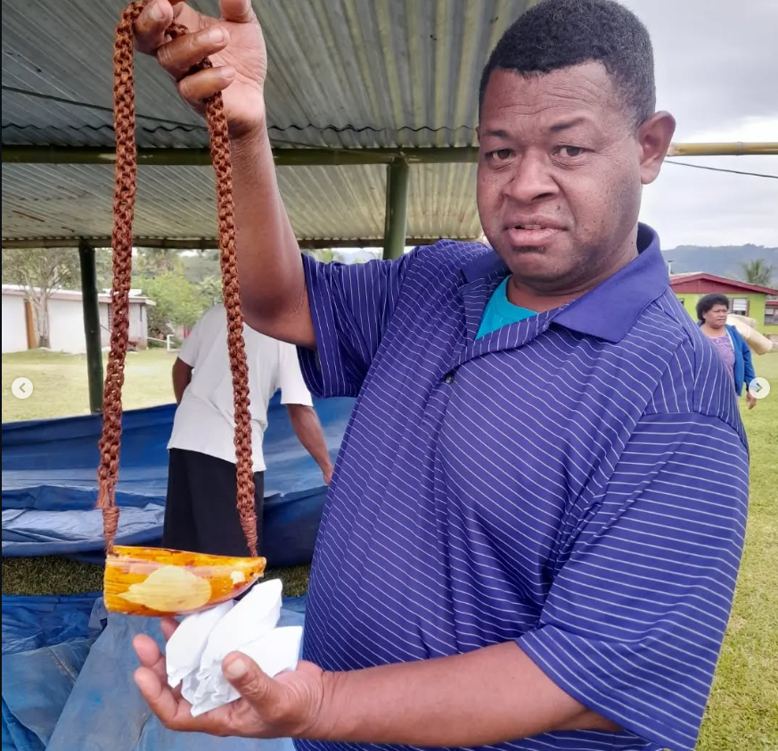

# Warren Burroughs Bio
Hello! This is my short bio!
I will discuss:
- Peace Corps
- Some of the things that interest me
- My favorite tea (as per Gavin Gondalwala's request)
## Peace Corps
Sometimes, you hear about something and instantly click with the idea. It's hard to explain, but when I hear about an opportunity that sounds cool, I commit to pursuing it. The Peace Corps was one of those opportunities.
Peace Corps is a US government instiution that sends volunteers to "help interested countries in meeting their need for trained people." On paper, my job was to teach financial literacy trainings (personal money mangaement, basic business skills, and project design and management) and work alongside my village community and the women's group. But, in reality, a lot of my time was spent hanging out, drinking tea, and getting to know the people in my village. I lived in my village for two years, and by the end, I considered them a second family. 
I made a video for my undergrad school that shows off my experience. You can find it [here.](https://drive.google.com/file/d/189UtwG7OpluMGfLAMiO1l5D9ws-JND30/view?usp=drive_link)
## Peace Corps' Influence
At McCourt, I am a first year MIDP student. Sort of like my experience in the Peace Corps, my study interests is financial inclusion. In particular, I find the way people choose to use their money to be fascinating. When I was in Fiji, I saw how a different relationship with money can influence how people view their finances. Additionally, one of my favorite books, Debt by David Graeber, delves deeper into the topic. I was shocked by how close the book mirrored my reality in Fiji, particularly related to something he called "human currencies." In the book, Graeber explains how in many cultures, currency is used not to exchange goods, but to exchange human relationships. An example could be "bridesprices" or "doweries," which often use "real" money. However, many cultures have used other things, such as cloth. In Fiji, for any sort of festival, whether it be funerals, weddings, births, or circumcisions, people would exchange mats (mainly), whaleteeth, or cloth. Below is a picture of a whalestooth that was given to a father in exchange for his daughter's hand in marriage. 

### My favorite tea
Maybe not my favorite tea ever, but I do have fond memories of lemongrass tea -- I used to grab a bundle every morning from outside my house to share with my host family. 