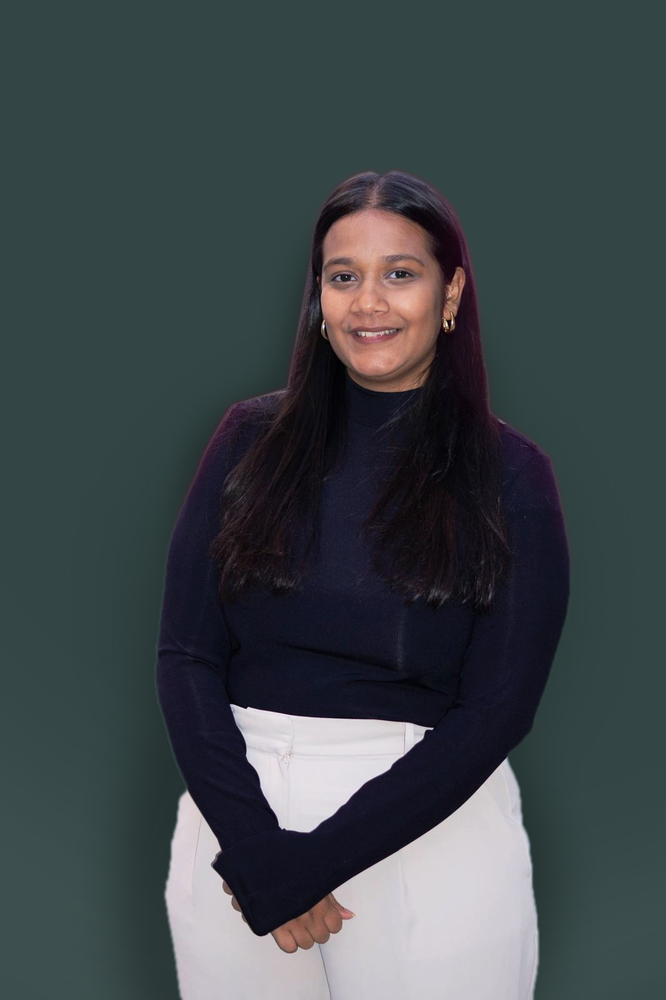

# Introduction to Me! 

I'm Yousra (she/her), from Bangladesh, studying at Georgetown as a first-year MIDP. I've lived in DC for the last three years and have curated a list of restaurants that are worthy of my time and coffee shops that have the best coffee to productivity ratio. Though my journey in America has lasted 7 years so far, I yearn to go back to my home and contribute meaningfully to the country that raised me (hence the degree). 

## Hobbies 
Piano (since I was 13)
Junk Journalling (recent hobby so I can remember things when I'm old)
Reading (currently doing a book a month) 

## Favorite Restaurants 

-Maydan 
-Da Hong Pao 
-Lupo Pizzeria 

## Utility Maximizing Coffee Shops 

-The Line Hotel 
-Blue Bottle Georgetown 
-Colada Shop (trust me) 

Photo of me: 
(to access image try command+selecting the image.png link) 

Here's my linkedin profile: https://www.linkedin.com/in/yousra-hussain-4a0ab6182/
And goodreads profile: https://www.goodreads.com/user/show/187266596-yousra-hussain
