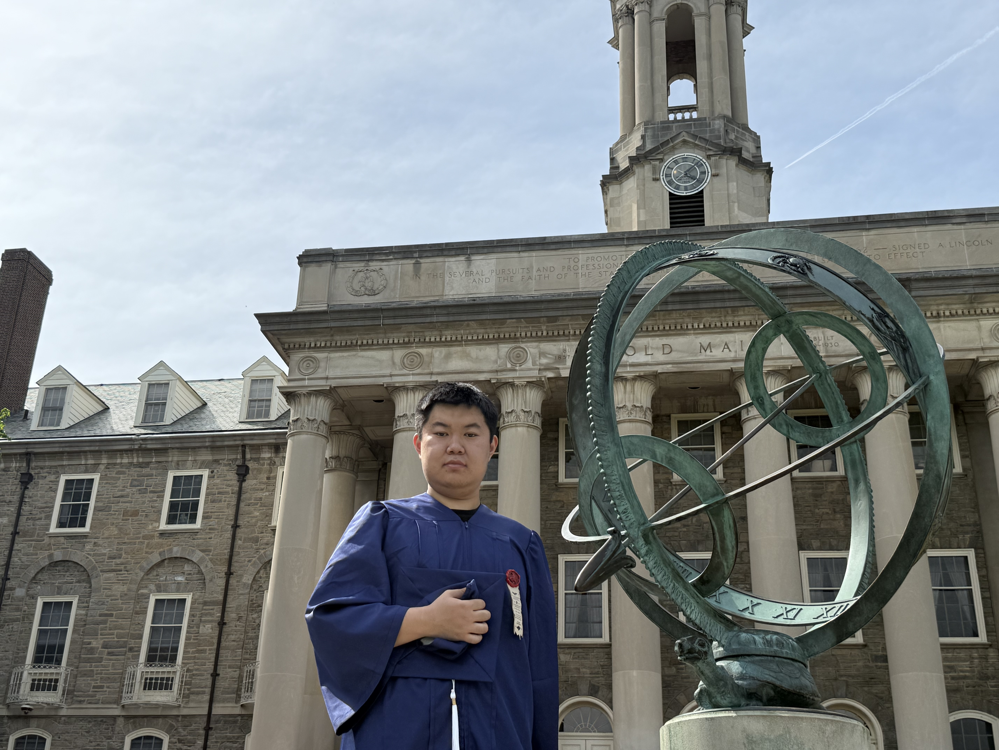

<h1>Zheng Gu</h1>
hello, everyone my name is Zheng Gu I am a first year student in MIDP, and I am looking forward to study with you in the next semeseter. I get my undergraduate degree from Penn State, and I studied political science there.

<h2>interests</h2>
<ol>
  <li>board games, like DND and COC</li>
  <li>video games</li>
  <li>minature painting </li>
  <li>history,especially WWII history </li>
  <li>philosophy,espcially political philosophy</li>
<h2>some minatures I paint </h2>
!(a778d14f69395184deb9665bf21560cc-1.jpg)
!(55ab04791a03a5a5adfb60687692b3d7.jpg)
!(8661e01be106d6b9a19393bdde4021a5.jpg)
This is my [github link](https://github.com/murphygu1126)
