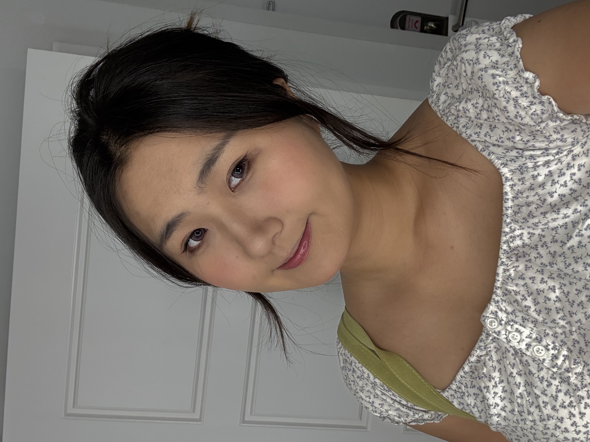

# About Me

I grew up in Beijing, where I spent six years of middle and high school biking to school every day. That routine shaped how I think about cities, movement, and everyday life in subtle ways.

I would describe myself as someone who enjoys the idea of outdoor activities and loves being outdoors, but does not always enjoy the “exercise” part of sports. I like nature, walking, and being outside more than structured workouts.

## Personal Interests

I enjoy exploring different cultures and learning through experience. One of my most memorable trips was to Lugu Lake in Yunnan, where I learned about the Mosuo people, a matrilineal society with a social structure very different from what I had known before.

That experience strongly shaped how I think about culture, family, and social organization.

You can learn more about the Mosuo people here:  
https://en.wikipedia.org/wiki/Mosuo

## Things I’m Curious About

- Different cultural and social systems  
- Storytelling through images and everyday observations  
- Learning new skills through travel and experience  

## A place I love in DC
One of my favorite places to unwind in DC is the Waterfront Park along the Potomac River. It’s usually quiet and calm, and everyone seems to be peacefully doing their own thing — some people are reading, some are fishing, and others are playing with their dogs. I often end up meeting the most interesting puppies there, which always makes my day a little better.

## Music I love
I’m a huge Taylor Swift fan — definitely a Swiftie. Besides *All Too Well*, one song I’ve been listening to a lot recently is *You Are In Love* from *1989*. I love how it captures that quiet, unexpected moment of realizing you’re falling in love — mysterious, fresh, and full of hope. That feeling of suddenly thinking, “oh, I’m in love,” really resonates with me.

## A Picture
