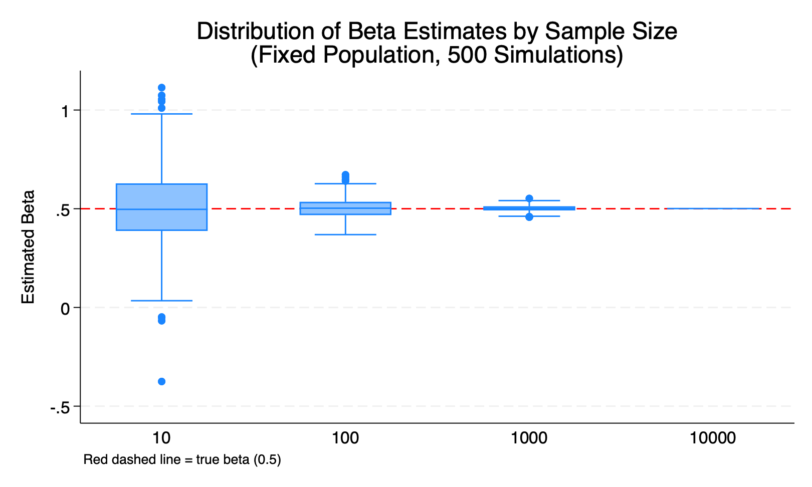
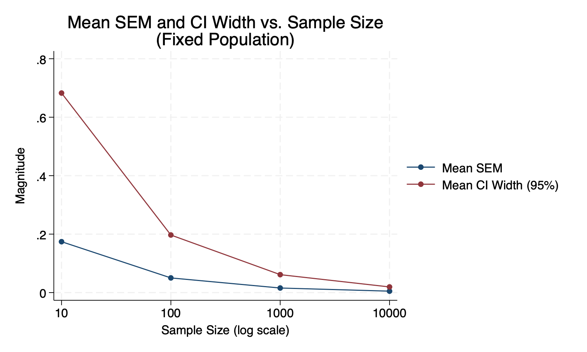
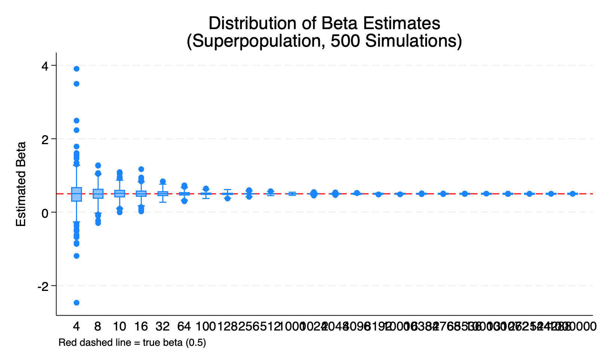
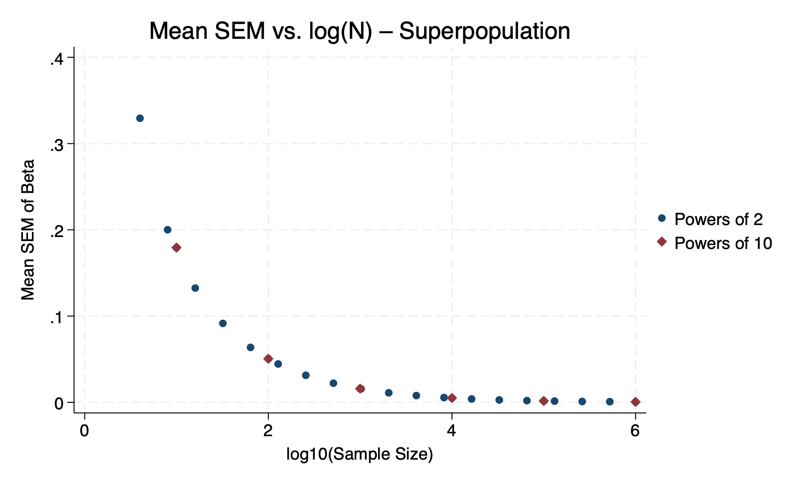
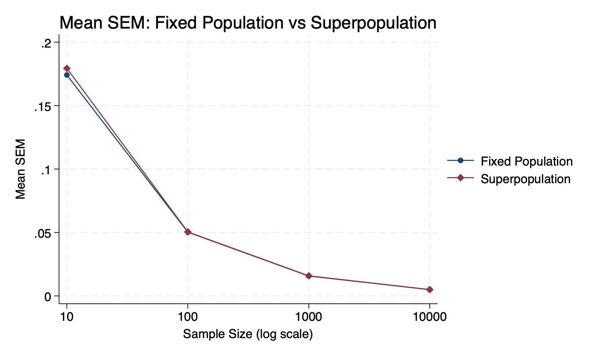
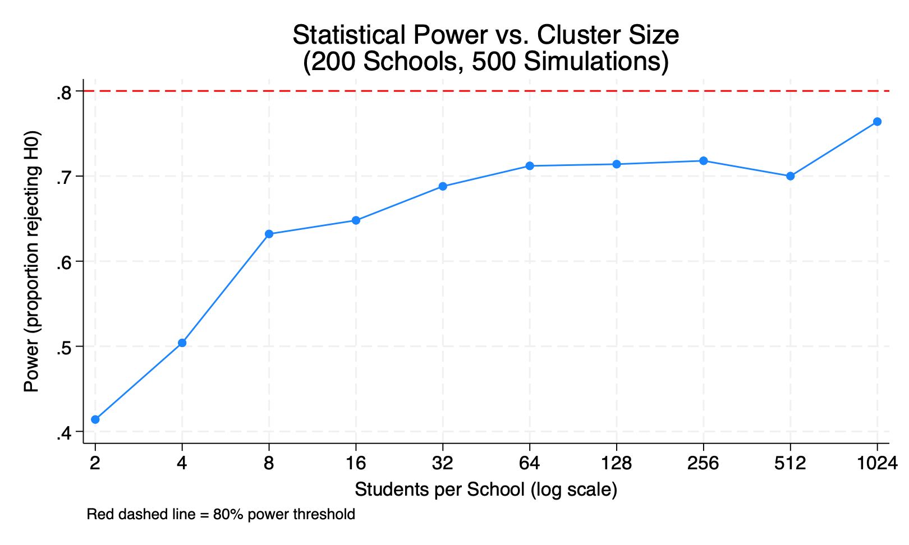
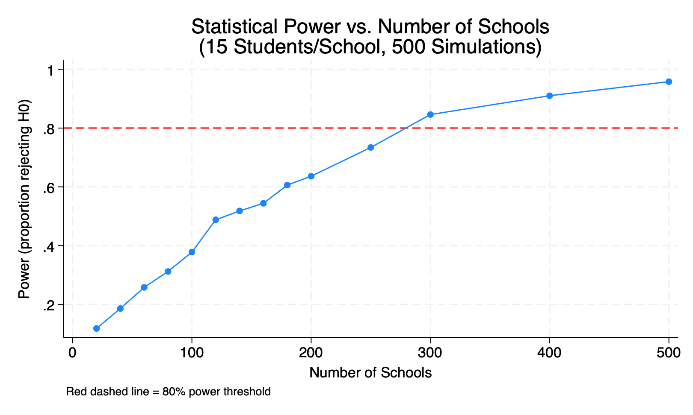
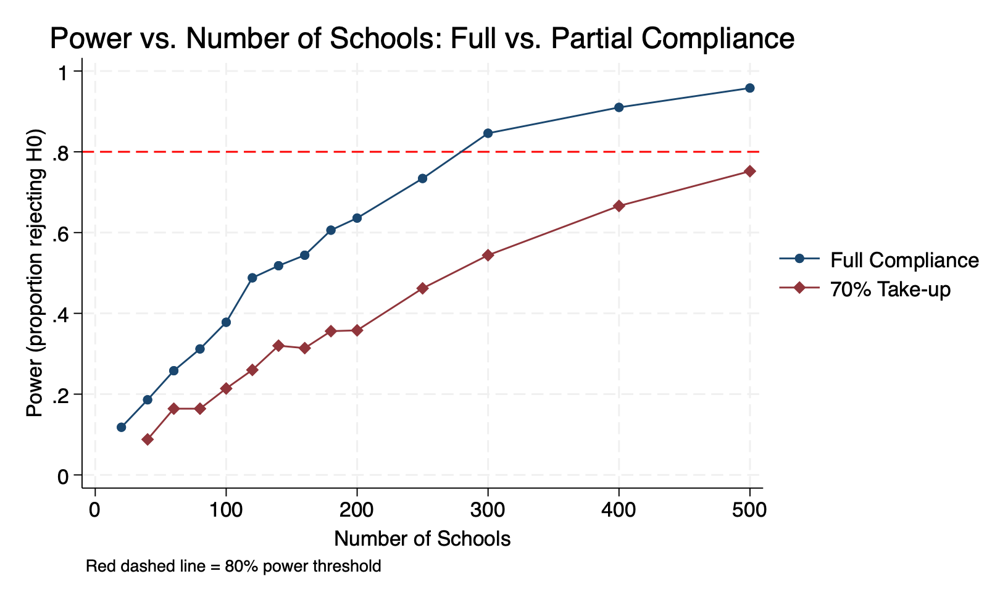

# PPOL 6818 – Homework 03
## Part 1: Sampling Noise in a Fixed Population

### Data Generating Process

The fixed population of 10,000 individuals was generated using the following DGP:

- **X** ~ Normal(50, 10) — a continuous predictor (e.g., a baseline test score)
- **Y = 2 + 0.5·X + ε**, where ε ~ Normal(0, 5)
- **True β = 0.5** (the parameter we are trying to recover)

The population was saved once with `set seed 20240101` to ensure all subsequent samples are drawn from an identical fixed dataset.

---

### Simulation Design

A program `sample_and_reg` was written to: (a) load the fixed population; (b) randomly draw a subsample of size N; (c) regress Y on X; and (d) return N, $\hat{\beta}$, SEM, p-value, and 95% confidence intervals via `r()`. Using Stata's `simulate` command, this program was run **500 times** at each of four sample sizes: **N = 10, 100, 1,000, and 10,000**.

---

### Results

#### Table 1: Summary of Beta Estimates by Sample Size

| Sample Size (N) | Mean $\hat{\beta}$ | SD of $\hat{\beta}$ | Mean SEM | CI Width (95%) | % Simulations Significant |
|:-:|:-:|:-:|:-:|:-:|:-:|
| 10 | 0.501 | 0.198 | 0.174 | 0.683 | 70.4% |
| 100 | 0.502 | 0.050 | 0.050 | 0.197 | 100.0% |
| 1,000 | 0.501 | 0.016 | 0.016 | 0.062 | 100.0% |
| 10,000 | 0.501 | 0.005 | 0.005 | 0.019 | 100.0% |

*True β = 0.5. SEM = standard error of the mean. CI Width = 2 × 1.96 × Mean SEM.*

---

#### Figure 1: Distribution of Beta Estimates by Sample Size

**Figure 1** shows the distribution of 500 $\hat{\beta}$ estimates at each sample size. Several patterns are immediately visible:

- At **N = 10**, the distribution is extremely wide (SD = 0.198), spanning roughly from −0.4 to +1.1. Several outlier estimates fall far from the true value. This reflects the high sampling noise inherent in very small samples drawn from a finite population.
- At **N = 100**, the spread narrows substantially (SD = 0.050). The interquartile range is much tighter and the median sits close to the true value of 0.5.
- At **N = 1,000** and **N = 10,000**, the distributions become extremely tight — almost degenerate at 0.5. At N = 10,000 (the full population), the estimate is essentially the exact population parameter with virtually no sampling variance remaining.

All distributions are centered on the true β = 0.5 (red dashed line), confirming that OLS is **unbiased** regardless of sample size.

---

#### Figure 2: Mean SEM and CI Width vs. Sample Size

**Figure 2** plots the mean SEM and mean 95% CI width against sample size on a log scale. Both decline steeply and follow the expected **1/√N** pattern:

- From N = 10 to N = 100 (10× larger), SEM falls from 0.174 to 0.050 — a reduction of roughly **√10 ≈ 3.16×**, consistent with theory.
- From N = 100 to N = 1,000, SEM falls from 0.050 to 0.016 — again approximately a √10 reduction.
- From N = 1,000 to N = 10,000, SEM falls from 0.016 to 0.005.

The CI width is simply 2 × 1.96 × SEM, so it tracks the same curve scaled up. At N = 10,000, the 95% CI is only ±0.010 wide — extremely precise.

---

### Key Takeaways

1. **Unbiasedness**: The mean $\hat{\beta}$ equals the true β (0.5) at every sample size, confirming that random sampling from a fixed population produces unbiased estimates.

2. **Precision increases with N**: Both the SD of $\hat{\beta}$ and the SEM shrink at the rate 1/√N. Quadrupling the sample size halves the uncertainty.

3. **Upper bound on precision**: Because the population is **fixed at 10,000**, sampling at N = 10,000 yields the exact population parameter with no remaining sampling error. This is a key difference from Part 2 (infinite superpopulation), where precision keeps improving indefinitely as N grows.

4. **Statistical power**: At N = 10, only 70% of simulations reject H₀: β = 0 at the 5% level. By N = 100, power reaches 100% — the true effect (β = 0.5) is large enough that even modest samples detect it reliably.

## Part 2: Sampling Noise in an Infinite Superpopulation

### Simulation Design

A program `superpop_reg` was written to draw a **fresh dataset** from the DGP on every iteration
(rather than sampling from the saved fixed population). This means the population is effectively
infinite — there is no upper bound on sample size. The program was run **500 times** at each of
26 sample sizes: the first 20 powers of 2 (N = 4, 8, 16 … 524,288) plus 6 powers of 10
(N = 10, 100, 1,000, 10,000, 100,000, 1,000,000), yielding 13,000 total regression results.

---

### Results

#### Table 2: Superpopulation Summary (Selected Sample Sizes)

| N | Mean $\hat{\beta}$ | SD of $\hat{\beta}$ | Mean SEM | CI Width (95%) | % Significant |
|:-:|:-:|:-:|:-:|:-:|:-:|
| 4 | 0.502 | 0.455 | 0.329 | 1.291 | 16.8% |
| 10 | 0.511 | 0.170 | 0.179 | 0.703 | 72.2% |
| 100 | 0.501 | 0.050 | 0.051 | 0.198 | 100.0% |
| 1,000 | 0.499 | 0.017 | 0.016 | 0.062 | 100.0% |
| 10,000 | 0.500 | 0.005 | 0.005 | 0.020 | 100.0% |
| 100,000 | 0.500 | 0.002 | 0.002 | 0.006 | 100.0% |
| 1,000,000 | 0.500 | 0.001 | 0.001 | 0.002 | 100.0% |

---

### Figure 3: Distribution of Beta Estimates (Superpopulation)

At N = 4 the estimates are extremely dispersed (SD = 0.455), with outliers ranging from −2.5
to +4.0. As N grows, the distribution tightens continuously toward the true value of 0.5 with
no plateau — even at N = 1,000,000 precision keeps improving. All distributions remain centered
on 0.5, confirming OLS is unbiased throughout.

---

### Figure 4: Mean SEM vs. log(N)

The SEM declines smoothly along a straight line on the log scale, confirming the 1/√N
relationship across the entire range. Powers of 2 (circles) and powers of 10 (diamonds) fall
on the same curve, showing the relationship is continuous and not specific to any particular
N sequence.

---

### Figure 5: Part 1 vs. Part 2 — SEM Comparison

At shared sample sizes (N = 10–10,000) the two lines are nearly identical. The key divergence
is conceptual: in Part 1, precision **stops improving** once N reaches the full population of
10,000 (you have the census — no sampling error remains). In Part 2, precision continues to
improve indefinitely as N grows.

---

### Why Can Part 2 Use Larger Sample Sizes?

In Part 1, N is capped at 10,000 — the size of the fixed population. Drawing more than 10,000
observations would require sampling with replacement, which changes the inferential setup. In
Part 2, each simulation generates brand-new data from the DGP, so N = 100,000 or N = 1,000,000
simply means generating more fresh draws — there is no logical ceiling.

### Why Might SEM Differ at the Same N?

At small N the fixed-population SEM is very slightly **smaller** than the superpopulation SEM.
This is because sampling without replacement from a finite population introduces a finite
population correction factor (FPC < 1), which mechanically reduces variance. As N grows
relative to the population size this effect disappears — which is why the two lines converge
and become indistinguishable by N = 100.

## Part 3: Power Calculations – Individual-Level Randomization

### Data Generating Process

- **Y** ~ Normal(0, 1) in the control group
- **Treatment effect** ~ Uniform(0.0, 0.2) sd, so the average treatment effect (ATE) = 0.1 sd
- **Treatment assignment**: 50/50 split (half treatment, half control)

---

### Question 3: Required Sample Size (No Attrition)

Using `power twomeans` with a two-sided t-test (α = 0.05, power = 0.80, sd = 1, ATE = 0.1):

**N = 3,142 total (1,571 per group)**

This was verified by simulation: running 1,000 simulations at N = 3,142 yielded a simulated
power of **81.1%**, closely matching the analytical target of 80%.

---

### Question 4: Accounting for 15% Attrition

With symmetric attrition across arms, the effective sample size shrinks by 15%. To still
achieve 80% power after attrition, we inflate the required N by 1/(1 − 0.15):

> Adjusted N = ⌈3,142 / 0.85⌉ = **3,697 total (1,849 per group)**

The inflation factor is 1.176, meaning we need to enroll approximately **18% more participants**
than the baseline calculation to account for expected dropout.

---

### Q5. What if only 30% of the sample actually receives the treatment?

This is a **partial take-up** (non-compliance) problem. Treatment is still randomly
assigned 50/50, but only 30% of those assigned to the treatment group actually receive
the intervention. The remaining 70% of the treatment group behave like the control group.

Under an Intent-to-Treat (ITT) analysis — which compares all assigned-treatment
individuals to all control individuals regardless of actual take-up — the detectable
effect is diluted by the compliance rate:

> ATE_ITT = compliance rate × ATE_TOT = 0.30 × 0.1 = **0.03 sd**

To detect this much smaller effect at 80% power, the required sample size increases
dramatically to **N = 34,886** — roughly 11 times the baseline requirement. This
illustrates why ensuring high take-up rates is critical in RCT design: low compliance
does not just reduce the effect size, it causes sample size requirements to grow
with 1/δ², making studies vastly more expensive.

---

### Summary Table

| Scenario | Detectable Effect | Required N | N per Group |
|:--|:-:|:-:|:-:|
| Baseline (no attrition, full compliance) | 0.10 sd | 3,142 | 1,571 |
| 15% attrition (symmetric) | 0.10 sd | 3,697 | 1,849 |
| 30% take-up (ITT) | 0.03 sd | 34,886 | 17,443 |

## Part 4: Power Calculations – Cluster Randomization

### Data Generating Process

Student math scores are generated with a two-level hierarchical structure.
At the school level, each school draws a random effect uj ~ Normal(0, 0.3),
representing unobserved school quality. At the student level, each student draws
an idiosyncratic error eij ~ Normal(0, 0.7). The outcome for student i in school j is:

**Yij = uj + eij + treatedj × school_tej**

where school_tej ~ Uniform(0.15, 0.25), giving a mean treatment effect of **0.2 sd**.
Treatment is assigned at the school level with a 50/50 split.

By construction, the intra-class correlation is:

**ICC (ρ) = σb² / (σb² + σw²) = 0.3 / (0.3 + 0.7) = 0.30**

which means 30% of the total variation in student scores is attributable to
school-level factors, and 70% to individual-level noise.

The program `cluster_power_sim` accepts `nclusters()`, `clustersize()`, and an optional
`takeupratio()` argument (default = 1.0 for full compliance). All regressions use
cluster-robust standard errors (`vce(cluster school_id)`) to account for within-school
correlation.

---

### Question 5: Vary Cluster Size (200 Schools Fixed)

#### Table 4a: Power by Cluster Size (N = 200 Schools)

| Students/School | Power |
|:-:|:-:|
| 2 | 41.4% |
| 4 | 50.4% |
| 8 | 63.2% |
| 16 | 64.8% |
| 32 | 68.8% |
| 64 | 71.2% |
| 128 | 71.4% |
| 256 | 71.8% |
| 512 | 70.0% |
| 1,024 | 76.4% |

#### Figure 6: Statistical Power vs. Cluster Size

Power increases rapidly as cluster size grows from 2 to ~64 students per school, then
**plateaus around 70–72%** and never reaches the 80% threshold — even at 1,024 students
per school. This is a direct consequence of the high ICC (ρ = 0.3): once within-cluster
sample size is large enough, adding more students to the same school yields very little
additional information, because students within a school are highly correlated. The
**effective sample size** in cluster-randomized trials is N / DEFF, where
DEFF = 1 + (m − 1) × ρ, so large m with high ρ produces rapidly diminishing returns.

**Recommendation**: Given that power plateaus well below 80% regardless of cluster size,
increasing cluster size alone is not a viable path to 80% power with only 200 schools.
If constrained to 200 schools, the researcher should instead seek a larger treatment effect,
a lower ICC design, or add more schools. Among the sizes tested, **64 students/school**
offers a reasonable balance — power is near its plateau (71.2%) without the logistical
burden of very large schools — but a fundamental redesign is needed to reach 80%.

---

### Question 6: Vary Number of Schools (Cluster Size = 15 Fixed)

#### Table 4b: Power by Number of Schools (15 Students/School, Full Compliance)

| Number of Schools | Power |
|:-:|:-:|
| 20 | 11.8% |
| 60 | 25.8% |
| 100 | 37.8% |
| 140 | 51.8% |
| 180 | 60.6% |
| 200 | 63.6% |
| 250 | 73.4% |
| 300 | **84.6%** |
| 400 | 91.0% |
| 500 | 95.8% |

#### Figure 7: Statistical Power vs. Number of Schools

Power increases monotonically with the number of schools. With 15 students per school and
full compliance, **80% power is first achieved at approximately 300 schools** (power = 84.6%).
Unlike cluster size, adding more clusters directly increases the number of independent
treatment assignments, which is the binding constraint in cluster-randomized trials.

**Answer: approximately 300 schools are required for 80% power.**

---

### Question 7: 70% School-Level Take-up

#### Table 4c: Power by Number of Schools (15 Students/School, 70% Take-up)

| Number of Schools | Full Compliance | 70% Take-up |
|:-:|:-:|:-:|
| 100 | 37.8% | 21.4% |
| 200 | 63.6% | 35.8% |
| 300 | 84.6% | 54.4% |
| 400 | 91.0% | 66.6% |
| 500 | 95.8% | 75.2% |

#### Figure 8: Full Compliance vs. 70% Take-up

When only 70% of assigned treatment schools actually adopt the intervention, the ITT effect
is diluted — the analysis still compares all assigned-treatment schools to control, but 30%
of "treated" schools behave like control schools. This reduces the detectable effect size
and substantially cuts power. At 500 schools, power under 70% take-up is only 75.2%,
still below the 80% threshold. The 80% power threshold is **not reached within the tested
range (up to 500 schools)**, meaning the researcher would need well over 500 schools —
roughly **500+ schools** — to achieve 80% power under partial compliance.

The gap between the two curves in Figure 8 illustrates the real-world cost of imperfect
compliance: achieving the same power requires substantially more clusters, driving up
study cost and logistical complexity. A per-protocol analysis or CACE estimation
(Complier Average Causal Effect) could recover the true treatment effect among compliers,
but the ITT analysis used here is the conservative and pre-specified standard.