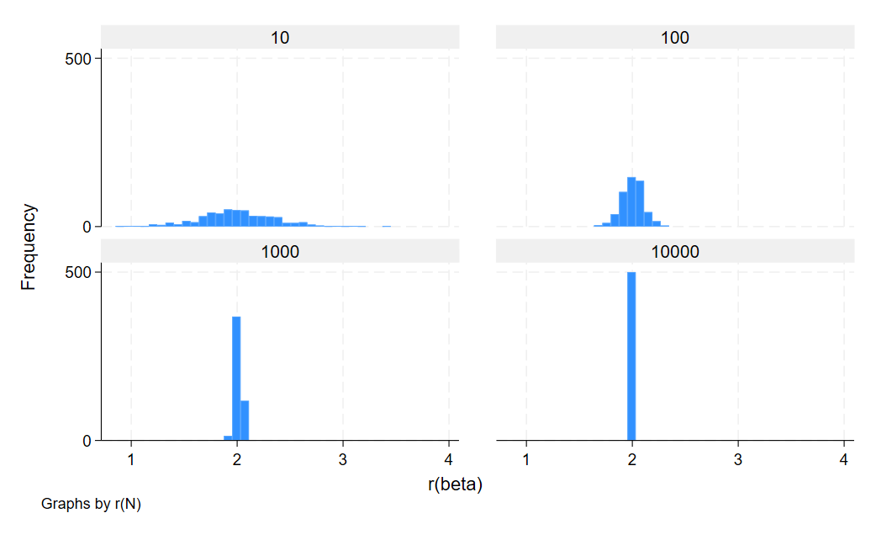
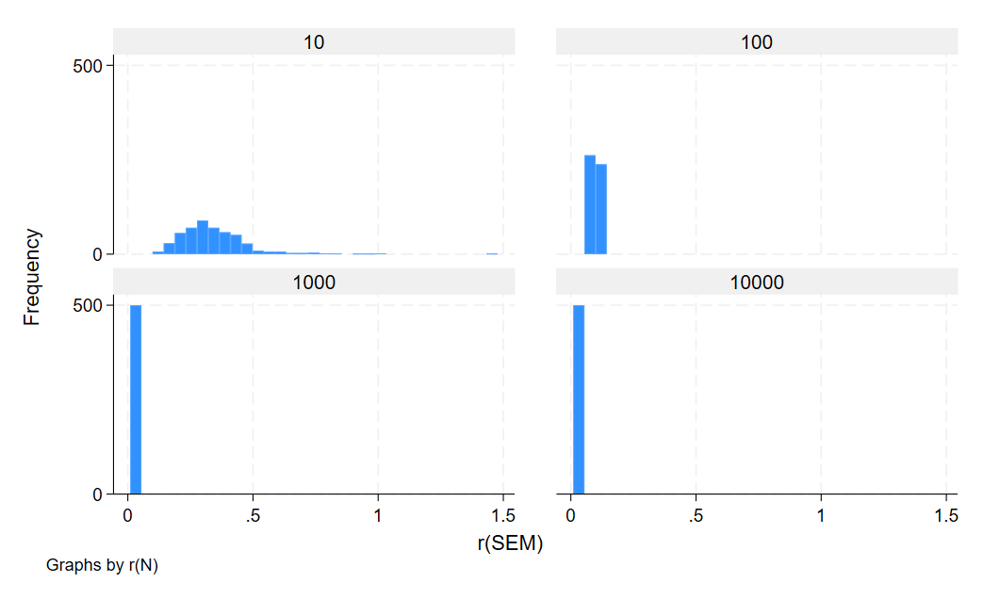
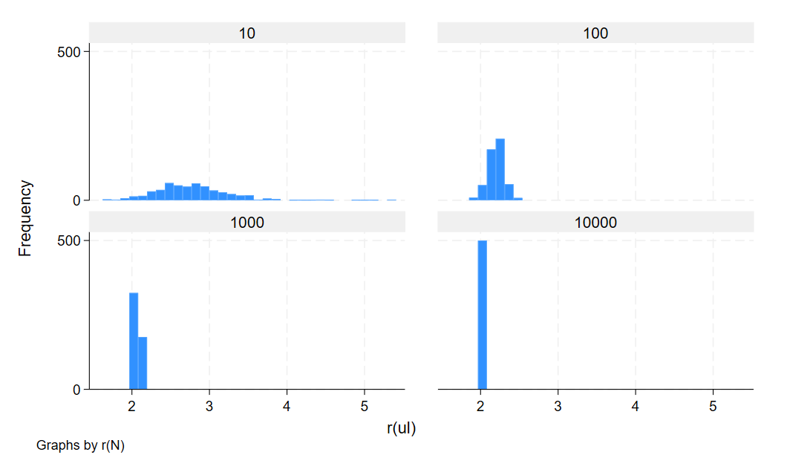
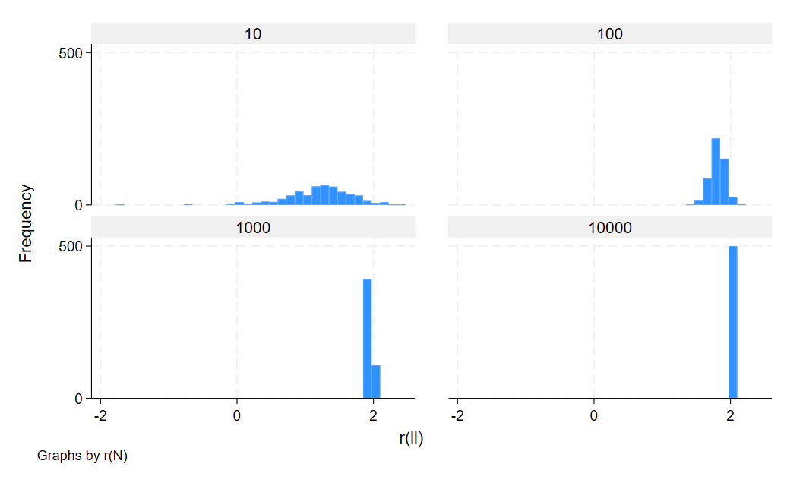
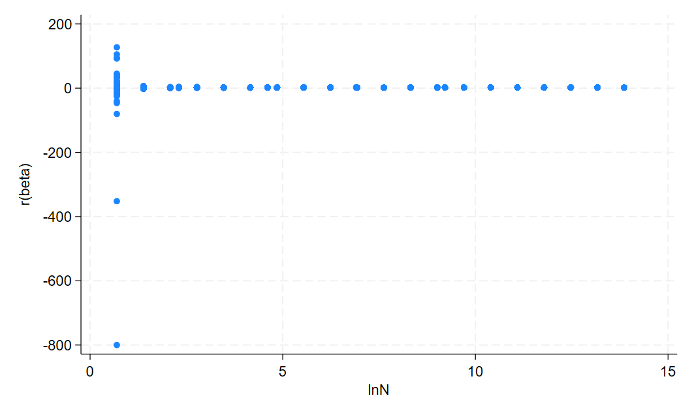
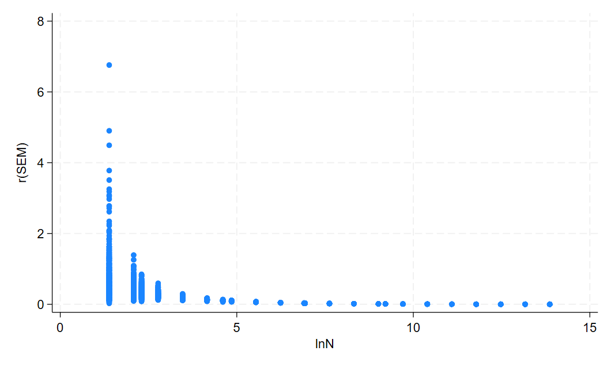
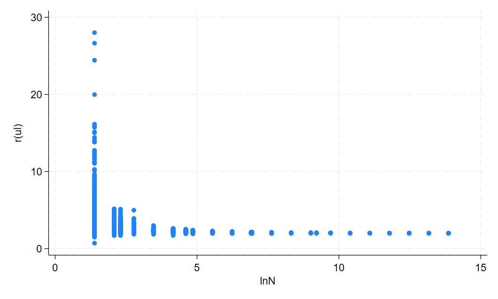
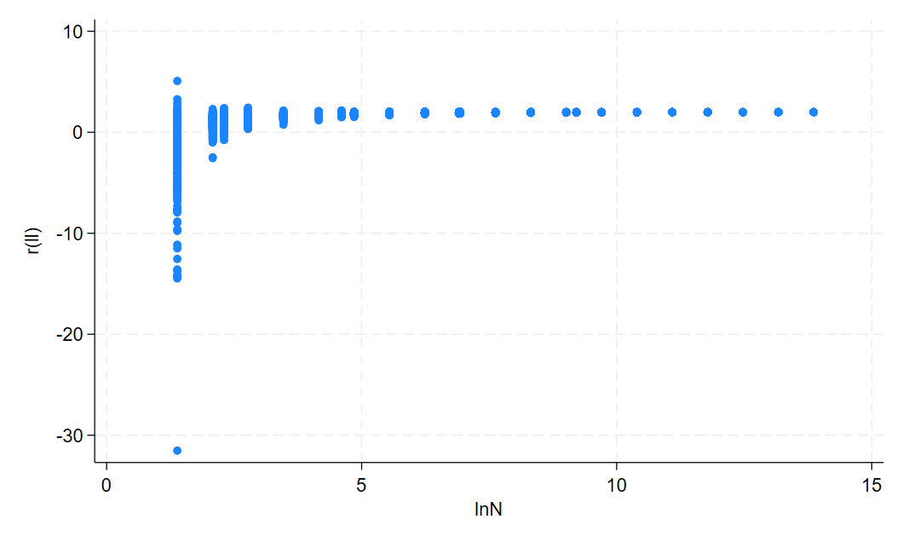

# Question 1

|           | r(N)          |               |               |               |
|           | 10            | 100           | 1000          | 10000         |
|-----------|---------------|---------------|---------------|---------------|
| r(beta)   | 1.998 (0.370) | 2.004 (0.102) | 2.009 (0.030) | 2.008 (0.000) |
| r(SEM)    | 0.343 (0.143) | 0.099 (0.010) | 0.031 (0.001) | 0.010 (0.000) |
| r(pvalue) | 0.004 (0.018) | 0.000 (0.000) | 0.000 (0.000) | 0.000 (0.000) |
| r(ll)     | 1.206 (0.482) | 1.808 (0.105) | 1.948 (0.030) | 1.989 (0.000) |
| r(ul)     | 2.790 (0.508) | 2.201 (0.102) | 2.070 (0.030) | 2.028 (0.000) |

We know that the correct population values is shown in sample size equals 10,000 as that is the entire population. We see that as sample size increases, SEM and p-value descreases because our test gets more precise. Further, the confidence intervals (UL & LL) tighten around the true value as sample size increases. 

# Question 2
       N |      beta       SEM    pvalue        ll        ul
---------+--------------------------------------------------
       2 |    0.4658         .         .         .         .
       4 |    2.0222    0.7441    0.1473   -1.1795    5.2240
       8 |    1.9858    0.4117    0.0155    0.9784    2.9933
    **10 |    2.0474    0.3550    0.0039    1.2286    2.8661**
      16 |    1.9906    0.2697    0.0001    1.4122    2.5691
      32 |    1.9923    0.1863    0.0000    1.6118    2.3729
      64 |    1.9902    0.1260    0.0000    1.7383    2.2421
   **100 |    2.0061    0.1017    0.0000    1.8044    2.2079**
     128 |    1.9984    0.0886    0.0000    1.8230    2.1737
     256 |    1.9971    0.0626    0.0000    1.8738    2.1204
     512 |    2.0007    0.0441    0.0000    1.9141    2.0873
  **1000 |    2.0010    0.0317    0.0000    1.9388    2.0631**
    1024 |    1.9994    0.0313    0.0000    1.9380    2.0609
    2048 |    1.9995    0.0221    0.0000    1.9562    2.0428
    4096 |    2.0004    0.0156    0.0000    1.9697    2.0311
    8192 |    1.9996    0.0110    0.0000    1.9780    2.0213
 **10000 |    1.9997    0.0100    0.0000    1.9801    2.0193**
   16384 |    1.9996    0.0078    0.0000    1.9843    2.0149
   32768 |    1.9999    0.0055    0.0000    1.9891    2.0108
   65536 |    1.9998    0.0039    0.0000    1.9921    2.0074
  131072 |    1.9999    0.0028    0.0000    1.9945    2.0053
  262144 |    1.9999    0.0020    0.0000    1.9961    2.0037
  524288 |    2.0001    0.0014    0.0000    1.9974    2.0028
 1048576 |    2.0000    0.0010    0.0000    1.9981    2.0019
---------+--------------------------------------------------
Numbers in asterisks are meant to be compared to the numbers in the 4 columns in table 1! Note interestingly that the numbers are slightly but meaningfully differently! More interestingly, the SEM, LL, and UL values for the true population are roughly equal in the two tables! This is found in the 10,000 sample size column in table 1 and the 1,048,576 sample size row in table 2! 

In the same way that question 1's statistics get tighter and closer to the true parameter, the same happens in question 2. 
However, in question 2, we are pulling from a very large and roughly infinite population, and as such, each draw is independent from another draw. In other words, we are sampling without replacement. 
In contrast, in question 1, each pick in a sample is dependent on the previous pick. Say if you existed in that 10,000 person population from question 1. The likelihood of you getting choosen goes up with each person added to the sample since there are fewer people to choose from with each draw. This is sampling without replacement.
The impact is that in question 2, the variance remains the same for each n. This impacts our hypothesis testing calculations.
