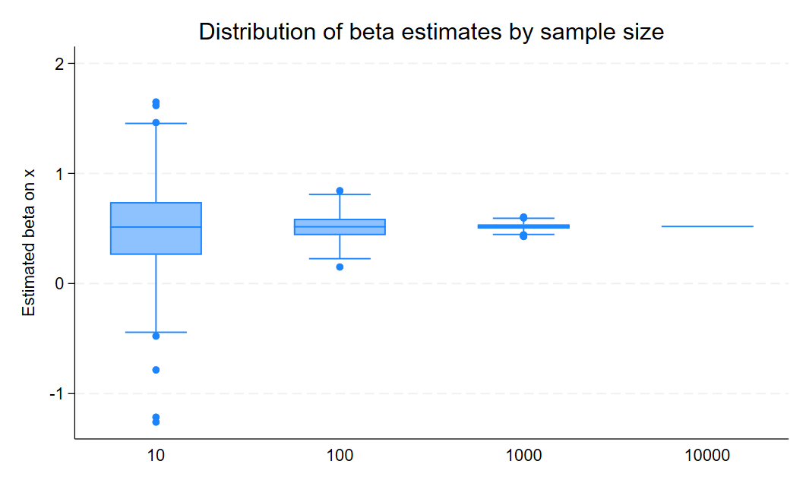
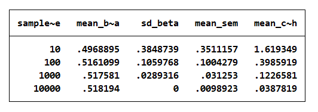
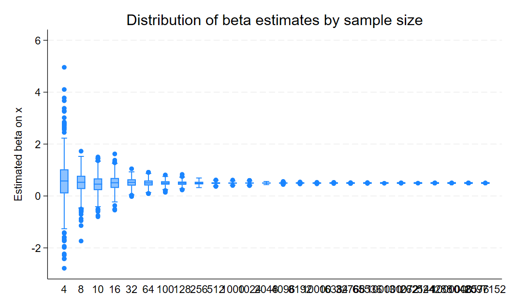
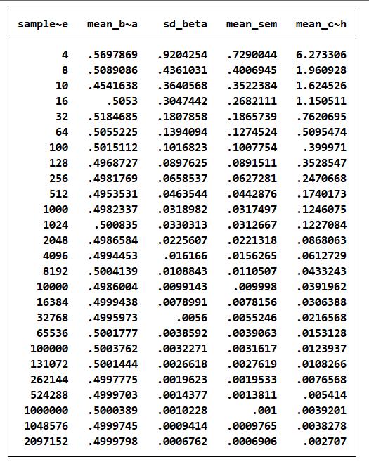

# PPOL 6818 - Assignment Stata 3

## Part 1: Sampling Noise in a Fixed Population

### Overview

In this part, I generate a fixed population of 10,000 observations with a true linear relationship between X and Y.
I repeatedly draw samples of different sizes and estimate the regression of Y on X to examine how sampling noise varies with sample size.

The true data generating process (DGP) is: - $X \sim N(0,1)$ - $Y = 1 + 0.5X + \epsilon$, where $\epsilon \sim N(0,1)$

The true coefficient on X is **0.5**.

------------------------------------------------------------------------

### Figure: Distribution of Beta Estimates

This figure shows the distribution of estimated coefficients across 500 simulations for each sample size.

**Key observations:** - At **N = 10**, estimates are highly dispersed and often far from the true value.
- As sample size increases, the distribution becomes tighter and more centered around 0.5.
- At **N = 10,000**, estimates are extremely concentrated around the true coefficient.

This demonstrates that sampling variability decreases as sample size increases.

------------------------------------------------------------------------

### Table: Summary Statistics by Sample Size

This table summarizes the mean and variability of estimates.

**Key observations:** - The **mean beta** is close to the true value (0.5) for all sample sizes, indicating unbiasedness.
- The **standard deviation of beta** decreases sharply as N increases.
- The **standard error (SEM)** declines with larger sample sizes.
- The **confidence interval width** becomes much smaller as N increases.

------------------------------------------------------------------------

### Interpretation

These results illustrate the role of sampling noise in a fixed population:

-   Small samples produce noisy and unstable estimates.
-   Larger samples reduce variability and improve precision.
-   Standard errors and confidence intervals shrink with increasing sample size.

Overall, increasing the sample size leads to more precise and reliable estimates of the true parameter.

## Part 2: Sampling Noise in an Infinite Superpopulation

### Overview

In this part, I generate a new dataset in each simulation rather than repeatedly sampling from one fixed population.
The data generating process is the same as in Part 1:

-   $X \sim N(0,1)$
-   $Y = 1 + 0.5X + \epsilon$, where $\epsilon \sim N(0,1)$

The true coefficient on X is **0.5**.

I run 500 simulations for each sample size using the first twenty powers of two, as well as $N = 10, 100, 1000, 10000, 100000, 1000000$, and then compare the regression results across sample sizes.

------------------------------------------------------------------------

### Figure: Distribution of Beta Estimates

This figure shows the distribution of estimated coefficients across simulations for different sample sizes.

**Key observations:** - At very small sample sizes, especially **N = 4** and **N = 8**, the estimates are highly dispersed.
- As sample size increases, the distribution becomes much tighter around the true value of **0.5**.
- At very large sample sizes, the estimates are extremely concentrated and sampling noise becomes very small.

This shows that beta estimates become more stable and precise as the sample size increases.

------------------------------------------------------------------------

### Table: Summary Statistics by Sample Size

This table summarizes the mean beta, the standard deviation of beta, the mean standard error, and the mean confidence interval width for each sample size.

**Key observations:** - The **mean beta** stays close to the true value of **0.5** across sample sizes.
- The **standard deviation of beta** decreases steadily as sample size grows.
- The **mean SEM** becomes smaller as N increases.
- The **mean confidence interval width** also shrinks quickly with larger samples.

These patterns confirm that larger samples produce more precise estimates.

------------------------------------------------------------------------

### Interpretation

Compared with Part 1, I am able to use much larger sample sizes here because this part assumes an **infinite superpopulation**.
Instead of drawing from one fixed population of 10,000 observations, each simulation creates a new dataset, so there is no upper limit on the sample size.

The results are also somewhat different from Part 1 for this reason.
In Part 1, repeated samples come from the same fixed population, while in Part 2, each sample comes from a newly generated population.
This means that Part 2 reflects sampling variation from an underlying superpopulation rather than repeated sampling from a single finite dataset.

The SEM and confidence intervals continue to shrink as N increases.
At the powers of ten shown here, they may differ from Part 1 because Part 1 is constrained by the fixed population, while Part 2 is not.
In Part 2, increasing the sample size keeps improving precision even at very large N.

Overall, the results in Part 2 show the same general pattern as Part 1: larger samples reduce sampling noise, improve precision, and produce estimates that are more tightly centered around the true parameter.

## Part 3: Power Calculations for Individual-Level Randomization

### Overview

In this part, I simulate an individually randomized experiment where the baseline outcome is normally distributed with mean 0 and standard deviation 1.
Treatment effects are heterogeneous and drawn from a uniform distribution between 0.0 and 0.2 standard deviations, so the average treatment effect is 0.1 standard deviations.

I calculate the sample size needed to achieve **80% power** under three scenarios: 1.
50% of individuals assigned to treatment 2.
50% assigned to treatment with 15% attrition 3.
30% assigned to treatment

------------------------------------------------------------------------

### Results

| Scenario                    | Required sample size for 80% power |
|-----------------------------|-----------------------------------:|
| 50% treated                 |                               3100 |
| 50% treated + 15% attrition |                               3550 |
| 30% treated                 |                               3650 |

------------------------------------------------------------------------

### Interpretation

When treatment is assigned to **50%** of the sample, the required sample size to achieve 80% power is **3100** individuals.

When I assume **15% attrition**, the required sample size increases to **3550**.
This happens because attrition reduces the effective sample size, which lowers statistical power.

When only **30%** of the sample receives treatment, the required sample size increases further to **3650**.
This is because an unbalanced treatment-control ratio is less statistically efficient than a 50-50 split.

Overall, these results show that power decreases when the effective sample becomes smaller or when treatment assignment becomes less balanced, so a larger total sample is needed to maintain 80% power.

## Part 4: Power Calculations for Cluster Randomization

### Overview

In this part, I simulate a cluster-randomized trial in which treatment is assigned at the school level and outcomes are measured for individual students.
The outcome is a student math score, and the data generating process is designed so that the intra-class correlation coefficient (ICC) is approximately 0.3.

Treatment effects are heterogeneous and drawn from a uniform distribution between 0.15 and 0.25 standard deviations, so the average treatment effect is 0.2 standard deviations.
Schools are divided evenly between treatment and control groups.

------------------------------------------------------------------------

### Results

When I hold the number of schools fixed at **200** and increase cluster size using the first ten powers of two, power rises at first and then levels off:

| Cluster size | Power |
|--------------|------:|
| 2            | 0.372 |
| 4            | 0.556 |
| 8            | 0.606 |
| 16           | 0.686 |
| 32           | 0.724 |
| 64           | 0.730 |
| 128          | 0.718 |
| 256          | 0.714 |
| 512          | 0.712 |
| 1024         | 0.698 |

Holding cluster size fixed at **15 students per school**, the number of schools required to achieve **80% power** is:

| Scenario                     | Required number of schools |
|------------------------------|---------------------------:|
| Full adoption                |                        280 |
| 70% of treated schools adopt |                        530 |

------------------------------------------------------------------------

### Interpretation

Power increases as cluster size becomes larger, but the gains become very small after about **64 students per school**.
This happens because outcomes within the same school are correlated when ICC is high, so adding more students within a school provides less new information than adding more schools.

Based on these results, I would recommend a cluster size of about **64 students per school**, because this is where power is near its highest level and additional increases in cluster size produce very limited improvement.

When cluster size is fixed at 15, I need **280 schools** to reach 80% power under full adoption.
When only **70% of treated schools actually adopt the treatment**, the required number of schools rises to **530**.
This is because incomplete adoption reduces the effective treatment contrast between treatment and control groups, which lowers power and increases the number of schools needed.
