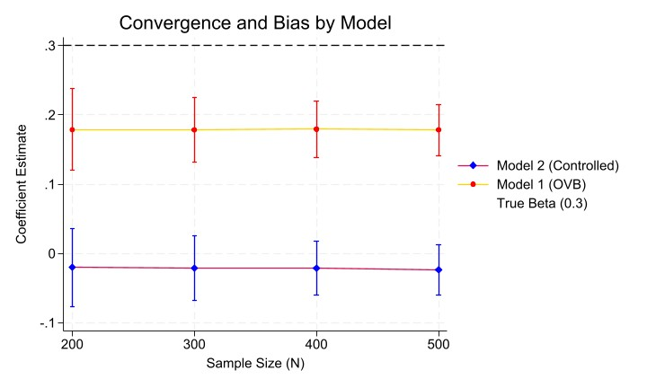

# README: De-biasing Parameter Estimates Using Controls

## 1. Project Overview
This project uses a Monte Carlo simulation to demonstrate how different model specifications (omitting variables, controlling for mediators, or controlling for colliders) affect the bias and convergence of a treatment effect estimate. 

The goal is to recover a **True Direct Effect of 0.3**, while navigating a complex Data Generating Process (DGP) containing confounders, mediators, and colliders.

---

## 2. Data Generating Process (DGP)
The data is simulated using the following structural equations to define the relationship between variables:

* **Confounder (`confound`):** $N(0,1)$. Affects both treatment and outcome.
* **Treatment (`treat`):** $0.5 \times confound + N(0,1)$.
* **Mediator (`mediate`):** $0.4 \times treat + N(0,1)$.
* **Outcome (`y`):** $0.3(treat) + 0.5(confound) - 0.8(mediate)$.
* **Collider (`collide`):** $0.6(treat) + 0.2(y) + N(0,1)$.

> **Note on the "True" Beta:** While the *Direct Effect* of treatment on $Y$ is **0.3**, the *Total Effect* (accounting for the mediator) is $0.3 + (0.4 \times -0.8) = \mathbf{-0.02}$.

---

## 3. Model Specifications
We ran five regression models to observe the resulting coefficients ($b_1$ through $b_5$):

| Model | Specification | Description |
| :--- | :--- | :--- |
| **Model 1** | `reg y treat` | **Omitted Variable Bias:** Fails to control for the confounder. |
| **Model 2** | `reg y treat confound` | **Total Effect:** Controls for the confounder; isolates the total causal effect. |
| **Model 3** | `reg y treat mediate` | **Direct Effect:** Controls for the mediator to isolate the direct path. |
| **Model 4** | `reg y treat collide` | **Selection Bias:** Controls for a collider, inducing a false correlation. |
| **Model 5** | `reg y treat confound collide` | **Complex Bias:** Combines confounder control with collider bias. |

---

## 4. Results & Analysis

### Summary Statistics (Mean Estimates)
Based on 1,000 simulations per sample size ($N$), the treatment effects predicted are:

| N | Model 1 (OVB) | Model 2 (Total) | Model 3 (Direct) | Model 4 | Model 5 |
| :--- | :--- | :--- | :--- | :--- | :--- |
| **200** | 0.179 | -0.020 | 0.499 | 0.076 | -0.094 |
| **300** | 0.178 | -0.021 | 0.499 | 0.074 | -0.096 |
| **400** | 0.179 | -0.021 | 0.501 | 0.077 | -0.094 |
| **500** | 0.178 | -0.023 | 0.501 | 0.075 | -0.098 |

### Key Observations
1.  **Bias vs. Sample Size:** The bias in Model 1 (~0.18 vs the true 0.3) does not disappear as $N$ increases. Increasing sample size improves **precision** (smaller standard errors) but does nothing to fix **accuracy** (systematic bias).
2.  **The Mediation Effect:** In Model 2, the coefficient is nearly zero (-0.02). This is because the positive direct effect (0.3) is almost perfectly canceled out by the negative indirect path through the mediator ($0.4 \times -0.8$). 
3.  **Convergence:** The standard deviation of the estimates decreases as $N$ grows (from **0.059** at $N=200$ to **0.037** at $N=500$), showing that the estimates become more tightly clustered around their (potentially biased) means.

---

## 5. Visual Summary
The figure below illustrates the convergence of **Model 1** and **Model 2**.

* The **Dashed Line (0.3)** represents the True Direct Beta.
* **Model 1 (Yellow/Red)** shows the persistent upward bias from the omitted confounder.
* **Model 2 (Blue/Purple)** converges to the Total Effect of -0.02, showing how controlling for a confounder shifts the estimate toward the total causal impact.

---