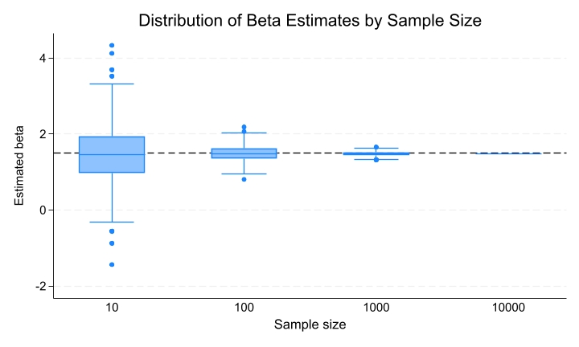
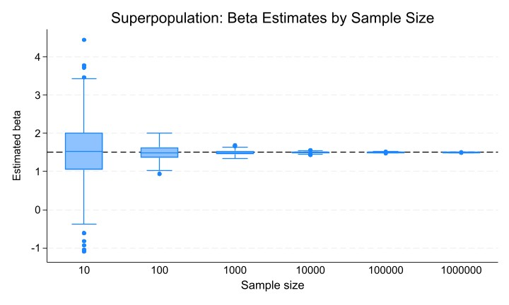
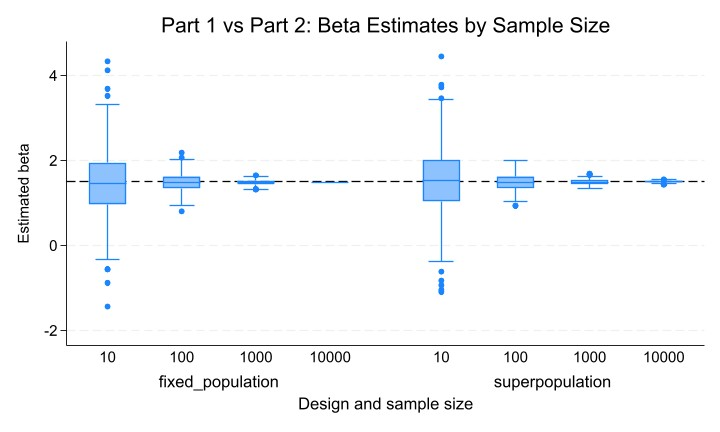

## Part 1 Sampling Noise in a Fixed Population

Project Objective
This project examines sampling noise in linear regression when the population is fixed but the sample is randomly drawn. The goal is to show how regression estimates vary across repeated samples and how that variation changes as sample size increases.

Data Generating Process
I created a fixed population of 10,000 observations in Stata using a fixed random seed so that the same population can be reproduced every time. The independent variable X was generated from a normal distribution with mean 0 and standard deviation 1. The outcome Y was generated according to the following true relationship:

    Y = 2 + 1.5X + u

where u is a normally distributed error term with mean 0 and standard deviation 2. Therefore, the true population coefficient on X is 1.5.

Simulation Procedure
I wrote a Stata program that:
1. loads the fixed population dataset,
2. randomly draws a sample of size N,
3. runs a regression of Y on X,
4. returns the sample size, estimated coefficient on X, standard error, p-value, and 95% confidence interval.

Using the simulate command, I repeated this procedure 500 times for each of four sample sizes:
- N = 10
- N = 100
- N = 1000
- N = 10000

This produced a total of 2,000 regression results.

Results
The results show clear evidence of sampling noise at smaller sample sizes. When N = 10, the estimated coefficients varied substantially across simulations. The mean estimated beta was 1.4745, which is close to the true value of 1.5, but the standard deviation of the beta estimates was 0.7618, indicating substantial dispersion across repeated samples. The mean standard error was 0.6898, the average confidence interval width was 3.1813, and the mean p-value was 0.1524. This suggests that with very small samples, estimates are noisy and imprecise.

When N = 100, the estimates became much more stable. The mean beta was 1.4885, the standard deviation of the beta estimates fell to 0.2001, the mean standard error fell to 0.2003, and the average confidence interval width narrowed to 0.7949. The mean p-value was approximately 0.0000, indicating much stronger statistical significance.

When N = 1000, the estimates were even more concentrated around the true parameter. The mean beta was 1.4813, the standard deviation of the beta estimates was 0.0590, the mean standard error was 0.0631, and the average confidence interval width was 0.2475.

When N = 10000, the regression estimates were extremely stable. The mean beta was 1.4826, the mean standard error was 0.0199, and the average confidence interval width was only 0.0781. The distribution of beta estimates across simulations was extremely tight.

Overall, the simulations demonstrate that larger samples reduce sampling noise and improve the precision of regression estimates. Across all sample sizes, the mean beta estimates remained close to the true coefficient of 1.5, but the variability of the estimates declined sharply as sample size increased. The standard error and confidence interval width both became much smaller as N increased, confirming that larger samples provide more precise inference.

Figure and Table
The table summarizes the mean beta estimate, the standard deviation of beta, the mean standard error, the mean confidence interval width, and the mean p-value for each sample size. The box plot shows that the distribution of beta estimates becomes progressively tighter as sample size increases. Together, the table and figure show that small samples generate much more sampling noise, while large samples produce estimates that are more stable and precise.

Please check the end of part2.

Conclusion
This exercise illustrates a core principle of statistical inference: even when the population and the true relationship are fixed, regression estimates vary across samples because of random sampling variation. Increasing the sample size reduces this variation, making the estimated coefficient more reliable and the corresponding inference more precise.

Files Included
- fixed_population.dta: fixed population dataset of 10,000 observations
- sim_n10.dta: simulation results for N = 10
- sim_n100.dta: simulation results for N = 100
- sim_n1000.dta: simulation results for N = 1000
- sim_n10000.dta: simulation results for N = 10000
- all_sim_results.dta: combined simulation results
- do-file(s) used to create the population, define the program, run simulations, and generate the table and figure
- box plot figure showing the distribution of beta estimates by sample size

## Part 2：Sampling noise in an infinite superpopulation

The Part 2 results show the same general pattern as Part 1: beta estimates become more concentrated around the true value of 1.5 as sample size increases, while standard errors and confidence intervals shrink substantially.

For the benchmark sample sizes, the results were as follows:

- At \(N = 10\), the mean beta was 1.530110, the mean standard error was 0.717841, the average confidence interval width was 3.310691, the mean p-value was 0.144880, and the standard deviation of beta across simulations was 0.777265.
- At \(N = 100\), the mean beta was 1.487979, the mean standard error was 0.201953, the average confidence interval width was 0.801537, and the standard deviation of beta was 0.197618.
- At \(N = 1{,}000\), the mean beta was 1.496097, the mean standard error was 0.063306, the average confidence interval width was 0.248457, and the standard deviation of beta was 0.060154.
- At \(N = 10{,}000\), the mean beta was 1.499664, the mean standard error was 0.020004, the average confidence interval width was 0.078423, and the standard deviation of beta was 0.019894.
- At \(N = 100{,}000\), the mean beta was 1.500225, the mean standard error was 0.006326, the average confidence interval width was 0.024797, and the standard deviation of beta was 0.006717.
- At \(N = 1{,}000{,}000\), the mean beta was 1.499784, the mean standard error was 0.002000, the average confidence interval width was 0.007840, and the standard deviation of beta was 0.001870.

These results show a very clear decline in uncertainty as sample size grows. For example, the mean standard error fell from 0.717841 at \(N = 10\) to 0.002000 at \(N = 1{,}000{,}000\), and the average confidence interval width shrank from 3.310691 to 0.007840. This illustrates that larger samples produce much more precise regression estimates.

#Comparison of Part 1 and Part 2

Part 1 and Part 2 can be meaningfully compared at the common sample sizes \(N = 10\), \(N = 100\), \(N = 1{,}000\), and \(N = 10{,}000\).

### Why Part 2 allows larger sample sizes

The key difference is that Part 1 draws repeated samples from a fixed population of 10,000 observations, so the largest possible sample is 10,000. In contrast, Part 2 generates a fresh random sample in every simulation directly from the underlying data generating process. Because this superpopulation is treated as effectively infinite, it is possible to simulate sample sizes much larger than 10,000, such as 100,000 and 1,000,000.

### Why SEM and confidence intervals differ across parts

At small and moderate sample sizes, the two designs produce very similar results. For example:

- At \(N = 100\), the mean standard error was 0.2003 in Part 1 and 0.2020 in Part 2.
- At \(N = 1{,}000\), the mean standard error was 0.0631 in Part 1 and 0.0633 in Part 2.
- The average confidence interval widths at those sample sizes were also extremely close across the two parts.

However, the difference becomes more conceptually important at \(N = 10{,}000\). In Part 1, a sample of 10,000 effectively covers the entire fixed population, so there is almost no remaining sampling variation. This is why the standard deviation of beta across simulations is approximately 0.0000 in the fixed-population case. In Part 2, by contrast, a sample of 10,000 is still only one draw from an effectively infinite superpopulation, so some sampling variation remains. That is why the standard deviation of beta at \(N = 10{,}000\) in Part 2 is still 0.0199 rather than essentially zero.

This is also reflected in the standard errors and confidence intervals:
- At \(N = 10{,}000\), the mean standard error is 0.0199 in Part 1 and 0.0200 in Part 2, which are very close.
- But the variation in beta across simulations is still visibly present in Part 2, while it nearly disappears in Part 1 because the fixed population is exhausted.

### Can Part 1 and Part 2 be visualized together?

Yes. The two parts can be compared meaningfully using:
- a comparison table at the common sample sizes \(10, 100, 1{,}000,\) and \(10{,}000\),
- a combined box plot showing the distribution of beta estimates by design and sample size.

This joint visualization highlights both similarities and differences. At smaller sample sizes, both designs show substantial sampling noise. At larger sample sizes, both designs become more precise, but the fixed-population design becomes especially stable once the sample approaches the entire population.

## Main Takeaways

This project illustrates several core principles of statistical inference.

First, even when the true relationship is fixed, regression estimates vary across samples because of sampling noise. Second, increasing sample size reduces this noise, making estimated coefficients more stable and shrinking standard errors and confidence intervals. Third, there is an important conceptual distinction between finite-population sampling and superpopulation sampling. In a fixed finite population, uncertainty can shrink dramatically as the sample approaches the population size. In an infinite superpopulation, some sampling variation remains unless the sample size becomes extremely large.

## Figures and Tables

The project includes:
- a figure for Part 1 showing the distribution of beta estimates by sample size,
- a figure for Part 2 showing the distribution of beta estimates by sample size,
- a comparison figure showing Part 1 and Part 2 together, summary tables reporting the mean beta, standard deviation of beta, mean standard error, mean confidence interval width, and mean p-value.

## Table 1. Part 1 Benchmark Results

| Sample Size | Mean Beta | Mean SE | Mean CI Width | Mean P-value | SD of Beta |
|-------------|-----------|---------|---------------|--------------|------------|
| 10          | 1.4745    | 0.6898  | 3.1813        | 0.1524       | 0.7618     |
| 100         | 1.4885    | 0.2003  | 0.7949        | 0.0000       | 0.2001     |
| 1000        | 1.4813    | 0.0631  | 0.2475        | 0.0000       | 0.0590     |
| 10000       | 1.4826    | 0.0199  | 0.0781        | 0.0000       | 0.0000     |
## Table 2. Part 2 Benchmark Results

| Sample Size | Mean Beta | Mean SE | Mean CI Width | Mean P-value | SD of Beta |
|-------------|-----------|---------|---------------|--------------|------------|
| 10          | 1.530110  | 0.717841 | 3.310691 | 0.144880 | 0.777265 |
| 100         | 1.487979  | 0.201953 | 0.801537 | 0.000000 | 0.197618 |
| 1000        | 1.496097  | 0.063306 | 0.248457 | 0.000000 | 0.060154 |
| 10000       | 1.499664  | 0.020004 | 0.078423 | 0.000000 | 0.019894 |
| 100000      | 1.500225  | 0.006326 | 0.024797 | 0.000000 | 0.006717 |
| 1000000     | 1.499784  | 0.002000 | 0.007840 | 0.000000 | 0.001870 |
				
## Table 3. Comparison of Part 1 and Part 2 at Common Sample Sizes

| Design | Statistic | 10 | 100 | 1000 | 10000 |
|--------|-----------|----|-----|------|-------|
| Fixed Population | Mean Beta | 1.4745 | 1.4885 | 1.4813 | 1.4826 |
| Fixed Population | Mean SE | 0.6898 | 0.2003 | 0.0631 | 0.0199 |
| Fixed Population | Mean CI Width | 3.1813 | 0.7949 | 0.2475 | 0.0781 |
| Fixed Population | SD of Beta | 0.7618 | 0.2001 | 0.0590 | 0.0000 |
| Superpopulation | Mean Beta | 1.5301 | 1.4880 | 1.4961 | 1.4997 |
| Superpopulation | Mean SE | 0.7178 | 0.2020 | 0.0633 | 0.0200 |
| Superpopulation | Mean CI Width | 3.3107 | 0.8015 | 0.2485 | 0.0784 |
| Superpopulation | SD of Beta | 0.7773 | 0.1976 | 0.0602 | 0.0199 |

## Files Included

- do-files for generating the fixed population, defining the regression programs, running simulations, and producing summary outputs
- `fixed_population.dta`
- `all_sim_results.dta`
- `superpop_all_results.dta`
- `part1_part2_compare.dta`
- figures for Part 1, Part 2, and the Part 1 vs. Part 2 comparison
- README file

## Figure 1. Part 1: Fixed Population

## Figure 2. Part 2: Infinite Superpopulation

## Figure 3. Part 1 vs Part 2 Comparison

## Part 3： Power calculations for individual-level randomization

### Data Generating Process and Assumptions

In Part 3, I considered an individually randomized experiment in which the untreated outcome is normally distributed around 0 with standard deviation 1. I assumed:

\[
Y_i(0) \sim N(0,1)
\]

Individual treatment effects were drawn from a uniform distribution between 0.0 and 0.2 standard deviations:

\[
\tau_i \sim U(0, 0.2)
\]

This implies an average treatment effect of 0.1 standard deviations. The observed outcome can therefore be written as:

\[
Y_i = Y_i(0) + D_i\tau_i
\]

where \(D_i\) indicates whether the individual is assigned to treatment.

### Baseline Power Calculation: 50% Treatment, 50% Control

I first assumed that half of the individuals are assigned to treatment and half to control. Using Stata's `power twomeans` command with a two-sided 5 percent significance level, standard deviation of 1, and target power of 80 percent, I calculated the sample size needed to detect an effect of 0.1 standard deviations.

The required total sample size was approximately **1,568 individuals**, which corresponds to about **784 individuals per arm**.

### Adjusting for 15% Attrition

I then assumed that 15 percent of the sample would attrite, with similar attrition rates in the treatment and control groups. To account for this, I inflated the original sample size by dividing by 0.85. This increased the required initial sample size from 1,568 to approximately **1,845 individuals**.

This means that if I expect 15 percent attrition, I would need to enroll about 1,845 people in order to retain enough observations for 80 percent power.

### Unequal Assignment: Only 30% Receive Treatment

Next, I assumed that the treatment is expensive and only 30 percent of the sample can receive it, with the remaining 70 percent assigned to control. This makes the design less statistically efficient because power is highest when treatment and control groups are balanced.

Using Stata with a treatment-control ratio corresponding to 30 percent treated and 70 percent control, the required total sample size increased to approximately **3,734 individuals**.

### Unequal Assignment with Attrition

If I combine the 30 percent treatment share with 15 percent attrition, the required initial sample size rises further. Adjusting 3,734 for attrition by dividing by 0.85 gives approximately **4,393 individuals**.

### Main Takeaway

The Part 3 calculations show that sample size requirements are highly sensitive to both attrition and treatment allocation. Under equal randomization, about 1,568 individuals are required to detect a 0.1 standard deviation treatment effect with 80 percent power. Attrition increases this requirement to about 1,845. When only 30 percent of the sample can receive treatment, the design becomes less efficient and the required sample size rises sharply to about 3,734, or about 4,393 after accounting for 15 percent attrition.

Overall, the most statistically efficient design is the balanced 50-50 treatment allocation. Unequal treatment assignment and attrition both increase the required sample size substantially.

## Part 4: Power calculations for cluster randomization

## Data Generating Process and Design Setup

I generated student-level math scores in a clustered school setting where treatment is assigned at the school level. For each school, I generated a school-level random effect and then added individual-level noise for each student. Specifically, the outcome was generated as:

\[
Y_{ij} = u_j + e_{ij} + D_j\tau_j
\]

where \(u_j\) is a school-level random effect, \(e_{ij}\) is an individual-level error term, \(D_j\) is school-level treatment assignment, and \(\tau_j\) is the school-level treatment effect. I set the school-level variance to 0.3 and the residual variance to 0.7 so that the target intraclass correlation coefficient would be approximately 0.3.

The estimated ICC from a mixed-effects model was 0.2844, which is close to the target value of 0.3. Schools were divided evenly between treatment and control groups. Treatment effects were drawn from a uniform distribution between 0.15 and 0.25, which implies an average treatment effect of 0.2 standard deviations.

The simulation function was written so that both the number of clusters (schools) and the cluster size (students per school) could be varied.

## Question 5 Results

Holding the number of schools fixed at 200, power generally increases as cluster size becomes larger, but the gains diminish as more students are added within each school. Power rises from 0.320 when there is only 1 student per school to 0.628 at 8 students per school, and then to 0.680 at 16 students per school. Beyond that point, the improvements are much smaller: power is 0.684 at 32 students, 0.760 at 64 students, 0.712 at 128 students, 0.772 at 256 students, and 0.730 at 512 students.

Although the pattern is not perfectly monotonic, the overall trend is clear: increasing cluster size improves power, but with diminishing returns. This is consistent with the relatively high ICC of about 0.28 to 0.30. Because students within the same school are correlated, adding many more students within an existing school contributes less new information than adding new schools. For this reason, I would recommend a moderate cluster size such as 15 to 30 students per school. This range captures much of the power gain from increasing cluster size without requiring very large numbers of students within each school.

## Table 1. Power by Cluster Size with 200 Schools Fixed

| Cluster Size | Power | Mean Beta | Mean SE |
|-------------|------:|----------:|--------:|
| 1   | 0.320 | 0.2108 | 0.1417 |
| 2   | 0.378 | 0.1932 | 0.1133 |
| 4   | 0.502 | 0.1944 | 0.0965 |
| 8   | 0.628 | 0.2015 | 0.0881 |
| 16  | 0.680 | 0.2014 | 0.0824 |
| 32  | 0.684 | 0.2012 | 0.0800 |
| 64  | 0.760 | 0.2065 | 0.0782 |
| 128 | 0.712 | 0.1969 | 0.0779 |
| 256 | 0.772 | 0.2040 | 0.0772 |
| 512 | 0.730 | 0.2025 | 0.0776 |

## Question 6 Results

Holding cluster size fixed at 15 students per school, power increases steadily as the number of schools increases. Power is only 0.124 with 20 schools and rises gradually to 0.384 with 100 schools, 0.608 with 160 schools, and 0.666 with 200 schools. At 240 schools, power reaches 0.772, which is still below the 80 percent target. The first design that achieves at least 80 percent power is 280 schools, where power is 0.806. At 320 schools, power rises further to 0.834.

Therefore, with 15 students per school, I would need approximately 280 schools in the cluster-randomized trial to achieve 80 percent power to detect a 0.2 standard deviation treatment effect.

## Table 2. Power by Number of Schools with 15 Students per School

| Number of Schools | Power | Mean Beta | Mean SE |
|------------------|------:|----------:|--------:|
| 20  | 0.124 | 0.2157 | 0.2543 |
| 40  | 0.176 | 0.1937 | 0.1853 |
| 60  | 0.276 | 0.2043 | 0.1510 |
| 80  | 0.344 | 0.1994 | 0.1311 |
| 100 | 0.384 | 0.1970 | 0.1168 |
| 120 | 0.426 | 0.1944 | 0.1068 |
| 140 | 0.504 | 0.1959 | 0.0986 |
| 160 | 0.608 | 0.2048 | 0.0932 |
| 180 | 0.610 | 0.2009 | 0.0875 |
| 200 | 0.666 | 0.1981 | 0.0830 |
| 240 | 0.772 | 0.2042 | 0.0759 |
| 280 | 0.806 | 0.1953 | 0.0702 |
| 320 | 0.834 | 0.1974 | 0.0656 |

## Question 7 Results

When only 70 percent of treated schools actually adopt the intervention, power falls substantially relative to the full-adoption case. With 15 students per school, power is only 0.094 with 20 schools and increases gradually to 0.232 with 100 schools, 0.416 with 200 schools, and 0.644 with 400 schools.

This means that 400 schools are still not enough to achieve 80 percent power under partial adoption. In my simulations, the required number of schools must therefore be greater than 400. The reason is that incomplete adoption reduces the effective treatment contrast between treatment and control schools, which weakens the intention-to-treat effect and lowers statistical power. As a result, substantially more schools are required to detect the treatment effect when only 70 percent of assigned schools actually implement the intervention.

## Table 3. Power by Number of Schools with 70% Adoption and 15 Students per School

| Number of Schools | Power | Mean Beta | Mean SE |
|------------------|------:|----------:|--------:|
| 20  | 0.094 | 0.1301 | 0.2540 |
| 40  | 0.132 | 0.1481 | 0.1829 |
| 60  | 0.148 | 0.1439 | 0.1512 |
| 80  | 0.186 | 0.1476 | 0.1323 |
| 100 | 0.232 | 0.1425 | 0.1179 |
| 120 | 0.276 | 0.1440 | 0.1077 |
| 140 | 0.258 | 0.1332 | 0.0995 |
| 160 | 0.338 | 0.1453 | 0.0933 |
| 180 | 0.352 | 0.1398 | 0.0879 |
| 200 | 0.416 | 0.1482 | 0.0835 |
| 240 | 0.420 | 0.1378 | 0.0760 |
| 280 | 0.512 | 0.1406 | 0.0708 |
| 320 | 0.548 | 0.1379 | 0.0660 |
| 360 | 0.598 | 0.1403 | 0.0625 |
| 400 | 0.644 | 0.1395 | 0.0594 |

