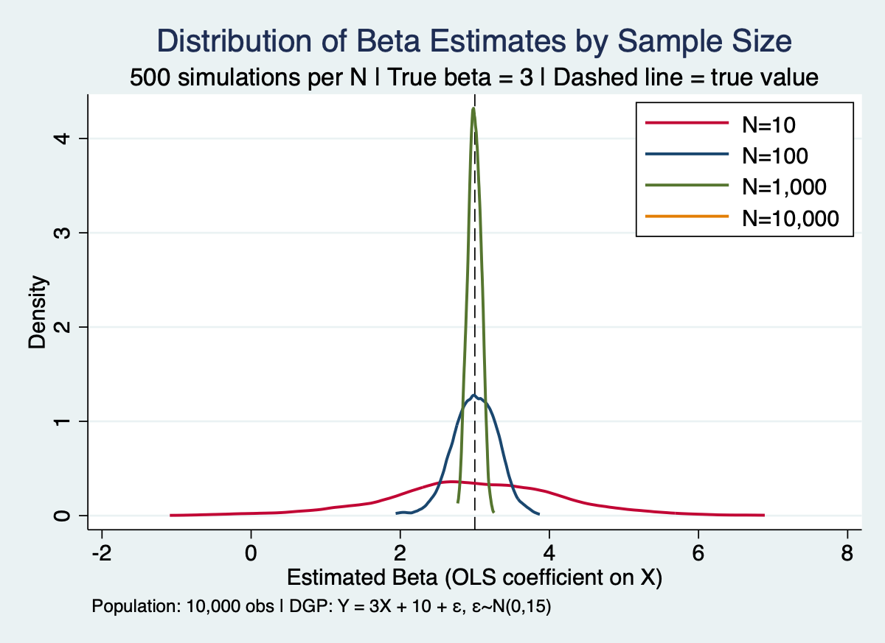
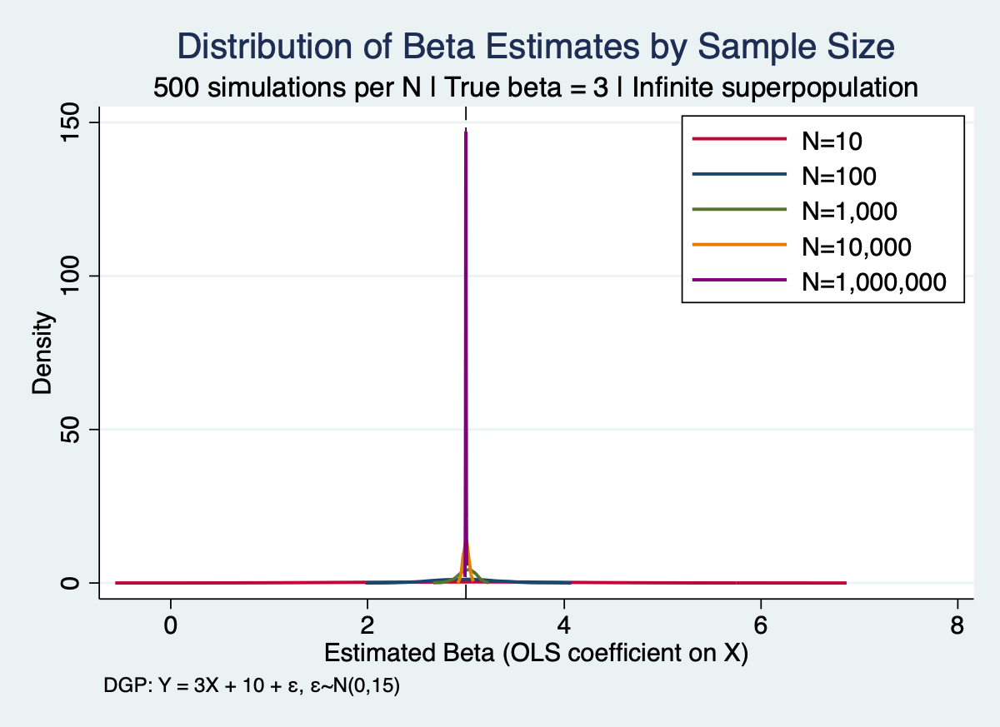
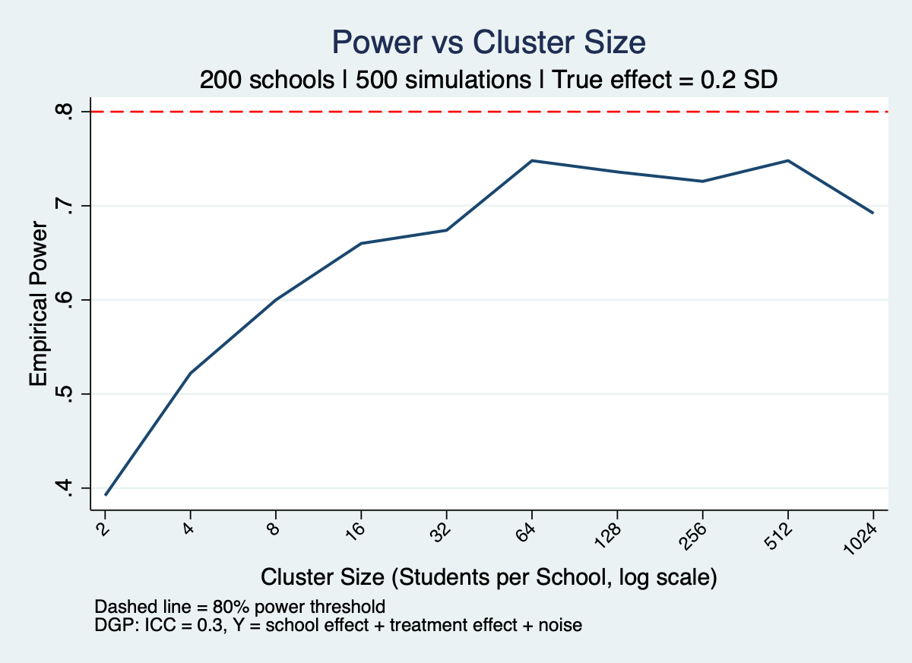
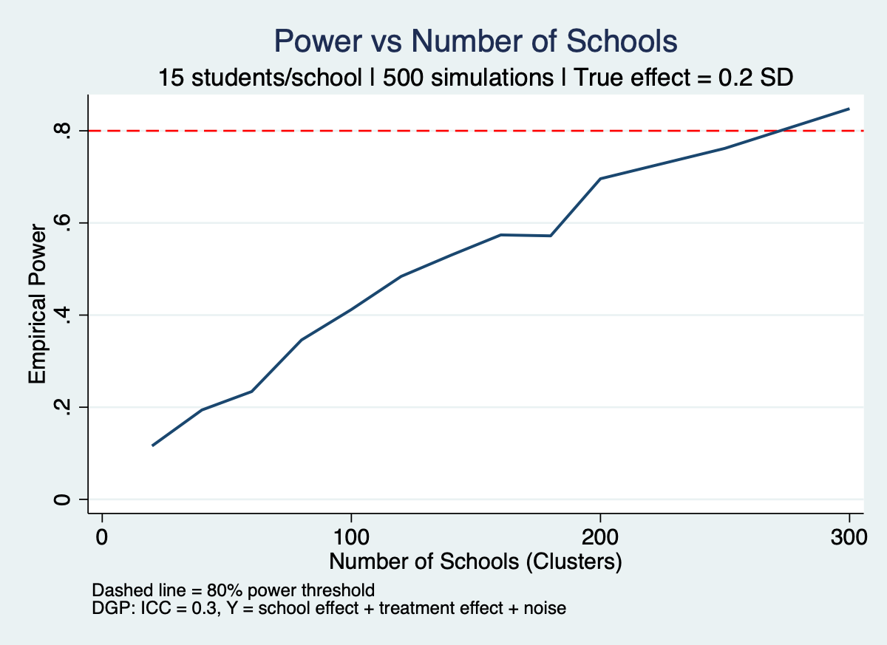
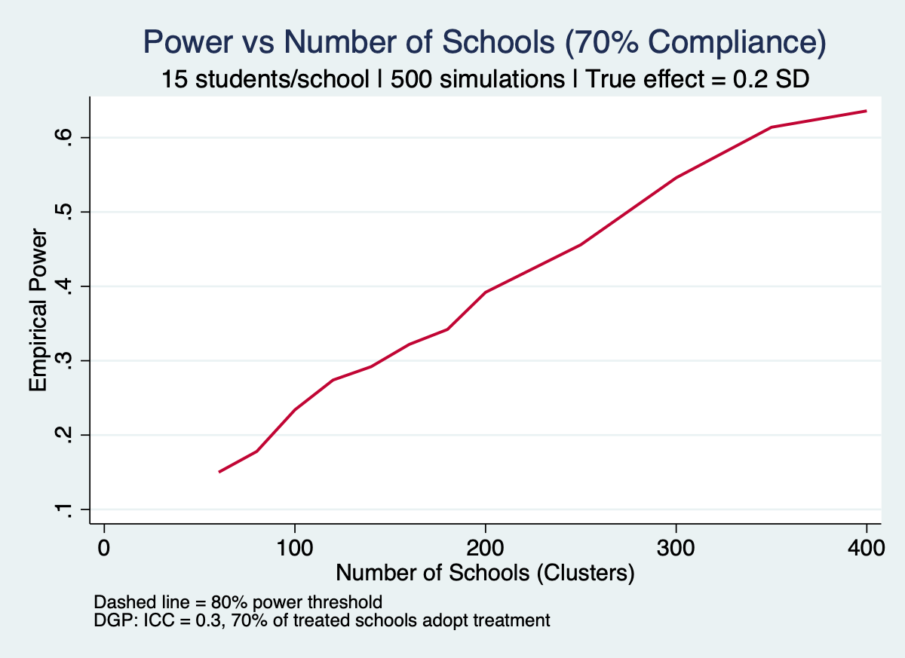

# PPOL 6818 – Stata 3 Assignment(cm2020)
### Generated: March 19, 2021
### Edited: March 20, 2021
### Edited: March 21, 2021
### Edited: March 22, 2021

## PART 1: Sampling noise in a fixed population
Q5-6: Create at least one figure and at least one table showing the variation in your beta estimates depending on the sample size, and characterize the size of the SEM and confidence intervals as N gets larger.

### Figure 1: Distribution of Beta Estimates by Sample Size

The figure shows the distribution of beta estimates across 500 simulations at each sample size. The dashed vertical line marks the true value of β = 3.

- At **N=10**, the distribution is very wide — estimates range from roughly -2 to 7, and any single estimate could be off base.
- At **N=100**, the distribution tightens. Most estimates fall within about ±1 of the true value.
- At **N=1,000**, the distribution is narrow and closely centered around 3.
- At **N=10,000**, the distribution is almost a single spike at exactly 3 — estimates are nearly identical to the true parameter.

As sample size grows, estimates become more precise and cluster more tightly around the true value.

---

### Table 1: Summary Statistics of Simulation Results

| N | Mean Beta | SD of Beta | Mean SEM | Mean CI Width |
|---|---|---|---|---|
| 10 | 2.9802 | 1.1831 | 1.0394 | 4.7938 |
| 100 | 3.0030 | 0.2971 | 0.3026 | 1.2011 |
| 1,000 | 2.9955 | 0.0855 | 0.0949 | 0.3726 |
| 10,000 | 2.9989 | 0.0000* | 0.0300 | 0.1178 |

*SD rounds to zero at N=10,000 due to display formatting — estimates are extremely precise but not literally identical.

**Key observations:**
1. **Mean beta stays close to 3 at every sample size** — OLS consistently recovers the true value on average, regardless of how small the sample is.
2. **SD of beta shrinks as N grows** — the spread of estimates falls from 1.18 at N=10 to nearly zero at N=10,000, meaning individual estimates become far more reliable.
3. **SEM tracks SD of beta closely** — the standard error that OLS reports is an accurate reflection of true estimation uncertainty, except at very small N (N=10) where it slightly underestimates the spread.
4. **CI width shrinks dramatically** — the confidence interval at N=10 is roughly 40× wider than at N=10,000. Small samples produce very uncertain estimates.

---

### Interpretation

The key takeaway is simple: bigger samples produce more reliable estimates. The true beta is always 3 — but with a small sample, random noise can make it look like 1 or 5. With a large sample, the noise averages out and the estimate converges to the truth. This is why sample size matters so much in research.

## PART 2: Sampling noise in an infinite superpopulation

### Questions
### Q3: Create at least one figure and at least one table showing the variation in your beta estimates depending on the sample size, and characterize the size of the SEM and confidence intervals as N gets larger.

### Q4: Fully describe your results in your README file, including figures and tables as appropriate.

### Q5: In particular, take care to discuss the reasons why you are able to draw a larger sample size than in Part 1, and why the sizes of the SEM and confidence intervals might be different at the powers of ten than in Part 1. Can you visualize Part 1 and Part 2 together meaningfully, and create a comparison table?

### Figure 1: Precision of Beta Estimates vs Sample Size

At N=10, the distribution is nearly flat — estimates range widely and are often far from the true value of 3. At N=1,000,000, the distribution is a near-vertical spike at exactly 3. All distributions remain centered on 3 regardless of sample size, confirming that OLS is unbiased.

---

### Table 1: Summary Statistics (selected sample sizes)

| N | Mean Beta | SD of Beta | Mean SEM | Mean CI Width |
|---|---|---|---|---|
| 4 | 3.1133 | 2.6545 | 2.1192 | 18.2364 |
| 10 | 2.9338 | 1.1625 | 1.0981 | 5.0646 |
| 100 | 2.9900 | 0.3284 | 0.3020 | 1.1985 |
| 1,000 | 3.0049 | 0.0925 | 0.0951 | 0.3732 |
| 10,000 | 3.0007 | 0.0283 | 0.0300 | 0.1176 |
| 100,000 | 3.0007 | 0.0094 | 0.0095 | 0.0372 |
| 1,000,000 | 2.9999 | 0.0030 | 0.0030 | 0.0118 |

---

### Why SEM and CI widths differ slightly from Part 1

At shared sample sizes (N=10, 100, 1,000, 10,000), Part 1 and Part 2 produce very similar but not identical results. The small differences arise because Part 1 samples from a fixed pool without replacement — when N is large relative to the population size (especially N=10,000 which uses the entire population), there is less variation than in Part 2 where each run draws completely fresh data.

### Comparison: Part 1 vs Part 2

| N | Part 1 Mean SEM | Part 2 Mean SEM | Part 1 CI Width | Part 2 CI Width |
|---|---|---|---|---|
| 10 | 1.0394 | 1.0981 | 4.7938 | 5.0646 |
| 100 | 0.3026 | 0.3020 | 1.2011 | 1.1985 |
| 1,000 | 0.0949 | 0.0951 | 0.3726 | 0.3732 |
| 10,000 | 0.0300 | 0.0300 | 0.1178 | 0.1176 |

The two approaches converge as N grows. By N=10,000 the results are essentially identical.

---

### Interpretation

The key takeaway from Part 2 is the same as Part 1 — bigger samples produce more reliable estimates — but Part 2 extends this to much larger sample sizes and confirms the pattern holds all the way to N=2,000,000. The infinite superpopulation framework is the standard assumption in most research: when a researcher surveys 500 people, they treat those 500 as 
a draw from an ongoing process, not a sample from a fixed list.

## PART 3: Power calculations for cluster randomization for individual-level randomization

### Q3: The proportion of individuals receiving treatment should be 0.5 (i.e. half in control, and half in treatment) Calculate the number of individuals required to reach 80% power when you are trying to detect 0.1 sd treatment effect.

3,142 people are required, with 1,571 in the treatment group, 1,571 in control group

This was verified by simulation — running 1,000 experiments at N=3,142 produced significant results 79.9% of the time, meeting the 80% power target.

### Q4: Now assume, 15% of the sample will attrite (assume similar attrition rates in control and treatment arms.) How does this change your sample size calculations from the previous part? 

If 15% of participants drop out before the study ends, more people need to be recruited in the beginning in order to account for this. A simple calculation suggests that 3,697 people need to be recruited.

- 3,142 / 0.85 = **3,697 people to recruit**
- After 15% dropout, ~3,142 remain for analysis

To verify this, we run the simulation 1,000 times at N=3,697 with 15% attrition applied each run. The variable `sim_sig` shows whether each run returned a statistically significant result (1 = yes, 0 = no). Out of 1,000 runs, 805 were statistically significant, meeting the 80% target.

| Variable | Obs | Mean | Std. Dev. | Min | Max |
|---|---|---|---|---|---|
| sim_sig | 1,000 | 0.805 | 0.3964 | 0 | 1 |

### Q5: Now assume the intervention is very expensive and we can only afford to provide this specific treatment to 30% of the sample. How would this change the sample size needed for 80% power.

When only 30% of the sample receives treatment (instead of 50%), the unequal split reduces power, requiring a larger sample. The simulation found that 3,740 people are required to reach 81.4% power (assuming 0 attrition).

### Summary Table

| Scenario | N Required | Treatment % | Attrition | Empirical Power |
|---|---|---|---|---|
| Q3: Basic (50/50, no attrition) | 3,142 | 50% | 0% | 79.9% |
| Q4: 15% attrition (50/50) | 3,697 | 50% | 15% | 80.5% |
| Q5: 30% treatment proportion | 3,740 | 30% | 0% | 81.4% |

## PART 4: Power calculations for cluster randomization

### Q5: Holding the number of clusters fixed at 200, what happens to the power when you increase the cluster size (use first 10 powers of 2) What cluster size would you recommend and why?

Notes:
- Power rises steadily from 39% at cluster size 2 up to about 75% at cluster size 64
- After 64 it plateaus and slightly declines
- The trendline never reaches the 80% threshold

Question answer:
64 students per school is the optimal cluster size. After this, power peaks, meaning that adding more students does not offer any gains but will increase the cost of the study.

### Q6: Now hold the cluster size fixed (15 students/school). How many schools do you need in your RCT to get 80% to detect 0.2 sd treatment effect?

Question answer: 
Power crosses the 80% threshold between 250 and 300 schools, as shown in the figure. To attempt to isolate the true answer, I ran a narrower simulation.

| Schools (Clusters) | Empirical Power |
|---|---|
| 250 | 76.2% |
| 260 | 81.2% |
| 270 | 79.8% |
| 280 | 78.8% |
| 290 | 84.0% |
| 300 | 84.8% |

As you can see, the resulting empirical power values vary quite a bit likely due to simulation noise. This make is dificult to pinpoint where the 80% threshold is exactly, but it is likely somewhere within 260-280 schools. Conservatively, we can say that it would be at 280 schools.  

### Q7: Now assume that only 70% of the schools actually adopt your treatment. How many schools do you need now to get 80% power?

With only 70% of assigned schools actually adopting the treatment, power is substantially reduced. Even at 400 schools, empirical power only reaches 63.6%, still below the 80% threshold.

| Schools | Empirical Power |
|---|---|
| 200 | 39.2% |
| 300 | 54.6% |
| 400 | 63.6% |

This happens because non-compliance "dilutes" the treatment effect. In other words, when 30% of treated schools don't adopt the intervention, the observed difference between treatment and control groups shrinks, requiring far more schools to detect it.

Adding more schools helps push us over the 80% threshold.

| Schools (Clusters) | Empirical Power |
|---|---|
| 400 | 63.6% |
| 450 | 69.0% |
| 500 | 73.8% |
| 550 | 79.4% |
| 600 | 85.6% |
| 650 | 88.0% |
| 700 | 89.0% |
| 750 | 91.8% |
| 800 | 90.0% |

Summary:
Power crosses the 80% threshold somewhere between 550 and 600 schools

### Takeaway
Bigger sample sizes are better but have diminishing returns, while adding to the cost of the study. Non-compliance can have a major negative effect on statistical validity.